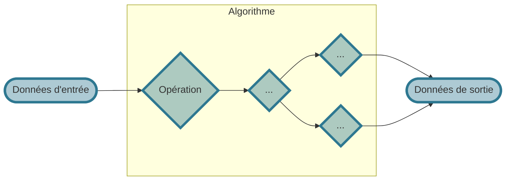
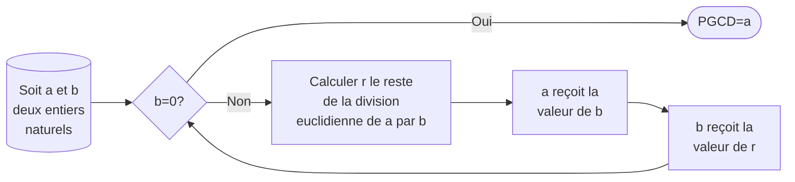

# ALGORITHMIQUE <span onclick="window.print()" class="pdf-link"> :fa fa-file-pdf:</span>

!> !! Work in progress !!


## Définissons un algorithme

D'un point de vue mathématique, un algorithme est une « **suite finie et non ambigüe d’opérations ou d’instructions permettant de résoudre une problème ou d’obtenir un résultat** » (Source : [wiktionary](https://fr.wiktionary.org/wiki/algorithme)). Le mot *algorithme* est une référence au mathématicien perse  **Al-Khwârizmî** (en arabe : الخوارزمي) qui a classifié les algorithmes existants à son époque ($\thicksim780 \thickspace \text{\textendash} \thickspace 850$) en fonction de leurs critères de terminaison (nous en parlerons plus tard).

D'un point de vue des sciences informatiques, un algorithme est une **procédure de calcul définie par une suite finie d’opérations élémentaires obéissant à un enchaînement déterminé**. Il s'agit de résoudre un problème en un certain nombre d'étapes clairement définies dans un dialogue avec un ou des ordinateurs. La grande majorité des algorithmes prennent des **valeurs en entrée** et à la **suite des opérations** des l'algorithme renvoient des **valeurs de sortie**.



--- 
<p class="center-p"> Schema simplifié d'un algorithme.</p>

<details>
<summary> <strong> Niveau avancé :</strong></summary>

Un algorithme dois respecter cinq propriétés selon D. Knuth (<abbr title="Donald E. Knuth, Algorithmes, Stanford, CSLI Publications, 2011, 510 p. (ISBN 978-1-57586-620-8)"> 2011 </abbr>) : 
- **Finitude** : « Un algorithme doit toujours se terminer après un nombre fini d’étapes. »
- **Définition précise** : « Chaque étape d'un algorithme doit être définie précisément, les actions à transposer doivent être spécifiées rigoureusement et sans ambiguïté pour chaque cas. »
- **Entrées** : « quantités qui lui sont données avant qu'un algorithme ne commence. Ces entrées sont prises dans un ensemble d'objets spécifié ».
- **Sorties** : « quantités ayant une relation spécifiée avec les entrées ».
- **Rendement** : « toutes les opérations que l'algorithme doit accomplir doivent être suffisamment basiques pour pouvoir être en principe réalisées dans une durée finie par un homme utilisant un papier et un crayon ».
</details>


> Une recette de cuisine peut être réduite à un algorithme. En **entrée** on injecte des ingrédients et on spécifie le matériel utilisé. Ces entrées sont ensuite utilisés par des **instructions élémentaires simples** (couper, frire, mélanger...) pour donner en **sortie** un plat préparé. 

### L'algorithme d'Euclide

L'algorithme antique le plus connu est l'algorithme d'Euclide qui permet de calculer le plus grand commun diviseur (PGCD) de deux nombres entiers, c'est à dire de trouver le plus grand entier qui divise les deux entiers en laissant un reste nul. Cet algorithme simple est décrit ci-dessous grâce à un organigramme, un peuso-code (code en langage naturel) puis sous une version python. 


Il s'agit d'un algorithme assez simple mais qui a quand même une caractéristique assez complexe, c'est la boucle dans l'algorithme. En fait, l'algorithme recommencera au début (mais avec de nouvelles valeurs) jusqu'à remplir la condition (b=0). On appelle une fonction qui s'appelle elle même une fonction récursive. C'est au programme de NSI mais en Terminale seulement. Pour comprendre les codes ci-dessous, il faut savoir que a%b (on le lit « a modulo b ») renvoie le reste de la division euclidienne de a par b. Par exemple 15%4=3, 240%13=6 ou encore 17%12=5. Il s'agit bien de la façon de calculer notre petit r.

```pseudo-code
fonction euclide(a, b)
    '''
    Calcul le le plus grand commun diviseur (PGCD) de deux nombres entiers
    paramètres:
        a et b sont deux entiers naturels non nuls
    résultat:
         retourne le PGCD de a et b
    '''
    si b = 0 alors
        retourner a
    sinon
        r=a modulo b
        a=b
        b=r
        euclide(a,b)        
```

```python
def algo_euclide(a, b)
   if b == 0 :
      return a
   return gcd(a%b, a)
```

## Analyse des algorithmes

Il existe trois axes de vérifications d'un algorithme:
- **la terminaison** : est-que l'algorithme ne tourne pas de manière infinie ?
- **La correction** : est-que le résultat renvoyé est le bon ?
- **La complexité** :  quel est le temps d'exécution d'un algorithme et la mémoire qu'il requiert?


Exemple du parcours séquentiel d'un tableau

http://www.monlyceenumerique.fr/nsi_premiere/algo_a/a2_complexite.php


## Algorithme de tri
http://www.monlyceenumerique.fr/nsi_premiere/algo_a/a3_tri_invariant.php#4

### Tri par insertion


### Tri par sélection


Écrire un algorithme en pseudo code qui calcule la moyenne de trois nombres a, b et c. Le résultat sera stocké dans une variable moy. 

Écrire un algorithme qui permet d’échanger le contenu de deux variables var1 et var2
