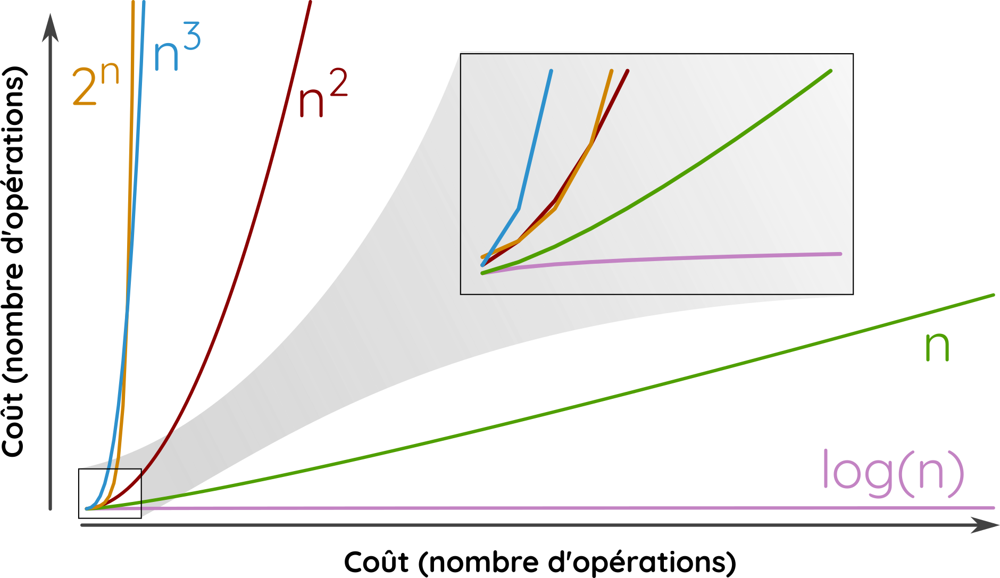

# Algorithmique <span onclick="window.print()" class="pdf-link"> :fa fa-file-pdf:</span>

## Définissons un algorithme

D'un point de vue mathématique, un algorithme est une « **suite finie et non ambiguë d’opérations ou d’instructions permettant de résoudre un problème ou d’obtenir un résultat** » (Source : [wiktionary](https://fr.wiktionary.org/wiki/algorithme)). Le mot _algorithme_ est une référence au mathématicien perse **Al-Khwârizmî** (en arabe : الخوارزمي) qui a classifié les algorithmes existants à son époque ($\thicksim780 \thickspace \text{\textendash} \thickspace 850$) en fonction de leurs critères de terminaison (nous en parlerons plus tard).

D'un point de vue des sciences informatiques, un algorithme est une **procédure de calcul définie par une suite finie d’opérations élémentaires obéissant à un enchaînement déterminé**. Il s'agit de résoudre un problème en un certain nombre d'étapes clairement définies dans un dialogue avec un ou des ordinateurs. La grande majorité des algorithmes prennent des **valeurs en entrée** et à la **suite des opérations** des l'algorithme renvoient des **valeurs de sortie**.


---

<p class="center-p"> Schema simplifié d'un algorithme.</p>

<details class="advanced_level">
<summary> <strong> Niveau avancé :</strong></summary>

Un algorithme dois respecter cinq propriétés selon D. Knuth (<abbr title="Donald E. Knuth, Algorithmes, Stanford, CSLI Publications, 2011, 510 p. (ISBN 978-1-57586-620-8)"> 2011 </abbr>) :

- **Finitude** : « Un algorithme doit toujours se terminer après un nombre fini d’étapes. »
- **Définition précise** : « Chaque étape d'un algorithme doit être définie précisément, les actions à transposer doivent être spécifiées rigoureusement et sans ambiguïté pour chaque cas. »
- **Entrées** : « quantités qui lui sont données avant qu'un algorithme ne commence. Ces entrées sont prises dans un ensemble d'objets spécifié ».
- **Sorties** : « quantités ayant une relation spécifiée avec les entrées ».
- **Rendement** : « toutes les opérations que l'algorithme doit accomplir doivent être suffisamment basiques pour pouvoir être en principe réalisées dans une durée finie par un homme utilisant un papier et un crayon ».

Voir ["Qu'est-ce qu'un algorithme"](https://www.epi.asso.fr/revue/articles/a2209c.htm)
pour un article un peu plus détaillé sur cette notion. 
</details>

> Une recette de cuisine peut être réduite à un algorithme. En **entrée** on injecte des ingrédients et on spécifie le matériel utilisé. Ces entrées sont ensuite utilisés par des **instructions élémentaires simples** (couper, frire, mélanger...) pour donner en **sortie** un plat préparé.

###  L'algorithme d'Euclide

L'algorithme antique le plus connu est l'algorithme d'Euclide qui permet de calculer le plus grand commun diviseur (PGCD) de deux nombres entiers, c'est à dire de trouver le plus grand entier qui divise les deux entiers en laissant un reste nul. Cet algorithme simple est décrit ci-dessous grâce à un organigramme, un pseudo-code (code en langage naturel) puis sous une version python.


Il s'agit d'un algorithme assez simple mais qui a quand même une caractéristique assez complexe, c'est la boucle dans l'algorithme. En fait, l'algorithme recommencera au début (mais avec de nouvelles valeurs) jusqu'à remplir la condition (b=0). On appelle une fonction qui s'appelle elle même une fonction récursive. C'est au programme de NSI mais en Terminale seulement. Pour comprendre les codes ci-dessous, il faut savoir que a%b (on le lit « a modulo b ») renvoie le reste de la division euclidienne de a par b. Par exemple 15%4=3, 240%13=6 ou encore 17%12=5. Il s'agit bien de la façon de calculer notre petit r.

```pseudo-code
fonction euclide(a, b)
    '''
    Calcul le le plus grand commun diviseur (PGCD) de deux nombres entiers
    paramètres:
        a et b sont deux entiers naturels non nuls
    résultat:
         retourne le PGCD de a et b
    '''
    si b = 0 alors
        retourner a
    sinon
        r=a modulo b
        a=b
        b=r
        euclide(a,b)
```

```python
def algo_euclide(a, b):
   if b == 0 :
      return a
   return algo_euclide(b, a%b)
```

?> Tester la fonction algo_euclide avec les valeurs 20 et 30 sur le site [python tutor](https://pythontutor.com/) qui permet de suivre chaque étape de l'algorithme.

## Analyse des algorithmes

Il existe trois axes de vérifications d'un algorithme:

- **la terminaison** : est-que l'algorithme ne tourne pas de manière infinie ?
- **La correction** : est-que le résultat renvoyé est le bon ?
- **La complexité** : quel est le temps d'exécution d'un algorithme et la mémoire qu'il requiert?

### :fa fa-stopwatch: Coût d'un algorithme (complexité temporelle)

Pour mesurer la complexité temporelle d'un algorithme on compte le nombre maximal d'opérations exécutées par un programme. Chaque affectation (a = 2), comparaison (a>0), accès en mémoire (lire fichier a.txt), et opération élémentaire (a+b) compte pour une opération (une unité de temps).
Ainsi, la complexité (noté T(n)) de l'expression `a <- a*b+3` est égale à 5 (une affectation, un accès à la mémoire pour a, un accès à la mémoire pour b, une multiplication, une addition).

#### L'exemple du parcours séquentiel d'un tableau

Pour illustrer la complexité temporelle (coût d'un algorithme), prenons l'exemple du parcours séquentiel d'un tableau. Il y a deux cas à traiter :

- (i) l'entier recherché est présent dans le tableau en position j,
- (ii) l'entier n'est pas dans le tableau qui contient n éléments.

```pseudo code
                                                 Nombre d'opérations
                                               cas (i)          cas (ii)
tr ← Faux                                      (1 op.)          (1 op.)
i ← 1                                          (1 op.)          (1 op.)
tant que i <= longueur(t) et que tr == FAUX   (j+1 op.)        (n+1 op.)
    si t[i]==x :                               (j op.)          (n op.)
        tr ← VRAI                              (1 op.)          (0 op.)
    fin si
    i ← i+1                                    (j op.)          (n op.)
fin tant que
renvoyer la valeur de tr                       (1 op.)          (1 op.)

                                         TOTAL = 3j+5             3n+4
```

Le **coût de l’algorithme** est donné par le **nombre d’opérations effectuées dans le pire des cas**.

?> Dans notre exemple, quel est le coût de l'algorithme ? <abbr title="Ici, le nombre d'opérations maximum est atteint lorsque le nombre recherché se situe en dernière position (position n)"> <i class="fas fa-life-ring"></i> Indices </abbr>. <!-- 3n+5 -->

#### Différents ordres de grandeur

Le coût d'un algorithme dépend très souvent de la taille (notée _n_) du jeux de données en entrée. Il existe un grand nombre d'ordre de grandeurs ([:fa fa-wikipedia-w:](https://fr.wikipedia.org/wiki/Analyse_de_la_complexit%C3%A9_des_algorithmes)) dont les principaux sont les suivants :

- Complexité **constante** _Θ(1)_ : si le nombre d'opérations ne dépend pas de n,
- Complexité **logarithmique** _Θ(log n)_ : si le nombre d'opérations est proche de log(n),
- Complexité **linéaire** _Θ(n)_ : si le nombre d'opérations est d'ordre n,
- Complexité **quadratique** _Θ(n²)_ : si le nombre d'opérations est d'ordre $n^2$,
- Complexité **exponentielle** _Θ($2^n$)_ : si l'ordre est une forme de puissance de n.

Le coût de l'algorithme du parcours séquentiel d'un tableau (3n+5) est linéaire (noté Θ(n)).



<p class="center-p">

Représentation graphique des **principaux ordres de grandeur** des complexités algorithmiques.

</p>

?> Compter le nombre d'opération _faire_la_fete()_ exécutées par les algorithmes suivants avec n=3. Exprimer le nombre d'opération faire_la_fete() exécutées par les algorithmes 1 à 4 en fonction de n. Puis noter le type de complexité de tous les algorithmes.

```python
# Algo 1
for i in range (1, 5*n/n):
    faire_la_fete()

# Algo 2
for i in range(1, n):
    for j in range(1, n):
        faire_la_fete()

# Algo 3
for i in range(1, n):
    for j in range(1, i):
        faire_la_fete()

# Algo 4
for i in range(5, n-5):
    for j in range(i-5, i+5):
        faire_la_fete()

# Algo 5
for i in range(1, n):
    for j in range(1, i):
        for k in range(1, j):
            faire_la_fete()
```

<!--
Algo 1 : 5                  -> Constant
Algo 2 : n*n=n²             -> Quadratique
Algo 3 : n*(n+1)/2          -> Quadratique O(n²)
Algo 4 : (n-9)*11 = 11n-99  -> Linéaire O(n)
Algo 5 :                    -> O(n³)
-->

## Algorithme de tri

Trier une liste de valeurs (des nombres, des lettres, des cartes...) est un processus courant. L'informatique est particulièrement dépendant de ces tris pour faciliter certains algorithmes. Il existe plusieurs manières de trier une suite de valeur.

### Tri par insertion

Une des façons intuitive de trier des cartes, c'est :

- de poser la première carte sur la table,
- de comparer la valeur de la deuxième carte et de la placer à droite si la nouvelle carte a une valeur plus importante et à gauche dans le cas inverse,
- de sortir une troisième carte et de l'insérer entre les deux si la valeur est entre les deux cartes déjà posées,
- et de continuer ainsi à insérer les cartes dans la liste déjà triée.

```pseudocode
tri_insertion(liste L)
 Pour i allant de 1 à la longueur de L-1 faire
  placer l'élément L[i] dans la liste déjà classée L[0:i-1]
 retourner la liste L
```

```python
def tri_insertion(L):
 for i in range(1, len(L)):
  elt = L[i]
  j = i
  while elt < L[j-1] and j > 0:
   L[j]  =L[j-1]
   j -= 1
  L[j] = elt
 return L
```

?> Regarder les animations [en ligne](http://lwh.free.fr/pages/algo/tri/tri_insertion.html) du tri par insertion. Vous pouvez également visualiser l'algorithme de tri par insertion grâce à des [danseurs roumains](https://www.youtube.com/watch?v=ROalU379l3U).

Calculons maintenant le coût de l'algorithme de tri par insertion à travers deux cas :

- Si la liste est déjà triée, l'algorithme a une complexité linéaire notée Θ(n). En effet chaque valeurs va être comparée avec la valeur suivante une seule fois.
- Si la liste est mélangée de façon aléatoire, il faudra en moyenne (n2-n)/4 opération. On est face à une complexité quadratique notée Θ(n²).

?> Effectuer sur une feuille (papier ou virtuel) la suite d'opération en pseudo-code pour trier la suite de valeur [1, 2, 3, 4, 5]. Combien d'opération faut t'il faire? Faire la même chose avec la suite [1, 4, 3, 5, 2].

Le tri par insertion a un coût quadratique qui le rend très peu efficace sur des listes avec beaucoup d'éléments.

### Tri par sélection

?> Regarder les animations [en ligne](http://lwh.free.fr/pages/algo/tri/tri_selection.html) du tri par selection. Vous pouvez également visualiser l'algorithme de tri par selection grâce à des [danseurs roumains](https://www.youtube.com/watch?v=Ns4TPTC8whw).

?> Grâce à ces ressources, expliquer le tri par selection à votre grand-père/grand-mère pour qu'iel range plus vite son jeu de carte.

Dans tous les cas l'algorithme effectuera n(n-1)/2 comparaisons. Sa complexité est donc en Θ(n2) tout comme l'algorithme de tri par insertion. Il existe de meilleurs algorithmes de tri qui sont plus complexes mais plus rapides.

## Invariant et preuve de terminaison

<http://www.monlyceenumerique.fr/nsi_premiere/algo_a/a3_tri_invariant.php#1>


Une grande question lorsqu'on écrit un algorithme est de savoir quand (dans quelles conditions) il fonctionne correctement. Une première approche est de faire des tests pour un grand nombre de valeurs possibles (en particulier des valeurs atypiques, par exemple des valeurs négatives ou très grandes). Cette méthode be permet pas de tester tous les possibles. La méthode de **l'invariant de boucle** permet de démontrer -- au sens mathématique -- qu'un algorithme est correcte.  Un invariant de boucle, est une propriété qui, si elle est vraie avant l'exécution d'une itération de cette boucle, elle le demeure après l'exécution de l'itération. Autrement dit, pour un algorithme donné, on appelle invariant de boucle toute propriété qui est vraie avant et après chaque itération. 

Une preuve de correction d'un algorithme par invariant de boucle ce fait en trois étapes : 
1. INITIALISATION : on doit montrer que l'invariant de boucle est vrai avant la première itération de la boucle
1. CONSERVATION : on doit montrer que si l'invariant de boucle est vrai avant une itération de la boucle, il le reste avant l'itération suivante.
1. TERMINAISON : une fois la boucle terminée, l'invariant fournit une propriété utile qui aide à montrer la correction de l'algorithme.

### Exemples simples d'invariant de boucle

#### Calcul d'une somme 

```python
def somme(n):
    s = 0
    for i in range(1, n+1):
        s += i
    return s
```
L'invariant de boucle pour ce programme est la somme $s=\displaystyle\sum_{k=0}^{i-1}k$.

- **Initialisation** : L'invariant de boucle est correcte avant les boucles puisque $ s=0 $ et $i=1$.

- **Conservation** : si l'invariant est valable avant la i^ème itération, il en sera de même après cette itération puisque la boucle ajoute i à la somme et incrémente i d'une unité.  à ce poin

- **Terminaison** : Lorsque la boucle est sur le point de se terminer, l'invariant indique que $s= 0+1+2+...+n$, exactement ce qui est nécessaire pour que l'algorithme soit correct.

### Recherche séquentielle d'un maximum dans un tableau

```python
def maximum(T):
    maxi = T[0]
    for i in range(1, len(T)):
        if T[i] > maxi:
            maxi = T[i]
    return maxi
```

Prouver la correction de cet algorithme consiste donc à prendre un tableau T non vide
(précondition) quelconque et de montrer qu’à la fin de l’algorithme, la variable maxi est
bien l’élément maximal de T (postcondition).


- Trouver un invariant : pour cela, on cherche une propriété qui est vraie avant d’exécuter le tour de boucle i. Nous pouvons choisir l’invariant de boucle suivant : $maxi = maximum(T[0..i-1]$).


- Initialisation (L’invariant est-il vrai avant la première itération ?)
Vérifions que l’invariant est vrai pour i = 1 (c’est-à-dire que $maxi = maximum(T[0..1-1]) = maximum(T[0..0]))$. Avant l’entrée dans la boucle, $maxi = T[0]$ donc on a bien $maxi = maximum(T[0..0])$.

- **Conservation** (L’invariant est-il maintenu vrai par une itération de la boucle ?)
On suppose l'initialisation correcte, et donc l’invariant de l’itération précédente est vrai : $maxi = maximum(T[0..i-1])$.
    - Si $T[i] <= maxi$ alors on sait que maxi ne change pas puisque $T[i]$ est inférieur ou égal à maxi. On a donc bien $maxi = maximum(T[0..i])$ à la fin de l’itération d’indice i.
    - Si $T[i] > maxi$, alors $maxi = T[i]$. Cela signifie que $T[i] > T[0..i-1]$ et donc $T[i] = maximum(T[0..i])$, c’est-à-dire $maxi = maximum(T[0..i])$ à la fin de l’itération d’indice i.
Dans le deux cas, l’invariant est conservé par une itération de la boucle.

- **Terminaison** (l'invariant est vrai après la dernière itération) : Au début de la dernière itération on a maxi = maximum(T[0..n-2]) et après les instructions de la dernière itération on a maxi = maximum(T[0..n-1]). Autrement dit, après l’exécution de l’algorithme, la variable maxi est bien le maximum de tous les éléments de T. Cela prouve la correction partielle de l’algorithme.


## Apprentissage et algorithme du plus proche voisin

!> TO DO (work in progress)

https://eduscol.education.fr/document/30061/download

## Algorithmes gloutons

Un **algorithme glouton** est une stratégie qui consiste à tenter de trouver une solution optimale à un problème en avançant par étape de solution locale.

Imaginez un paysage dans lequel vous souhaitez atteindre le point le plus haut. Quels sont les solutions pour atteindre ce sommet?

- La première est de cartographier l'ensemble de la région et ainsi de savoir exactement où se situe le sommet. C'est la solution par **force brute**. Bien sûr, si vous avez déjà une carte avec vous, c'est que quelqu'un d'autre a précédemment utilisé la force brute et vous en fait bénéficier. Dans le cas ou vous n'avez pas de carte, créer une carte juste pour trouver le point le plus haut reviens à prendre un bazooka pour tuer une mouche...
- Une deuxième solution consiste à toujours choisir le chemin qui monte. Si vous monter jusqu'à ne plus pouvoir monter vous avez trouver un point assez haut, sans doute un sommet local. Ce n'est peut être pas le sommet le plus haut, mais c'est assez facile de trouver ce point géographique. Ici on utilise un **algorithme glouton**, on cherche des solutions locales optimales en espérant se rapprocher de la solution optimal globale.

?> Prenons l'exemple d'un commerçant qui doit vous rendre 9€ en monnaie. Combien y a t'il de combinaisons possibles sachant que le commerçant a des pièces de 1€, de 2€ et des billet de 5€ et de 10€? Lister toutes ces solutions. Quelle est la solution qui utilise le moins de pièces/billets ?

Bravo, dans l'exercice précédent vous venez d'utiliser la force brute. Maintenant imaginez que je vous pose la même question pour rendre 113 euros, listeriez vous toutes les solutions (1€ *113, 1€*111 + 2€ …) ?

Une solution assez simple utilise un algorithme glouton. Avec une stratégie gloutonne de rendu de monnaie, on va d'abord rendre la valeur maximal possible (ici 5€). Pour rendre 9 euros, on ne peut pas utiliser un billet de 10€, donc on rend d'abord un billet de 5€. Il reste alors 4€ à rendre. On va rendre alors une pièce de 2€. Il reste 2€ à rendre. On rend enfin une deuxième pièce de 2€. Dans le cas du rendu de monnaie en euro, un algorithme glouton va toujours permettre de trouver la solution optimal. On dit que le système en euro est **canonique**. Avec d'autres systèmes monétaire, l'algorithme glouton peut manquer la solution optimale.

?> Prenons un système monétaire avec des coupures de 1, 6 et 10. Trouver la solution optimale pour rendre 12. Ensuite effectuer les étapes d'un algorithme glouton comme ci-dessus. Combien de coupures avez vous besoin de rendre selon l'algorithme glouton?

?> Vous partez en sac a dos pour une randonnée de 3 jours en autonomie. Vous aller chez un vendeur spécialisé de repas nutritif léger. Vous voulez prendre 3kg maximum de nourriture pour ne pas trop vous charger. Vous souhaitez également maximiser le nombre de calorie par achat tout diversifiant vos achats (aucun achat en double). Le vendeur vous propose les éléments du tableau suivant :

| Achat | Poids | Energie (calorie) |
| ----- | ----- | ----------------- |
| A     | 2 kg  | 3000 Cal          |
| B     | 1 kg  | 1400 Cal          |
| C     | 700 g | 1200 Cal          |
| D     | 400 g | 800 Cal           |
| E     | 350 g | 700 Cal           |

?> Appliquer un algorithme glouton en faisant varier la manière de choisir les achats : (i) choisir les achats par ordre d'energie décroissant parmi ceux qui ne dépasse pas le poids restant dans le sac à dos, (ii) choisir les achats par ordre de poids croissant, (iii) choisir les achats par ordre de rapport energie/poids décroissant parmi ceux qui ne dépasse pas le poids restant dans le sac à dos.

Selon les problèmes, les algorithmes gloutons produisent d’excellents résultats ou se trompe complètement. Par exemple, dans l'exemple du sac à dos, si les poids des objets sont très déséquilibrés, les algorithmes gloutons trouverons des solutions locales très loin de la solution globale optimales car ce type d'algorithme a une mauvaise vision globale des problèmes. Si on reprend l'exemple de votre marche pour trouver le sommet d'un paysage, si le paysage est une montagne unique, la solution gloutonne (toujours choisir le chemin qui monte) devrait vous emmener au sommet. En revanche, si vous vous trouver dans un paysage constitué d'une multitude de collines, vous trouverez rapidement un sommet local qui sera peut être bien plus bas que le sommet global du paysage.

!> Aller voir un [animation](http://fred.boissac.free.fr/AnimsJS/Dariush_Glouton/index.html) de la méthode glouton.

---

## :fa fa-brain: Exercices

?> Écrire un algorithme en pseudo code qui calcule la moyenne de trois nombres a, b et c. Le résultat sera stocké dans une variable moy.

?> Écrire un algorithme qui permet d’échanger le contenu de deux variables var1 et var2
