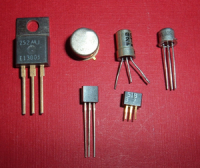

# :fa fa-code: CODAGE ET TYPAGE <span onclick="window.print()" class="pdf-link"> :fa fa-file-pdf:</span>

Nous allons voir dans ce chapitre que les ordinateurs ne comprennent que les 1 et le 0 (on parle de système binaire). 
Pour dialoguer avec la machine, il faut convertir nos mots (par ex. des chaînes de caractères), nos concepts (par ex. des valeurs booléennes) et nos chiffres (nombres entiers positifs, négatifs et nombres réels).

## Jongler entre les nombres

### :fa fa-sign-language: Origine des systèmes de calcul

À l'origine des premiers calculs, chaque quantité était représentée par un
nombre équivalent d'objets, par exemples des cailloux (*calculus* en
latin), des bâtons ou les dix doigts de la main (*digitus* en latin).
C'est l'origine de la **numération en base 10** ou numération décimale qui
est aujourd'hui la plus couramment utilisé à travers le système de
numération indo-arabe. 

Il existe d'autre façon de calculer. Ainsi la **base 12** (duodécimale) permet de dénombrer les mois de l'année ou les
heures sur une montre par exemple, la **base 60** (sexagésimale) permet de
dénombrer les minutes et les secondes. De façon très courante, les
informaticiens utilisent les bases **2** (binaire), **16** (hexadécimale) et **8**
(octale).


### :fas fa-microchip: Le microprocesseur

Le langage de base d'un ordinateur est un **langage binaire** composé de
0/1. Nous communiquons avec les processeur grâce à un **courant
électrique** qui passent plus ou moins bien dans les circuits ! Quand il
passe bien, la valeur est de 1, quand il passe mal ou pas, on décrète
que c'est 0.

Dès lors, comment communiquer le chiffre 2 à un ordinateur ? On doit
trouver une correspondance, un code (pas secret !), pour faire
correspondre ces 0/1 aux données que l'on manipule. Le système de notation en **base 2**
répond à cette question en n'utilisant que les chiffres 0 et 1 pour représenter les nombres :

| Base 10 | 0   | 1   | 2   | 3   | 4   | 5   | 6   | 7   | 8    |
| ------- | --- | --- | --- | --- | --- | --- | --- | --- | ---- |
| Base 2  | 0   | 1   | 10  | 11  | 100 | 101 | 110 | 111 | 1111 |

La valeur (0 ou 1) s'appelle un ***bit*** (binary digit). 8 bits forment
un ***octet*** (en anglais *bytes*). Un **mot machine** est
l'unité de base manipulée par un microprocesseur. Les ordinateurs
actuels utilisent des mots de 8, 16, 32 ou 64 bits (respectivement
appelés octet, mot, double mot, quadruple mot).  Le bit de poids fort est celui le plus à gauche, celui de poids
faible celui le plus à droite. 1000 0000 a pour bit de poids fort 1,
et 1111 1110 a pour bit de poids faible 0.

> **Sens de lecture des bits, petit ou gros boutisme** : Le petit et le gros boutisme viennent d'une guerre de religion inventée par Jonathan Swift dans « Les Voyages de Gulliver ». Il
s'agissait de savoir s'il faut manger les œufs par le gros bout ou par le petit bout.
En informatique, il s'agit de savoir comment on écrit les nombres en
mémoire : est-ce que l'on met les bits dans l'ordre « normal » ou dans
l'ordre inverse. L'ordre usuel permet une lecture par les humains plus
facile, tandis que l'ordre inverse permet des calculs plus simples par
le microprocesseur. Ainsi un mot de 16 bits comme AB12 sera écrit en
machine AB 12 en gros boutisme et 12 AB en petit boutisme. 


### :fa fa-server:  Les types et leur représentation

Il existe un grand nombre de **nature de données** : nombre entier, nombre à
virgule, caractère, texte, image... On appelle ces différents types de
données des ..., **types**. Les données étant toutes traduites en 0 et 1
dans la machine, le codage associé à un type permet de « comprendre » la
donnée. 

*Avant de voir comment sont codés les différents types en
machine, il est nécessaire de faire un petit crochet par les
mathématiques.*

## :fa fa-dice: Bases de numération


###  La base <span class="very_strong">10</span> 

Certains systèmes de numération sont des systèmes additifs qui requièrent d'additionner les chiffres pour obtenir la valeur. C'est le cas du systèmes romains (par ex. $CXIV = 114_{10}$.) 

À l'inverse, le principe de la **numération positionnelle** est d'exprimer un nombre en fonction de symboles et de
puissances de la base de numération. Prenons un
exemple en base 10 :

$$
\begin{aligned}
3\,247& = \textcolor{blue}{3} \times 1\,000 + \textcolor{blue}{2} \times 100 + \textcolor{blue}{4} \times 10 + \textcolor{blue}{7} \times 1\\&=
\textcolor{blue}{3} \times 10^3 + \textcolor{blue}{2} \times 10^2 + \textcolor{blue}{4} \times 10^1 + \textcolor{blue}{7} \times 10^0
\end{aligned}
$$
  
En base 10 (numération décimale), les symboles sont les chiffres de 0 à 9. Ce système permet de faire des calculs plus simplement qu'avec d'autres
systèmes, comme par exemple le système romain. On note la base 10 en utilisant la notation $X_{10}$

###   La base <span class="very_strong">2</span> 

En base 2 (numération binaire), on ne dispose que des chiffres 0 et 1, et des puissances de 2. On note la base 2 en utilisant la notation $X_{2}$ ou $\overline{X}$ (par ex. $3_{10}=11_2=	\overline{11}$).


$$ 6_{10}=110_2=\textcolor{blue}{1} \times 2^2+\textcolor{blue}{1} \times 2^1+ \textcolor{blue}{0} \times 2^0 $$

#### Conversion binaire :fas fa-arrows-alt-h: décimal   

Du binaire au décimal : on écrit tout simplement la somme de produits, sans les 0.

$$
\begin{aligned}
10100111_2 &= \textcolor{blue}{1} \times 2_7  + \textcolor{blue}{0} \times 2_6 + \textcolor{blue}{1} \times 2_5 + \textcolor{blue}{0} \times 2_4 + \textcolor{blue}{0} \times 2_3 + \textcolor{blue}{1} \times 2_2  + \textcolor{blue}{1} \times 2_1 + \textcolor{blue}{1} \times 2_0
\\&= 128 + 32 + 4 + 2 + 1\\&= 167
\end{aligned}
$$

Du décimal au binaire : on fait une succession de divisions euclidiennes par 2, en notant le quotient dans une colonne, et le reste dans une autre, à chaque étape.

$$
\begin{aligned}
111 &= \textcolor{orange}{55} \times 2 + \textcolor{green}{1} \\
55 &= \textcolor{orange}{27} \times 2 + \textcolor{green}{1} \\
27 &= \textcolor{orange}{13} \times 2 + \textcolor{green}{1} \\
13 &= \textcolor{orange}{6} \times 2 + \textcolor{green}{1} \\
6 &= \textcolor{orange}{3} \times 2 + \textcolor{green}{0} \\
3 &= \textcolor{orange}{1} \times 2 + \textcolor{green}{1} \\
1 &= \textcolor{orange}{0} \times 2 + \textcolor{green}{1} 
\end{aligned}
$$

On s'arrête quand le dernier quotient vaut 0. On peux ensuite lire le chiffre en binaire en lisant tous les restes dans l'ordre inverse : d'où le
résultat : $111_{10} = 1101111_2$.

?> **Exercice 1** : Convertir $11_2$ , $10001_2$ et $101000101_2$ en base 10. Convertir $12_{10}$, $787_{10}$ et $2329_{10}$ en base 2.

#### Les additions en base 2 :

L'addition binaire respecte les mêmes règles que l'addition décimale :

- $0 + 0 = 0$ 

- $0 + 1 = 1 + 0 = 1$

- $1 + 1 = 10$  (on pose 0 et on retient 1)

Par exemple :
$$
\begin{aligned}
\textcolor{red}{1}&\textcolor{red}{1100}\\
 &11101\\
+\enspace&10110\\
\hline
=1&10011
\end{aligned}
$$

On peut ainsi facilement se rendre compte que l'addition de deux nombres de n bits
donnera au maximum un nombre de n+1 bits. Cela se démontre mathématiquement par le fait que le plus grand nombre
codé sur n bits est $2n-1$ et que : $(2^n - 1) + (2^n - 1) = 2 \times 2^n - 2 = 2^{n+1} - 2$.

?> **Exercice 2** : Effectuer l'addition $111111_2 + 101101_2$. Puis convertir ces deux nombres binaires en nombres décimaux et faire l'addition à partir de ces nombres décimaux.


?> **Exercice 3** : Convertir depuis la base 10 vers la base 2 puis effectuer les opérations suivantes et donner le résultat en binaire sur 8 bits : 
$38 + 64$ ; $13 + 41$.

#### Les multiplications en base 2 :

En base 10, pour obtenir le résultat d'une multiplication par 10, il
suffit d'ajouter un 0. En base 2, de la même façon, on ajoute un 0 pour
obtenir de résultat d'une multiplication par $10_2$ (c'est-à-dire pour
une multiplication par 2). Pour les multiplications par 100, on ajoute
deux 0 et ainsi de suite. On peut donc poser les multiplications de
nombres binaires de la façon identique aux multiplications de nombres
décimaux :

$$
\begin{aligned}
1&101\\
\times& \textcolor{purple}{1} \textcolor{red}{0} \textcolor{blue}{1}\\
\hline

\textcolor{blue}{1}& \textcolor{blue}{101} \\
+ \textcolor{red}{11} & \textcolor{red}{010} \\
+ \textcolor{purple}{110} & \textcolor{purple}{100} \\

\hline
= 1011&011
\end{aligned}
$$


On peut facilement démontrer que la multiplication de deux nombres de n
bits donnera au maximum un nombre de 2n bits. En effet : $(2^n - 1) \times (2^n - 1) = 2^{2n} - 2^n + 1 < 2^{2n} - 1$

?> **Exercice 4**: Convertir ces opérations depuis la base 10 vers la base 2 puis
effectuer les opérations et donner le résultat en binaire sur 16 bits : $15 x 2$ ; $114 x 17$

### La base <span class="very_strong">16</span>

Dans la **base 16** (numération hexadécimale), les symboles/chiffres vont de 0 à 15. Or 15 n'est pas
un chiffre mais un nombre. On utilise donc les chiffres de 0 à 9, puis A
pour 10, B pour 11, etc. jusqu'à F pour 15 (en majuscules souvent,
parfois en minuscules).

L'avantage de la base 16 est qu'elle permet de « compacter » l'écriture
binaire. En effet, puisque $2^4=16$, on peut
regrouper par 4 les chiffres en base 2 (les « bits » par abus de
langage) pour obtenir un chiffre en base 2.

| Base 16 	| 0    	| 1    	| 2    	| 3    	| 4    	| 5    	| 6    	| 7    	|
|---------	|------	|------	|------	|------	|------	|------	|------	|------	|
| Base 10 	| 0    	| 1    	| 2    	| 3    	| 4    	| 5    	| 6    	| 7    	|
| Base 2  	| 0000 	| 0001 	| 0010 	| 0011 	| 0100 	| 0101 	| 0110 	| 0111 	|

| Base 16 	| 8    	| 9    	| A    	| B    	| C    	| D    	| E    	| F    	|
|---------	|------	|------	|------	|------	|------	|------	|------	|------	|
| Base 10 	| 8    	| 9    	| 10    	| 11    	| 12    	| 13    	| 14    	| 15    	|
| Base 2  	| 1000 	| 1001 	| 1010 	| 1011 	| 1100 	| 1101 	| 1110 	| 1111 	|


Les codes couleur, pour le web par exemple, sont souvent donnés sous
l'intensité des trois couleurs additives de base (Rouge Vert Bleu pour
un écran d'ordinateur, à l'inverse des couleurs soustractives Magenta
Cyan Jaune). Chaque intensité de couleur est codée de 0 à 255, soit de 0
à FF en hexadécimal. Les majuscules sur les lettres ne sont pas
importantes.

Le violet-rouge moyen a comme code RVB \#C71585, qui est plus lisible
que : $\textcolor{red}{11000111}\textcolor{green}{00010101}\textcolor{blue}{10000101}$ avec les 8 premiers bits (= le premier octet) qui code pour le rouge, le second octet pour le vert et le dernier octet pour le bleu.

Par ailleurs, les ordres de grandeur peuvent se deviner facilement ;
dans ce violet-rouge moyen il y a :

-   C7 rouge : c'est beaucoup (C est un grand chiffre)
-   15 vert : c'est peu (1 est un petit chiffre)
-   85 bleu : c'est moyen (8 c'est la moitié de 16, soit la moitié de la
    base)

?> **Exercice 5**: Convertir $11_2$, $10001_2$ et $101000101_2$ en base 16. Convertir $12_{10}$ et $787_{10}$ en base 16.

?> **Exercice 6**: Convertir $15A9_{16}$, $84E6AA03_{16}$, en base 2 puis en base 10.

?> **Exercice 7**:  À votre avis quelles sont les couleurs codées par les codes RVB \#f604e9, \#ebfb10, \#ececec et \#ff7900?

### Autres bases

Les principes exposés ci-dessus peuvent s'appliquer pour n'importe
quelle base. En informatique, on n'utilise que les bases 2, 10 et 16.
Dans la vie courante, il nous reste des traces du tout premier système
de numération né avec l'écriture, à savoir le système sexagésimal
utilisé par les Sumériens puis les Babyloniens (aux III^e^ et II^e^
millénaire av. J.C.). Cette numération, dite mésopotamienne, utilise la
base 60...elle nous est restée pour les heures et les degrés, mais est
aussi présente en Chine depuis -1191, et en Inde depuis -3102. Il existe
aussi des systèmes en bases 5 (par ex. en langue *wolof*, pour dire les
chiffres de 6 à 9 on dit 5+1 ... 5+4) et en base 20 (système
vicésimal qui serait à l'origine du *quatre-vingt* en français).

### Conversion entres les bases 2, 10 et 16


**Synthèse des méthodes de conversion** entre les bases 2, 10 et 16. Cette fiche est disponible en [pdf](../_img/dessin_conversion_bases.pdf).

---

## :fa fa-search-minus: Représentation des entiers (dont les négatifs)) en machine

Les entiers sont traduits en base 2, sur 32 bits au moins. Au regard des calculs précédent,
on pourrait penser qu'avec 32 bits on peut coder $2^{32} - 1=4\thinspace294\thinspace967\thinspace295$.
Pourtant, il faut aussi pouvoir représenter les **entiers négatifs** (cf.
paragraphes suivants). Le codage interne à l'ordinateur est
classiquement sur un mot de 4 octets, pour un entier de 32 bits. En
Python :fab fa-python:, les entiers sont aussi grands que l'on veut : si nécessaire,
le nombre de bits est augmenté par le logiciel en interne.

> :fab fa-python: *Typage en python :* type integer, « int ».

### Le problème de la représentation des entiers négatifs

On représente un **entier relatif** par un entier naturel auquel on rajoute
un signe + ou -. Avec des mots de 16 bits, la valeur des entiers positif peut aller de 0
à $1111111111111111_2 = 2^16 - 1 = 65535_{10}$. Pour représenter des entiers relatifs, gardons le
premier bit pour coder le signe. Il restera donc 15 bits pour la valeur
absolue de l'entier. On pourra donc représenter les entiers de $-32768$ à $32767$.

#### Commençons par une méthode simple mais inefficace

Pour coder les entiers relatifs sur n bits, la première idée qui vient à
l'esprit est d'utiliser 1 bit pour le signe et n-1 bits pour la valeur
absolue du nombre à représenter. Le bit de signe est le bit dit « de
poids fort » (c'est à dire le bit le plus à gauche). Mettons ce bit de poids
fort serait à 0 dans le cas d'un nombre positif et à 1 dans le cas
d'un nombre négatif. Par exemple, sur 8 bits (1 octet), on représenterait l'entier 5 par
00000101 et l'entier -5 par 10000101.

!> **Cette méthode pose deux problèmes** : (i) il existe deux zéros, un zéro
positif (00000000) et un zéro négatif (10000000) et (ii) les opérations
arithmétiques (par ex. les additions) sont plus compliqués (une addition
entre un nombre positif et un négatif ne fonctionne pas avec la méthode présenté ci-dessus).

?> **Exercice 8**: Faire l'addition binaire de $0101_2$ (5 en base 10) et $1101_2$ (-5 en
base 10). Que remarquez-vous?

#### La solution : le principe de la notation en complément à deux

Pour déterminer le complément à deux d'un nombre binaire, il faut
déterminer son complément à un (c'est-à-dire inverser tous les bits du
nombre) et lui ajouter 1. Pour calculer le complément à deux de 12
($00001100_2$), on passe au complément à un ($11110011_2$) puis on ajoute 1
(pour rappel, il y a aussi des retenues dans les additions binaires car $1_2 + 1_2 = 10_2$).

$$
\begin{aligned}
\textcolor{red}{11}\enspace\\
11110011\\
+00000001\\
\hline
11110100
\end{aligned}
$$

Le nombre $11110100_2$ va donc être utiliser pour représenter -12. Afin de vérifier
que l'utilisation de ce complément à deux est cohérente, on peut
calculer le résultat de l'addition - 12 + 12 avec en représentation
binaire.

$$
\begin{aligned}
\textcolor{red}{11111}\enspace\enspace\enspace\\
11110100\\
+00001100\\
\hline
00000000
\end{aligned}
$$

La dernière retenue fait sortir un 1 sur le 9ème bit mais, comme nous
utilisons un codage en 8 bits, il n'apparaît pas et le résultat obtenu
est bien 0. On peut également vérifier qu'il n'existe qu'un seul 0
puisque le complément à deux de $00000000_2$ est bien $00000000_2$. Le codage en
8 bits des entiers relatifs permet donc de coder de 0 (00000000) à 127
(01111111) en utilisant les 7 premiers bits et de -128 (1000000) à -1
(11111111) en utilisant le huitième bit. De façon générale, un codage
des entiers relatifs sur n bits permet de coder de $-2^n-1$ à $2^n-1 + 1$.

Pour les entiers relatifs, l'addition se fait en utilisant le complément
à deux pour tous les chiffres négatifs. Pour rappel, avec un codage des
entiers relatifs, il faut tenir compte du signe représenté par le bit de poids
fort. Dans le cas d'une multiplication d'un nombre positif par un nombre négatif, on prend
le complément à deux du nombre négatif et le résultat obtenu et le
complément à deux du résultat cherché. Dans le cas d'une multiplication
de deux nombres négatifs, on prend leur complément à deux et le résultat
obtenu est le résultat cherché.

?> **Exercice 9**: Représenter en base 2 sur 8 octets les nombres relatifs suivants : $-8_{10}$, $-125_{10}$ et $259_{10}$. Déterminer le nombre de bits minimum pour représenter $-15879966_{10}$ et en déduire le nombre d'octets à utiliser.

!> En résumé, un entier positif *n* est représenté par lui-même. Un entier
négatif *n* est représenté par $n+2^N$, (avec des mots de *N* bits).

> **Exemples**: sur un mot de 3 bits, on représente les entiers positifs de
0 à $2^3-1=7$. Si on veut également représenter
des entiers négatifs en complément à deux, on peut alors écrire les
entiers de $-4$ à $3$. Le premier schéma ci-dessous donne cette
représentation en complément à deux pour des mots de 3 bits. Sur la
première ligne, on a les nombres à représenter, compris entre $-4$ et $3$.

#### Un peu de python

Un nombre binaire s'écrit avec 0b devant, et **bin**(x) permet d'obtenir la conversion en binaire. Un nombre hexadécimal s'écrit avec 0x devant, et **hex**(x) permet d'obtenir la conversion en hexadécimal. La fonction **int** permet de faire les conversions vers la base 10.

```python
>>> bin(199)
'0b1111000'
>>> hex(199)
'0xc7'
>>> int('0b11100', base=2)
28
```


## :fa fa-ruler:  Les nombres réels (à virgules)

On ne peut représenter que des valeurs décimales, vu qu'on ne dispose
que de mots de longueur finie. Racine de 2 et *P* (*pi*) ne peuvent pas
être représentés exactement. En informatique un réel est en fait un
décimal. Nous sommes limités par le nombre de bits que nous réservons
pour coder un nombre.

Considérons le nombre ***N = 23,375***, il est constitué d'une partie
entière (23) et d'une partie décimale (0.375).

En base 10 le nombre 23,375 se réécrit comme suit :

$$
\begin{aligned}
23,375 =& 2\times 10 +3 \times 1 + 3 \times 0,1 + 7 \times 0,01 + 5 \times 0,001 \\
 =&  2 \times 10^1 + 3 \times 10^0 + 3 \times 10^{-1} + 7 \times 10^{-2} + 5 \times 10^{-3}
\end{aligned}
$$

En base 2 le nombre $10111,011_2$ ($=23,375_{10}$) se réécrit comme suit :

$$
\begin{aligned}

10111,011_2 =& 1 \times 2^4 + 0 \times 2^3 + 1 \times 2^2 + 1 \times 2^1 + 1 \times 2^0 + 0 \times
2^-1 + 1 \times 2^-2 + 1 \times 2^-3 \\
=& 1 \times 16 + 0 \times 8 + 1 \times 4 + 1 \times 2 + 1 \times 1 + 0 \times 0,5 + 1 \times 0,25
+ 1 \times 0,125\\
=& 23,375_{10}
\end{aligned}
$$

### Fonctionnement de la représentation en nombre binaire

On vient de voir que : $10111,011_2 = 23,375_{10}$. Pour coder 23 en binaire c'est la méthode utilisée pour coder un nombre
entier. $23_{10} =10111_2$. Pour coder 0,375 on utilise la méthode suivante :

$0,375 \times 2 = \textcolor{orange}{0},750$ (ce qui signifie que : $0,375 = 0,750 \times
2^{-1}=0 \times 2^{-1}+ 0,75 \times 2^{-1}$).

$0,750 \times 2 = \textcolor{orange}{1},5$ (ce qui signifie que : $0,75 = 1,5 \times
2^{-1}$ soit encore que : 
$0,375 =0 \times 2^{-1}+ ( 1,5 \times 2^{-1}) \times 2^{-1}=0 \times 2^{-1}+ 1,5 \times 2^{-2}= 0 \times 2^{-1}+ 1 \times 2^{-2}+ 0,5 \times 2^{-2}$.

$0,500 \times 2 = \textcolor{orange}{1}$ (ce qui signifie que : $0,5 = 1 \times 2^{-1}$
soit encore que  :
$$ 0,375 =0 \times 2^{-1}+ 1 \times 2^-2+ ( 1 \times 2^{-1}) \times 2^{-2}= \textcolor{orange}{0} \times 2^{-1}+ \textcolor{orange}{1} \times 2^{-2}+ \textcolor{orange}{1} \times 2^{-3}=0,011_2$$

On obtient ainsi : $23,375_{10} = 10111,011_2$.
**Cependant la virgule n'est pas codée**. Tout comme $23,375=2,375 x 10 ^1$ on peut écrire
$10111,011_2=1,0111011 x 2^{4}_2$. Cette méthode permet de *normaliser la position de la virgule*. C'est ce que l'on appelle **la notation en virgule flottante**.

**Codage d'un nombre réel sur 32/64 bits**

Pour coder un nombre réel sur 32 bits, on utilise le fait que  :

Tout nombre réel en base 2 peut s'écrire sous la forme $(-1)^{\textcolor{blue}{signe}} \times 1,\textcolor{purple}{Mantisse} × 2^{\textcolor{#e91e63}{±exposant}}$. Les exposants 00000000 et 11111111 sont réservés
pour les situations exceptionnelles ($+\infin$ , $-\infin$, NaN : Not a Number). Les
exposants vont donc de 00000001 à 11111110. L'exposant est compris entre
-126 et 127. Pour pour ne pas avoir à traiter les valeurs négatives
d'exposant, on ajoute 127 à l'exposant :

$$
\Large{
(-1)^{\textcolor{blue}{signe}} \times 1,\textcolor{purple}{Mantisse} × 2^{\textcolor{#e91e63}{±exposant}+127}
}
$$

Sur **32 bits** on obtient l'écriture :

- 1 bit pour le $\textcolor{blue}{signe}$ (0 ou 1) à gauche,
- 8 bits pour l'$\textcolor{#e91e63}{exposant}$ (avec un décalage de + 127 ),
- 23 bits pour la $\textcolor{purple}{Mantisse}$.

Pour 23,375  :fa fa-long-arrow-alt-right: $10111,011_2=1,0111011 \times 2^4_2$

- Le $\textcolor{blue}{signe}$: 0 ici car c'est un nombre positif,
- L'$\textcolor{#e91e63}{exposant}$: 4 4+127 = 131 qui se code en binaire par : 10000011,
- La $\textcolor{purple}{Mantisse}$: Il faut la compléter par des 0 pour qu'elle occupe les 23 bits : 01110110000000000000000.


| Signe | Exposant | Mantisse               |
| ----- | -------- | ---------------------- |
| 0     | 10000011 | 1110110000000000000000 |


> Pour un mot en 64 bits on parle de **double précision**. Les nombre décimaux
peuvent aller de 10^-308^ à 10^308^ (contre 10^-38^ à 10^38^ en simple
précision, c'est à dire en 32 bits). De plus, en 64 bits on peux décrire
des nombres beaucoup plus précisément, même si le codage en 32 bits
suffit pour de nombreuses applications.


| **Précision**        | **Encodage** | **_Signe_** | **_Exposant_** | **_Mantisse_** | **Valeur d'un nombre**                        | **Précision** | **Chiffres significatifs** |
| -------------------- | ------------ | ----------- | -------------- | -------------- | --------------------------------------------- | ------------- | -------------------------- |
| **Simple précision** | 32 bits      | 1 bit       | 8 bits         | 23 bits        | $\small{(-1)^{S}\times M\times 2^{(E-127)}}$  | 24 bits       | environ 7                  |
| **Double précision** | 64 bits      | 1 bit       | 11 bits        | 52 bits        | $\small{(-1)^{S}\times M\times 2^{(E-1023)}}$ | 53 bits       | environ 16                 |

**Tableau** de comparaison des systèmes de codage en simple précision (32 bits) et double précision (64 bits)

--- 

?> **Exercice 10**: Retrouver en base 10 le nombre qui a pour Signe 1 pour Exposant 10000100 et pour Mantisse 10110100000000000000000.
[Correction](https://isn-icn-ljm.pagesperso-orange.fr/nsicourschapitre1/co/grain-nombres-reels.html)

## :fa fa-paragraph: Codage des caractères

Pour permettre les échanges d'informations textuelles entre systèmes
informatiques, le codage **ASCII** (American Standard Code for
Information Interchange, voir tableau ci-dessous ou [:fab fa-wikipedia-w:](https://upload.wikimedia.org/wikipedia/commons/1/1b/ASCII-Table-wide.svg)) a été proposé en 1963 (avant c'était le bazar). Chaque caractère est associé à un mot de 7
bits. Par exemple « R » est associé à $1010010_2= 82_{10} = 52_{16}$ 
et le symbole « 5 » à $0110101_2=35_{16}. 

Par commodité, chaque caractère est en fait codé dans un octet. Sont codés en plus des
caractères de contrôle, comme le « line feed », saut de ligne et
« carriage return », retour chariot. Ces deux caractères font passer à
la ligne, et donnent des comportements différents sous Windows ou sous
Unix (système à la base de Linux). Sont également codés les chiffres,
les signes de ponctuation, des opérations arithmétiques (+), un
« beep », un caractère d'effacement...

> Les 32 premiers caractères en ASCII, codés de 0 à 1F ne sont pas
imprimables. Le bit excédent (puisque la norme à l'époque était des mots
de 8 bits et non de 7) est un bit de contrôle qui permettait d'éviter
les erreurs de transmission. C'est le bit de poids fort, appelé bit de
parité. Il vaut 0 ou 1 de manière à ce que le nombre de 1 dans l'octet
soit toujours pair.

Comme l'ASCII ne permettait pas le codage des **lettres accentuées**,
d'autres normes de codage sont apparues (Windows cp 1252, MacRoman, ISO
8859-15). Par ailleurs, la présence d'un bit « libre » dans les octets
du codage ASCII permet de représenter plus de caractères. La majorité de
ces normes intègrent l'ASCII, mais ne sont pas compatibles entre elles.
Comme il n'y a pas moyen de savoir quel codage est utilisé pour un
document, cela donne parfois des surprises à la lecture, avec des
caractères étonnants.


<details>
<summary>Cliquer pour voir la table complète ASCII</summary>

| Dec | Hex | Html   | Char  |     | Dec | Hex | Html    | Char |
| --- | --- | ------ | ----- | --- | --- | --- | ------- | ---- |
| 0   | 0   |        | NUL   |     | 64  | 40  | \&#64;  | @    |
| 1   | 1   |        | SOH   |     | 65  | 41  | \&#65;  | A    |
| 2   | 2   |        | STX   |     | 66  | 42  | \&#66;  | B    |
| 3   | 3   |        | ETX   |     | 67  | 43  | \&#67;  | C    |
| 4   | 4   |        | EOT   |     | 68  | 44  | \&#68;  | D    |
| 5   | 5   |        | ENQ   |     | 69  | 45  | \&#69;  | E    |
| 6   | 6   |        | ACK   |     | 70  | 46  | \&#70;  | F    |
| 7   | 7   |        | BEL   |     | 71  | 47  | \&#71;  | G    |
| 8   | 8   |        | BS    |     | 72  | 48  | \&#72;  | H    |
| 9   | 9   |        | TAB   |     | 73  | 49  | \&#73;  | I    |
| 10  | A   |        | LF    |     | 74  | 4A  | \&#74;  | J    |
| 11  | B   |        | VT    |     | 75  | 4B  | \&#75;  | K    |
| 12  | C   |        | FF    |     | 76  | 4C  | \&#76;  | L    |
| 13  | D   |        | CR    |     | 77  | 4D  | \&#77;  | M    |
| 14  | E   |        | SO    |     | 78  | 4E  | \&#78;  | N    |
| 15  | F   |        | SI    |     | 79  | 4F  | \&#79;  | O    |
| 16  | 10  |        | DLE   |     | 80  | 50  | \&#80;  | P    |
| 17  | 11  |        | DC1   |     | 81  | 51  | \&#81;  | Q    |
| 18  | 12  |        | DC2   |     | 82  | 52  | \&#82;  | R    |
| 19  | 13  |        | DC3   |     | 83  | 53  | \&#83;  | S    |
| 20  | 14  |        | DC4   |     | 84  | 54  | \&#84;  | T    |
| 21  | 15  |        | NAK   |     | 85  | 55  | \&#85;  | U    |
| 22  | 16  |        | SYN   |     | 86  | 56  | \&#86;  | V    |
| 23  | 17  |        | ETB   |     | 87  | 57  | \&#87;  | W    |
| 24  | 18  |        | CAN   |     | 88  | 58  | \&#88;  | X    |
| 25  | 19  |        | EM    |     | 89  | 59  | \&#89;  | Y    |
| 26  | 1A  |        | SUB   |     | 90  | 5A  | \&#90;  | Z    |
| 27  | 1B  |        | ESC   |     | 91  | 5B  | \&#91;  | [    |
| 28  | 1C  |        | FS    |     | 92  | 5C  | \&#92;  | \    |
| 29  | 1D  |        | GS    |     | 93  | 5D  | \&#93;  | ]    |
| 30  | 1E  |        | RS    |     | 94  | 5E  | \&#94;  | ^    |
| 31  | 1F  |        | US    |     | 95  | 5F  | \&#95;  | _    |
| 32  | 20  | \&#32; | Space |     | 96  | 60  | \&#96;  | `    |
| 33  | 21  | \&#33; | !     |     | 97  | 61  | \&#97;  | a    |
| 34  | 22  | \&#34; | \"    |     | 98  | 62  | \&#98;  | b    |
| 35  | 23  | \&#35; | #     |     | 99  | 63  | \&#99;  | c    |
| 36  | 24  | \&#36; | \$    |     | 100 | 64  | \&#100; | d    |
| 37  | 25  | \&#37; | %     |     | 101 | 65  | \&#101; | e    |
| 38  | 26  | \&#38; | &     |     | 102 | 66  | \&#102; | f    |
| 39  | 27  | \&#39; | '     |     | 103 | 67  | \&#103; | g    |
| 40  | 28  | \&#40; | (     |     | 104 | 68  | \&#104; | h    |
| 41  | 29  | \&#41; | )     |     | 105 | 69  | \&#105; | i    |
| 42  | 2A  | \&#42; | *     |     | 106 | 6A  | \&#106; | j    |
| 43  | 2B  | \&#43; | +     |     | 107 | 6B  | \&#107; | k    |
| 44  | 2C  | \&#44; | ,     |     | 108 | 6C  | \&#108; | l    |
| 45  | 2D  | \&#45; | -     |     | 109 | 6D  | \&#109; | m    |
| 46  | 2E  | \&#46; | .     |     | 110 | 6E  | \&#110; | n    |
| 47  | 2F  | \&#47; | /     |     | 111 | 6F  | \&#111; | o    |
| 48  | 30  | \&#48; | 0     |     | 112 | 70  | \&#112; | p    |
| 49  | 31  | \&#49; | 1     |     | 113 | 71  | \&#113; | q    |
| 50  | 32  | \&#50; | 2     |     | 114 | 72  | \&#114; | r    |
| 51  | 33  | \&#51; | 3     |     | 115 | 73  | \&#115; | s    |
| 52  | 34  | \&#52; | 4     |     | 116 | 74  | \&#116; | t    |
| 53  | 35  | \&#53; | 5     |     | 117 | 75  | \&#117; | u    |
| 54  | 36  | \&#54; | 6     |     | 118 | 76  | \&#118; | v    |
| 55  | 37  | \&#55; | 7     |     | 119 | 77  | \&#119; | w    |
| 56  | 38  | \&#56; | 8     |     | 120 | 78  | \&#120; | x    |
| 57  | 39  | \&#57; | 9     |     | 121 | 79  | \&#121; | y    |
| 58  | 3A  | \&#58; | :     |     | 122 | 7A  | \&#122; | z    |
| 59  | 3B  | \&#59; | ;     |     | 123 | 7B  | \&#123; | {    |
| 60  | 3C  | \&#60; | <     |     | 124 | 7C  | \&#124; | \|   |
| 61  | 3D  | \&#61; | =     |     | 125 | 7D  | \&#125; | }    |
| 62  | 3E  | \&#62; | >     |     | 126 | 7E  | \&#126; | ~    |
| 63  | 3F  | \&#63; | ?     |     | 127 | 7F  | \&#127; | DEL  |

</details> 

La norme **ISO 8859** a utilisé le bit libre de la norme ASCII pour
proposer des caractères supplémentaires, comme les caractères accentués,
le [*ß*](https://fr.wikipedia.org/wiki/ß) allemand, etc... Les 128
premiers caractères sont ceux de l'ASCII, et les suivants dépendent...
de la sous-norme ! Il y a en fait 16 tables différentes, par exemple la
norme **ISO 8859-1**, dite latin-1, est pour l'Europe occidentale, la
8859-6 pour l'Arabe, etc. [:fab fa-wikipedia-w:](https://fr.wikipedia.org/wiki/ISO/CEI_8859-1) permet d'accéder à ces tableaux.


Actuellement la norme qui tend à s'imposer, venant de Linux et du HTML,
est l'**UTF-8**. Elle est présente par défaut sur les dernières versions
de Windows et d'OsX. La principale différence par rapport aux normes
précédentes est qu'un caractère est représenté par un mot de 1 à 4
octets, de longueur variable.

L'UTF-8 est une implémentation de la norme **Unicode,** qui peut
contenir plus de 4 millions de caractères différents. Ceci permet de
représenter les idéogrammes chinois, les caractères nordiques,
cyrilliques, arabes, etc. Les 256 premiers caractères de l'UTF-8 sont
ceux de la norme ISO 8859 (et donc les 128 premiers caractères sont ceux
de l'ASCII). Chaque caractère est associé à un unique entier appelé
**point de code**.

En UTF-8, si le bit de poids fort est 0, alors il s'agit du caractère
ASCII correspondant. Sinon, les bits de poids fort indiquent le nombre
d'octets pour coder le caractère, avec un nombre de 1 correspondant au
nombre d'octets, suivi d'un 0. Les caractères sont codés sous la forme
U+*xxxx* où *xxxx* est la valeur hexadécimale du code. Chaque octet a
une valeur comprise entre 128 et 255, ils commencent tous par 10.

De manière simplifiée (voir d'autres exemples sur [:fab fa-wikipedia-w:](https://fr.wikipedia.org/wiki/UTF-8#Exemples)), on a :

| Caractères codés   | Représentation binaire en UTF-8         | Signification           |
| ------------------ | --------------------------------------- | ----------------------- |
| U+0000 à U+007F    | 0xxx xxx                                | 1 octet codant 7 bits   |
| U+0080 à U-07FF    | 110x xxxx 10xx xxxx                     | 2 octets codant 11 bits |
| U+0800 à U+FFFF    | 1110 xxxx 10xx xxxx 10xx xxxx           | 3 octets codant 16 bits |
| U+10000 à U+10FFFF | 1111 0xxx 10xx xxxx 10xx xxxx 10xx xxxx | 4 octets codant 21 bits |


Citons également la norme UTF-16, qui code un caractère sur un minimum
de 16 bits, et la norme UTF-32, qui codent les caractères
systématiquement sur 32 bits, ce qui simplifie le décodage mais perd
beaucoup de place.

> :fab fa-python: *Typage en python :* aussi bien les caractères isolés, que les chaînes de
caractères sont de type « **str** » (string, qui veut aussi dire chaîne en
anglais).

## :fa fa-check: or :fa fa-times: : L'algèbre de Boole

Un **processeur** est composé de **transistors** permettant de réaliser
des fonctions sur des signaux numériques. Si le transistor est passant,
le signal vaut 1 ; s'il est bloquant, le signal vaut 0. Ces transistors,
assemblés entre eux, forment des composants permettant de réaliser des
fonctions très simples, que l'on appelle **portes logiques**. En
combinant ces portes, il est possible de créer des circuits logiques
réalisant des opérations très complexes. **L'algèbre de Boole**
(développé par George Boole à partir de 1844) est une algèbre binaire
basée sur l'utilisation de portes logiques, les opérateurs booléens.
L'avantage principale de cet algèbre est de pouvoir décrire le circuit
au niveau logique (portes), ce qui est beaucoup plus simple qu'une
description au niveau physique (transistors).

### Les transistors (hors programme, mais indispensable...)

<div class="img-flow">



</div>

Les **transistors** sont des composants électroniques à 3 bornes : la
base B (ou grille G), le collecteur C (ou source S) et l'émetteur E (ou
drain D). Il en existe une grande variété qui ont des fonctionnements
très différents les uns des autres. 

<div class="img-flow">


</div>


De manière générale, un transistor
est un dispositif **semi-conducteur** : il se comporte comme un
interrupteur entre les bornes C et E, commandé par la borne B. Si la
borne B est alimentée, le courant circule entre C et E, on dit que le
transistor est **passant**. Si elle n'est pas alimentée, le courant ne
circule pas, on dit que le transistor est bloquant.


<details>
<summary> <strong> Niveau avancé :</strong></summary>

 Les micro-processeurs actuels utilisent des
transistors MOS (Metal-Oxyde Semiconductor) dont il existe deux types :
le n-MOS et le p-MOS. L'association de ces deux types de transistors est
appelée la technologie CMOS (Complementary Metal-Oxyde Semiconductor).
Les matériaux semi-conducteurs sont constitués d'atomes ayant 4
électrons de valence comme le silicium ou le germanium. Ils ont la
propriété de pouvoir être conducteur ou non en fonction de la
température. Pour obtenir des transistors, il faut que ces
semi-conducteurs soient dopés :

- négativement en y ajoutant des atomes ayant 5 électrons de valence
comme le phosphore ou l'arsenic (semi-conducteur de type n),

- positivement en y ajoutant des atomes ayant 3 électrons de valence
comme l'aluminium ou le gallium (semi-conducteur de type p).

Un transistor est composé de trois couches de semi-conducteurs
alternées. Les transistors n-MOS sont constitués d'une alternance n-p-n
et les transistors p-MOS d'une alternance p-n-p.
</details>

### Opérateurs booléens

Il existe trois **opérateurs booléens** de base qui permettront par la
suite de réaliser toutes les portes logiques nécessaires à la
réalisation d'un circuit logique. Il s'agit des opérateurs **NON**
*(**NOT**)*, **ET** *(**AND**)* et **OU** *(**OR**).* Ils peuvent être
représentés de différentes manières (i) une **notation symbolique**,
(ii) une **table de vérité**, (iii) une **équation logique**, et (iv) un
**schéma électrique**.

---


---
**Synthèse des opérateurs booléens**. Cette fiche est disponible en [pdf](../_img/dessin_booleen.pdf).

---

### Codage du type booléen

Un **booléen** est en théorie un bit : **Vrai** ou **Faux**. On utilise généralement
le codage 0 pour faux et 1 pour vrai, comme par exemple en logique ou en
calcul booléen (que l'on verra dans quelques séances).

> :fab fa-python: *Typage en python :* le type booléen « bool » est en fait un entier, qui
vaut False pour 0 et True dans tous les autres cas. Ce qui peut donner des résultats surprenants...


---


---
**Notation des opérateurs booléens** avec leur notation symbolique Américaine et Européenne ainsi que leur équation logique. Cette fiche est disponible en [pdf](../_img/Circuit_elements.pdf).

---


**L'opérateur NON**

La porte NON est la plus simple, on l'appelle également inverseur. Elle
permet d'obtenir le complément. Elle est réalisée avec deux transistors,
un de type n et un de type p. 

<div class="flex" style="display:flex">

<div class="flex" style="flex: 1 1 0%;">

<a href="https://commons.wikimedia.org/wiki/File:Fonctions_logiques(2-a).png#/media/Fichier:Fonctions_logiques(2-a).png"></a>

<p class="center-p"> Schéma électrique de la porte <strong>NON</strong>. <a href="https://creativecommons.org/licenses/by-sa/1.0" title="Creative Commons Attribution-Share Alike 1.0">CC BY-SA 1.0</a>, <a href="https://commons.wikimedia.org/w/index.php?curid=1027143"><i class="fab fa-wikipedia-w"></i></a>  </p>
</div>

<div class="flex" style="flex: 1 1 0%;">

| A   | S   |
| --- | --- |
| 0   | 1   |
| 1   | 0   |

<p class="center-p">  Table de vérité de l'opérateur <strong>NON</strong> </p>
</div>
</div>

**L'opérateur ET**

<div class="img-flow">
</div>

La porte ET utilise deux valeurs en entrée (A et B). Si les deux entrées sont à
1, la sortie (S) vaut 1, elle vaut 1 sinon. Il faut 6 transistors pour la
câbler : trois de type p et trois de type n. 


<div class="flex" style="display:flex">

<div class="flex" style="flex: 1 1 0%;">


<a href="https://commons.wikimedia.org/wiki/File:Fonctions_logiques(3-a).png#/media/Fichier:Fonctions_logiques(3-a).png"></a>

<p class="center-p"> Schéma électrique de la porte <strong>ET</strong>. <a href="https://creativecommons.org/licenses/by-sa/1.0" title="Creative Commons Attribution-Share Alike 1.0">CC BY-SA 1.0</a>, <a href="https://commons.wikimedia.org/w/index.php?curid=1027148"> <i class="fab fa-wikipedia-w"></i></a></p>
</div>

<div class="flex" style="flex: 1 1 0%;">

| A   | B   | S   |
| --- | --- | --- |
| 0   | 0   | 0   |
| 0   | 1   | 0   |
| 1   | 0   | 0   |
| 1   | 1   | 1   |

<p class="center-p">  Table de vérité de l'opérateur <strong>ET</strong> </p>
</div>
</div>


**L'opérateur OU**

La porte utilise deux valeurs en entrée. Si les deux entrées sont à 0,
la sortie vaut 0, elle vaut 1 sinon. Il faut également 6 transistors
pour la câbler : trois de type p et trois de type n.

<div class="flex" style="display:flex">

<div class="flex" style="flex: 1 1 0%;">

<a href="https://commons.wikimedia.org/wiki/File:Fonctions_logiques(4-a).png#/media/Fichier:Fonctions_logiques(4-a).png"></a>

<p class="center-p"> Schéma électrique de la porte <strong>OU</strong>. <a href="https://creativecommons.org/licenses/by-sa/1.0" title="Creative Commons Attribution-Share Alike 1.0">CC BY-SA 1.0</a>, <a href="https://commons.wikimedia.org/w/index.php?curid=1027151"><i class="fab fa-wikipedia-w"></i></a>  </p>
</div>

<div class="flex" style="flex: 1 1 0%;">


| A   | B   | S   |
| --- | --- | --- |
| 0   | 0   | 0   |
| 0   | 1   | 1   |
| 1   | 0   | 1   |
| 1   | 1   | 1   |

<p class="center-p">  Table de vérité de l'opérateur <strong>OU</strong> </p>
</div>
</div>


?> **Exercice 11**: Faire la table de vérité de l'expression booléenne suivante : (A or B) and C.


### Circuits logiques de base

On peut associer ces trois portes logiques pour fabriquer les autres
portes logiques de base : le NON ET (**NAND**), le NON OU (**NOR**) et
le OU EXCLUSIF (**XOR**).


#### L'opérateur NON ET

La porte NON ET (ou NAND) utilise deux valeurs en entrée. La sortie vaut
0 si les deux entrées sont à 1, elle vaut 1 sinon. Elle correspond à
l'association série d'une porte ET et d'une porte NON.

| A   | B   | S   |
| --- | --- | --- |
| 0   | 0   | 1   |
| 0   | 1   | 1   |
| 1   | 0   | 1   |
| 1   | 1   | 0   |

<p class="center-p">  Table de vérité de l'opérateur <strong>NON ET</strong> </p>


Pour réaliser cette fonction, on pourrait mettre bout à bout les circuits
électriques correspondant aux portes ET et NON mais cette solution
utiliserait 8 transistors. En pratique, on utilise une solution beaucoup
plus simple qui n'utilise que 4 transistors. La porte NAND est dite
universelle car elle permet de reconstituer toutes les autres fonctions
logiques. Il existe donc des circuits intégrés, comme le 7400, qui ne
contiennent que des portes NAND.

#### L'opérateur NON OU

La porte NON OU (ou NOR) utilise deux valeurs en entrée. La sortie vaut
0 si au moins 1 des entrées vaut 1, elle vaut 1 sinon. Elle correspond à
l'association en série d'une porte OU et d'une porte NON.

| A   | B   | S   |
| --- | --- | --- |
| 0   | 0   | 1   |
| 0   | 1   | 0   |
| 1   | 0   | 0   |
| 1   | 1   | 0   |

<p class="center-p">  Table de vérité de l'opérateur <strong>NON OU</strong> </p>


Comme dans le cas des portes NAND, il existe un câblage à 4 transistors qui permet
d'obtenir la porte NOR. Cette porte est également universelle et il
existe également des circuits intégrés qui ne contiennent que des portes
NOR, comme le 7402 par exemple.

#### L'opérateur OU EXCLUSIF

La porte OU EXCLUSIF (ou XOR) utilise deux valeurs en entrée. La sortie
vaut 1 si une seule des entrées vaut 1, elle vaut 0 sinon. Il faut au minimum 14 transistors
pour câbler cette fonction.

| A   | B   | S   |
| --- | --- | --- |
| 0   | 0   | 0   |
| 0   | 1   | 1   |
| 1   | 0   | 1   |
| 1   | 1   | 0   |


<p class="center-p">  Table de vérité de l'opérateur <strong>XOR</strong> (OU EXCLUSIF) </p>


Il y a de nombreuses façons de câbler la fonction XOR en utilisant des
portes NON, ET, OU, NAND ou NOR. En voici trois exemples courants :


<p class="center-p">  3 manières courantes de câbler la fonction XOR. </p>


#### Additionneur binaire

Si un processeur doit être capable de réaliser des opérations logiques,
il doit aussi être capable de réaliser des opérations arithmétiques, et
principalement la plus simple d'entre elles, l'addition. Dans la table
de vérité d'une addition binaire 1 bit + 1 bit, il y a deux informations
en sortie : la retenue noté R et la somme notée S.

| A   | B   | R   | S   |
| --- | --- | --- | --- |
| 0   | 0   | 0   | 0   |
| 0   | 1   | 0   | 1   |
| 1   | 0   | 0   | 1   |
| 1   | 1   | 1   | 1   |

<p class="center-p">  Table de vérité d'une addition binaire 1 bit + 1 bit. </p>

?> **Exercice 12**: À quelles portes logiques correspondent la sortie S et la retenue R ?

<p><a href="https://commons.wikimedia.org/wiki/File:Half-adder.svg#/media/Fichier:Half-adder.svg"></a>

<p class="center-p"> Logigramme du demi-additionneur 1 bit + 1 bit.  <a href="http://creativecommons.org/licenses/by-sa/3.0/" title="Creative Commons Attribution-Share Alike 3.0">CC BY-SA 3.0</a>, <a href="https://commons.wikimedia.org/w/index.php?curid=1477592"><i class="fab fa-wikipedia-w"></i></a></p>

Pour obtenir un additionneur complet, on peut partir du
demi-additionneur en lui ajoutant l'information de la retenue notée
R~n-1~. Voici la table de vérité d'un additionneur 1 bit + 1 bit + 1
retenue R-1 :

| A   | B   | $R_{n-1}$ | R   | S   |
| --- | --- | --------- | --- | --- |
| 0   | 0   | 0         | 0   | 0   |
| 0   | 1   | 0         | 0   | 1   |
| 1   | 0   | 0         | 0   | 1   |
| 1   | 1   | 0         | 1   | 0   |
| 0   | 0   | 1         | 0   | 1   |
| 0   | 1   | 1         | 1   | 0   |
| 1   | 0   | 1         | 1   | 0   |
| 1   | 1   | 1         | 1   | 1   |

<p class="center-p"> Table de vérité d'un additionneur </p>

On retrouve le demi-additionneur dans la partie supérieur de la table
(chiffres en bleu). Il est difficile d'identifier un logigramme à partir
de cette table de vérité. Voici le logigramme de l'additionneur
complet.

<p><a href="https://commons.wikimedia.org/wiki/File:Full-adder.svg#/media/Fichier:Full-adder.svg"></a>

<p class="center-p">  Logigramme de l'additionneur complet<a href="http://creativecommons.org/licenses/by-sa/3.0/" title="Creative Commons Attribution-Share Alike 3.0">CC BY-SA 3.0</a>, <a href="https://commons.wikimedia.org/w/index.php?curid=1477617">Lien</a></p>


## :fa fa-brain: Exercices

*On demande des calculs **sans** **bin** **et** **hex** **de Python** !
Vous pouvez utiliser Python comme outil de vérification de vos
résultats.*

Les icônes :far fa-flag: indiquent des questions auxquelles il est indispensable de savoir répondre tandis que les icônes :fa fa-award: indiquent des questions de niveau avancé.

### Exercices en lignes :

- [codage des nombres (IUT d'informatique de Reims)](https://iut-info.univ-reims.fr/users/nourrit/codages/index.html)

### Ex. entiers positifs

1.  Trouver la représentation en base 2 des nombres décimaux 1, 3, 7, 15, 31 et 63. Expliquer le résultat.
1.  Trouver la représentation en base 16 des nombres décimaux 158 et 2045. Écrire en décimal le nombre hexadécimal BEEF.
2.  On donne les nombres suivants, qui sont soit en base 2, soit en base 16. S'ils sont en binaire les écrire en hexadécimal et vice-versa :  $111011001010$ ; $E15A$ ; $1010100101$; $45$.
3.  Trouver en base 10 la représentation du nombre $10010110_2$. 
4.  Pour multiplier par dix un entier naturel exprimé en base dix, il suffit d'ajouter un 0 à sa droite. Quelle est l'opération
    équivalente en base 2 ? Le vérifier sur 3, 6 et 12.
5.  Calculer en binaire la somme $1101101_2 + 1001011_2$. N'oublier pas les retenues.
6.  Comment peut-on multiplier un nombre en binaire par 2 ? Le diviser par 2 ? Que peut-il se passer dans ce dernier cas ?
7.  Écrire en langage naturel un algorithme permettant d'ajouter deux entiers exprimés en binaire. L'implémenter en Python, en utilisant des tableaux de 0 et de 1 pour représenter les nombres en binaire.

### Ex. entiers relatifs 

*Sauf mention contraire, le codage se fait sur 8 bits.*

1. Quels nombres peut-on représenter avec des entiers de 8 bits ? De 32 ou 64 bits ?
1. Trouver la représentation décimale des entiers relatifs dont la représentation en binaire est $0010010_2$, $1000000_2$ et $10110011_2$.
2. Coder -23 et -78 en binaire à l'aide de la mantisse.
1. Calculer la représentation binaire de 4, puis de -4, sur des mots de 8 octets. Vérifier que l'on obtient la représentation de -4 à partir de celle de 4 en inversant les 1 et les 0, puis en ajoutant 1.
3. Appliquer la méthode de l'exercice précédent pour trouver la représentation de -16. Vérifier que « ça marche ».
4. Comment faire une soustraction à partir d'un part, de la méthode d'addition en binaire, et d'autre part, de la représentation des entiers relatifs ? Appliquer à 15 - 7 (sur des mots de 8 bits)
5. Écrire un programme Python qui donne le complément à deux d'un nombre binaire. En entrée on donnera une liste de longueur quelconque comportant les chiffres, et en sortie on aura une liste de même longueur comportant les chiffres du complément.

### Ex. représentation des décimaux 

*Sauf mention contraire, le codage des entiers se fait sur 8 bits et celui des flottants sur 32 bits.*

1.  Trouver le décimal représenté par le mot : $0100\thinspace0011\thinspace0101\thinspace1110\thinspace0000\thinspace0000_2$
2.  Coder 141,42 sur 32 bits.
3.  Comment est représenté le nombre décimal $2^{-122} ?
4.  Comment est représenté le nombre entier 7 ? Et le nombre décimal 7,0 ?
5.  Comment est représenté le nombre 0,1 ? que remarquez-vous ?
6.  Quelle précision perd-on si on divise à nombre à virgule par 2, puis qu'on le multiplie à nouveau par 2 ? (Cet exercice a plusieurs
    réponses !)
7.  Trouver le plus petit *x* flottant tel que x == x + 1 renvoie True
8.  Trouver le plus grand *x* flottant tel que $2.0\*\*100 + x == 2.0\*\*100$ renvoie True (en python \*\* est une fonction qui élève à la puissance)
9. :fa fa-award: Résoudre « à la main » l'équation $\frac{1}{16}x_2 + \frac{1}{10}x + \frac{1}{25} = 0$. Sous Python, rentrer les trois coefficients en tapant $a = 1/4$, etc. , puis calculer delta. Conclure. 
10. Quelques tests sous Python ; expliquer les résultats obtenus.
```python 
1e75 + 275 - 1e75
1e75*2 - 1e75
#puis---------
x = 1e175
y = x**2
y//y
```

### Exercices (représentation des caractères et chaînes)

En Python, les chaînes de caractères sont traitées en partie comme des
tableaux. Les fonctions ord() et chr() permettent de travailler en
Python sur les caractères. Les caractères Unicode s'écrivent sous la
forme \"\\u*point\_de\_code\_en\_hexa*\". Voir l'exemple ci-dessous.

```python 
a = "bonjour"
premierCar = a[0] # premierCar contient « b »
ord(premierCar) # renvoie 98, le code décimal ASCII de « b »
a + " les petits" # renvoie « bonjour les petits » ; c'est une opération de *concaténation* de chaîne
a + chr(65) # renvoie bonjourA, c'est à dire « bonjour » concaténée avec le caractère dont le *point de code décimal* Unicode vaut 65 : A
"\u00e9" # codage *hexadécimal* Python du caractère « é »
```

1. :fa fa-award: Écrire un programme en Python qui, étant donné une chaîne de caractères, renvoie un tableau contenant les codes ASCII correspondants. Et un autre qui fait le contraire (pour tester ce dernier, n'utiliser que les codes de 65 à 90 --majuscules-, 97 à 122-minuscules-, 32 --espace-).
2. :fa fa-award: Modifier le programme précédent pour qu'il crypte un message, en décalant les lettres de 3 (code de César). On n'utilisera que des minuscules et des espaces. Les espaces devront rester identiques.
3. En Python, la norme retenue est UTF-8. Expliquer pourquoi il y a une contradiction apparente avec que l'on peut constater ci dessous.

|                               | Caractère 1                | Caractère 2                         |
| ----------------------------- | -------------------------- | ----------------------------------- |
| Écrire avec Microsoft Windows | Alt +265E                  | Alt +1F996                          |
| UTF-8 (hex)                   | 0xE2 0x99 0x9E (e2999e)    | 0xF0 0x9F 0xA6 0x96 (f09fa696)      |
| UTF-8 (binary)                | 11100010 10011001 10011110 | 11110000 10011111 10100110 10010110 |
| UTF-16 (hex)                  | 0x265E (265e)              | 0xD83E 0xDD96 (d83edd96)            |
| UTF-16 (decimal)              | 9822                       | 55 358 56 726                       |
| UTF-32 (hex)                  | 0x0000265E (265e)          | 0x0001F996 (1f996)                  |
| UTF-32 (decimal)              | 9822                       | 129430                              |
| Python source code            | u"\u265E"                  | u"\U0001F996"                       |

### Exercices en rab pour les plus avancés

- Qui sont les deux personnages suivants, dont les noms sont donnés ci-dessous avec les caractères Unicode, dans une des langues dans lesquels ils sont célèbres ? Indice : l'un est un héros des films Marvel Avengers, l'autre est son papounet.

fiston = \"\\u00DE\"+\"\\u00F3\"+\"\\u0072\"

papounet = \"\\u00D3\"+\"\\u00F0\"+\"\\u0069\"+\"\\u006E\"+\"\\u006E\"

Comparer avec \"\\u00DE\\u00F3\\u0072\"

Tester\"\\u00DE\\u00F3\\u0072tue\"

- La bibliothèque *unicodedata* permet d'avoir des informations sur les caractères unicode. Dans les quelques fonctions ci-dessous, *chr* peut être un caractère ou son point de code en format Python \"\\u*xxxx*".

  - unicode.name(*chr*) renvoie le nom du caractère
  - unicode.decomposition(*chr*) renvoie la décomposition du caractère en tant que chaîne de caractère.

Explorer ces deux fonctions pour trouver les points de code et les noms des caractères qui forment les caractères « é » (et « ȍ »...si vous arrivez à taper ce dernier...). Donner le nom des caractères dont les points de code décimaux sont 4031 et 9736. Et éventuellement 129430, ça peut planter.

