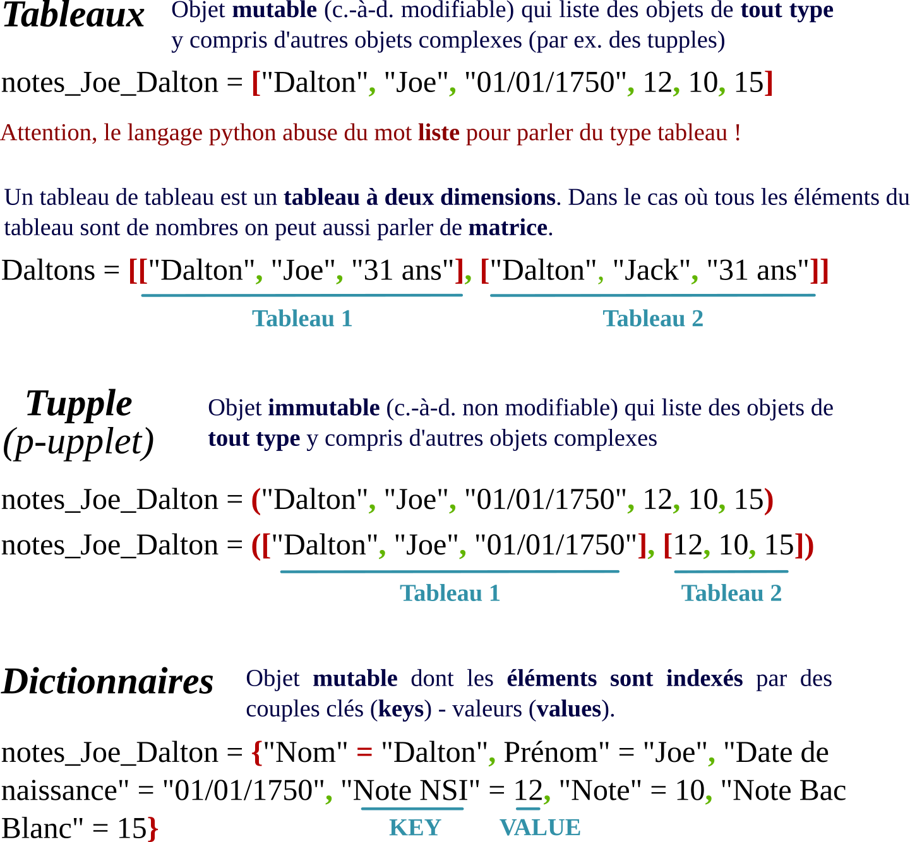

# :fa fa-list-alt: TYPES CONSTRUITS <span onclick="window.print()" class="pdf-link"> :fa fa-file-pdf:</span>

En programmation, on stocke souvent plusieurs valeurs dans un même objet
aussi appelé séquence. Ces objets sont des ensembles finis et ordonnés
contenant n éléments indexés (en python, l'index va de 0 à n-1). Dans
ce chapitre, nous allons étudier les trois principaux types d'objets
utilisés en python : les tuples, les tableaux (aussi appelé abusivement listes en python) et les dictionnaires.

---

<p class="center-p"> <strong> Résumés des types construits.</strong> </p>



---

## Les p-uplets (ou tuples)

---

Les **tuples** sont des séquences notées entre **parenthèses**. Il
n'est pas possible de modifier un tuple après qu'il ait été créé, on
dit qu'ils sont immutables. Créons notre premier tuple :

```python
mon_tuple = (1, 8, 56, 14)
```

Il est possible d'utiliser un élément d'un tuple.

```python
a = mon_tuple[3] # appelle le quatrième élément du tuple (indice 3)
```

Les tuples peuvent utiliser des éléments de tous types :

```python
mon_tuple = ('hello', 'world')
print(mon_tuple[0] + ' ' + mon_tuple[1] + ' !')
```

Il est courant que les fonctions renvoient des tuples en sortie :

```python
def add(a, b) :
    c = a + b
    return (a, b, c)

mon_tuple = add(5, 8)

print(f"{mon_tuple[0]} + {mon_tuple[1]} = {mon_tuple[2]}")
```

À noter ici, l'utilisation d'une f-string (le f au début du print) qui
permet de concaténer variable et chaîne de caractère sans faire
attention à la classe de l'objet contenu dans la variable (nouveauté
introduite par python 3.5).

## Les tableaux

!> Attention, le langage python abuse du mot liste pour parler du type abstrait tableau. Nous parlerons ici de tableau mais de nombreuses ressources (en particulier en anglais) autour des tableaux pythons parlerons de listes...

Les tableaux sont des séquences notées entre crochets. Contrairement aux
tuples, elles peuvent être modifiées après leur création, on dit
qu'elles sont mutables. Créons plusieurs tableaux :

```python
mon_tableau = list() # tableau vide*

nom_autre_tableau = [1, 2, 3, 4, 5] # tableau d'entiers

mon_troisième_tableau = [1, 3.5, 'une chaîne',[]] # tableau d'éléments de différentes classes
```

On **accède** aux différents éléments d'une tableau de la façon que pour
un tuple.

```python
mon_tableau[2] # renvoie le troisième élément de la tableau
```

Il existe plusieurs méthodes permettant de modifier des tableaux. La
méthode _append_ permet d'ajouter un élément en fin de tableau et la
méthode _insert_ permet de choisir l'indice d'insertion.

```python
mon_tableau = [1, 2, 3]
mon_tableau.append = [4] # on ajoute 4 à la fin du tableau
mon_tableau = [a, b, d, e]
mon_tableau.insert(2, 'c') # on insère un c à l'indice 2
```

On peut aussi **concaténer** deux tableaux avec la méthode _extend_ :

```python
tab1 = [3, 4, 5]

tab2 = [8, 9, 10]

tab1.extend(tab2) # on insère le tableau 2 à la fin du tableau 1.
```

Pour **supprimer** des éléments d'un tableau on peut utiliser le mot-clé
_del_ ou la méthode _remove_.

```python
mon_tableau = [-5, -4, 0, 4, 6, 78]
del mon_tableau[0] #supprime le premier élément du tableau
mon_tableau = [19, 20, 21, 22, 23]
mon_tableau.remove(21) # supprime l'élément 21*
```

?> **Exercice 1** : Que fait le code **mon_tableau.remove(21)** quand plusieurs éléments sont égaux à 21 ? N'hésitez pas à tester!

Pour déterminer la **longueur d'un tableau**, on utilise la fonction _len()_ :

```python
mon_tableau = [5, 8, 6, 9]
nombre_element = len(mon_tableau)
```

Pour **parcourir un tableau**, on peut utiliser des boucles while ou for :

```python
mon_tableau = ['a', 'b', 'c', 'd', 'e', 'f', 'g', 'h']
i = 0
while i < len(mon_tableau):
    print(mon_tableau[i])
    i += 1

for elt in mon_tableau :
    print elt
```

Il est également possible d'utiliser la méthode _enumerate_ qui
retourne un tuple qui donne l'index et l'élément :

```python
mon_tableau = ['a', 'b', 'c', 'd', 'e', 'f', 'g', 'h']
for elt in enumerate(mon_tableau):
print(elt)
```

La **compréhension de liste** (on utilise ici liste comme un synonyme de tableau) est un moyen qui permet de parcourir une
liste et d'en renvoyer une seconde, modifiée ou filtrée. Cela consiste
à écrire l'opération que l'on effectue pour modifier la liste
originale à l'intérieure de la liste modifiée.

```python
tab_original = [0, 1, 2, 3, 4, 5]

tab_modifie = [nb * nb for nb in tab_original] # renvoie la liste originale au carré
```

?> **Exercice 2** : Que renvoie le code qui suit? Essayer de trouver le résultat avant de le tester.

```python
pi = 3.14159
[str(round(pi, i)) for i in range(1, 6)]
```

Pour effectuer un **filtrage**, il suffit d'ajouter une condition :

```python
tab_original = [1, 2, 3, 4, 5, 6, 7, 8, 9, 10]

tab_modifie = [nb for nb in tab_original if nb % 2 == 0]
#renvoie les nombres pairs
```

?> **Exercice 3** : Que renvoie le code suivant? Essayer de trouver le résultat avant de le tester.

```python
li = [1, 2, 7, 6, 9]
li2 = [nb * 2 for nb in li if nb
% 3 == 0]*
*print**(li2)*
```

?> **Exercice 4** : Compléter le code suivant pour qu'il renvoie le résultat « [2, 8] ».

```python
li = [1, 2, 7, 6, 9]
li2 = [**********************]
print(li2)
```

## Les tableaux à plusieurs dimensions

Les **tableaux** peuvent être composé d'autres tableaux. On parle aussi de
**matrice** lorsque l'ensemble des valeurs du tableau sont numériques.
On les écrit ligne par ligne ou en concaténant des tableaux :

```python
ma_matrice = [[1, 2, 3], [4, 5, 6]]
tab1 = [1, 2, 3]
tab2 = [4, 5, 6]
ma_matrice = [tab1, tab2]
```

Dans cet exemple, la valeur 6 de ma matrice _ma_matrice_ est donc dans
la deuxième ligne (d'indice 1) et dans la troisième colonne (d'indice
2). Pour récupérer la valeur 6 dans une variable m, on écrira :

```python
a = m[1][2] # renvoie le numéro de la ligne d'indice 1 et de la colonne d'indice 2*
```

**Attention**: Dans le cas où l'on concatène des tableaux, la
modification d'un des tableaux utilisés pour créer la matrice modifiera
également la matrice... En fait, la matrice renvoie directement aux
tableaux préalablement crées pour connaître les valeurs.

Pour **parcourir** une matrice, on utilisera une double boucle _for_ :

```python
m = [[1, 3, 4], [5, 6, 8], [2, 1, 3], [7, 8, 15]]
nb_colonne = 3
nb_ligne = 4
for i in range(0, nb_ligne):
    for j in range(0, nb_colonne):
        a = m[i][j]
print(a)
```

## Les dictionnaires

Les **dictionnaires** sont aussi des séquences, mais au lieu d'héberger des
informations indexées, ils associent chaque **objet** (_value_)
qu'ils contiennent à une **clé** (_key_). Cette **clé** est, la
plupart du temps, une chaîne de caractères mais peut être n'importe
quel type d'objet. Les **valeurs** peuvent également être n'importe
quel type d'objets (des entiers, des chaînes de caractères, des
booléens...), comme dans une liste.

Il existe a deux manières de créer un dictionnaire vide :

```python
mon_dictionnaire = dict( )
mon_dictionnaire = { }
```

Pour le remplir, il faut associer des objets aux clés :

```python
mon_dictionnaire["pseudo"] = "Cornebidouille"
mon_dictionnaire["mot_de_passe"] = "Tartiflette"
```

On peut également créer un dictionnaire déjà rempli :

```python
*mon_placard* = {"chemise": 3, "pantalon": 6, "tee-shirt": 7}
```

Pour supprimer des clés d'un **dictionnaire**, on peut utiliser le
mot-clé _del_ ou la méthode _pop_. La méthode _pop_ renvoie
la valeur de la clé supprimée.

```python
del mon_placard["chemise"]
mon_placard_sans_chemise = mon_placard.pop("chemise")
print(mon_placard_sans_chemise)
```

Pour parcourir les _clés_ d'un **dictionnaire**, on utilise la
méthode **_keys_** :

```python
for cle in mon_dictionnaire.keys():
    print(cle)
```

Pour parcourir les valeurs d'un dictionnaire, on utilise la méthode
**_values_** :

```python
for valeur in mon_dictionnaire.values():
    print(valeur)
```

Pour parcourir les _clés_ et les _valeurs_ simultanément, on utilise la
méthode **_items_** :

```python
for cle, valeur in mon_dictionnaire.items() :
    print("La clé {} contient la valeur {}.".format(cle, valeur))
```

## Ensembles

Python fournit également un type de donnée pour les ensembles.
Un ensemble est une collection **non ordonnée sans élément dupliqué**.
Les ensembles sont pratiquent pour effectuer les opérations
mathématiques telles que les unions, intersections, et différences. On
créé un ensemble grâce à la fonction _set()_ ou avec des accolades.

## Les chaînes de caractères sont des séquences

Les **chaînes de caractères** ont des méthodes qui leur sont propres.

```python
ma_chaine = *'*Hello, world !'
ma_chaine_minuscule = ma_chaine.lower()
ma_chaine_majuscule = ma_chaine.upper()
ma_chaine = ma_chaine_minuscule.capitalize()
mon_titre = 'introduction'
mon_titre.upper().center(20)
```

?> **Exercice 5** : Expliquer ce que permettent les méthodes _lower_, _upper_, _capitalize_ et _center_ utilisées ci-dessus.

La méthode _format_ permet de formater une chaîne de caractère pour l'afficher.

```python
prenom = 'PE'
matiere = 'NSI'
lycee = 'Scholae'

print("Je m'appelle {} et j'enseigne le {} à {}.".format(prenom, matiere, lycee))
```

?> **Exercice 6** : Quel est le résultat du code suivant ?

```python
ma_chaine = *'*Hello, world !'
print(ma_chaine[*4*] + "-" + str(len(ma_chaine)))
```

Pour parcourir une chaîne, on peut utiliser une boucle **_while._**

```python
chaine = "Salut"
i = 0
while i < len(chaine):
    print(chaine[i])
    i += 1
```

Pour convertir une chaîne de caractère en liste, on utilise la méthode
**_split_**. Pour convertir une liste en chaîne, on utilise la méthode
**_join_**.

## :fa fa-brain: Exercices

1. Créer une fonction _remove_all(list, value)_ qui enlève toute les occurrences d'une valeur dans une liste, pas
   seulement la première.
