# Algorithmique <span onclick="window.print()" class="pdf-link"> :fa fa-file-pdf:</span>

!> Réviser le [programme de première](/premiere/types_construits.md) sur les types construits.

## Liste

!> Attention, les listes Python sont en fait des tableaux dynamiques. On parle ici du type abstrait de liste. Ce sont des faux amis.

Une liste est une structure de données permettant de regrouper des données. Une liste est composée de 2 parties : sa **tête** (souvent notée ***car*** pour : *contents of address register*), qui correspond au dernier élément ajouté à la liste, et sa **queue** (souvent notée ***cdr*** pour *contents of decrement register*) qui correspond au reste de la liste. Voici les opérations qui peuvent être effectuées sur une liste :

- **obtenir une liste vide** (on appelle souvent une liste vide ***nil***)
- **tester si une liste est vide**
- **obtenir le tête** de la liste (car)
- **obtenir la queue** de la liste (cdr)
- **construire une liste** à partir d'un élément et d'un autre liste (cons)

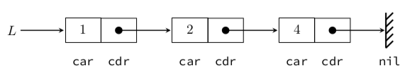

<p class="center-p"> Schéma d'une liste comportant les valeurs 1, 2 et 4 dans cet ordre.</p>

---

Nous avons définis ici le concept théorique de liste en informatique. C'est pourquoi on parle de type abstrait de données. Chaque langage de programmation est libre d'implémenter cette structure comme il le souhaite tant que les opérations décrites ci-dessus sont permises par l'implémentation. Pour implémenter le type abstrait *liste*, beaucoup de langages de programmation utilisent 2 types de structures : les tableaux et les listes chaînées.

<div class="nutshell">

L'implémentation d'une liste doit permettre (moyen mnémotechnique : initiale CAT) :

- de **construire** une liste vide et une liste à partir d'autres listes,
- d'**accéder** aux valeurs (obtenir la tête et la queue),
- de **tester** si une liste est vide.

</div>

## Listes chaînées

### Le problème des tableaux comme implémentation des liste

Les tableaux (abusivement appelés listes dans le langage python) sont une implémentation possible du type abstrait liste. En effet, on peux construire une liste vide, tester si une liste est vide, obtenir la tête, obtenir la queue et construire une liste à partir d'un élément que l'on ajoute/retire à une autre liste. Cependant, cette implémentation est très gourmande en ressource lorsque l'on veux insérer/supprimer un élément en début de liste. C'est pourquoi dans la suite nous allons nous intéressé à la structure de liste chaînées. À noter que dans le langage python, les tableaux ont une taille qui peux varier, c'est ce qu'on appelle des tableaux dynamiques.

?> Compléter le script ci-dessous qui montre que les tableaux pythons sont une implémentation possible du type abstrait liste.

```python
# Une liste vide
t1 = []
t2 = [1, 2, 3]

# Une fonction de test d'une liste vide
def tableau_est_vide(tab):
    if len(tab)>0: 
        print("Le tableau n'est pas vide")
    else:
        print("Le tableau est vide")

# Obtenir la tête
#....................

# Obtenir la queue
#....................

# Tester vos fonctions tete et queue sur les tableaux t1 et t2
#....................

# Modifier une liste
t1.append("Jimmy ")
t1.insert(0, "J'aime ")
t1.insert(2, "Corrigan")
print(t1)

```

### Le principe de la liste chaînée

Une liste chaînée est caractérisée par une séquence de valeurs dont chaque élément est matérialisé par un emplacement en mémoire contenant d'une part sa valeur et d'autre part l'adresse mémoire de la valeur suivante.

```python
class Cellule:
    """Une cellule d'une liste chaînée"""
    def __init__(self, valeur, suivante):
        self.car = valeur
        self.cdr = suivante

class Liste:
    def __init__(self, c):
        self.cellule = c
    def estVide(self):
        return self.cellule is None
    def car(self):
        assert not(self.cellule is None), 'Liste vide'
        return self.cellule.car
    def cdr(self):
        assert not(self.cellule is None), 'Liste vide'
        return self.cellule.cdr

def cons(valeur, suivante):
        return Liste(Cellule(valeur, suivante))

nil=Liste(None)
L = cons(5, cons(4, cons(3, cons(2, cons(1, cons(0,nil))))))
print(L)
```

?> À l'aide des  instructions  suivantes que vous testerez, écrire une fonction  qui  permet  d’afficher le dernier élément de la liste.

```python
print(L.estVide())
print(L.car())
print(L.cdr().car())
print(L.cdr().cdr().car())
```

?> Que permettent les deux fonctions ci-dessous? Écrire une version récursive de la fonction *fonction_mystere2()*.

```python
def fonction_mystere1(L):
    n = 0
    while not(L.estVide()):
        n += 1
        L = L.cdr()
    return n

def fonction_mystere2(L):
    t = []
    while not(L.estVide()):
        t.append(L.car())
        L = L.cdr()
    return t
```

?> Que produisent les instructions suivantes :

```python
#Instruction 1
L=cons(6,L)

# Instruction 2
x = L.car()
L = cons(L.cdr().car(), L.cdr().cdr())
```

<details class="advanced_level">
<summary> <strong> Niveau avancé :</strong></summary>

?> Faire le TP de [isn-icn-ljm](https://isn-icn-ljm.pagesperso-orange.fr/basthon-notebook/?from=https://isn-icn-ljm.pagesperso-orange.fr/notebook/listes_cha%C3%AEn%C3%A9e_TD.ipynb)

</details>

<div class="nutshell">

Une **liste chaînée** est une structure de données permettant de représenter une **séquence finie d'éléments**. Chaque élément contient une **valeur** (*car*) et fournis un moyen d'accéder à la cellule suivante (une **adresse** *cdr*). C'est une **implémentation** (une façon concrète de manipuler) du **type abstrait de liste** puisqu'il permet toute les opérations que l'on peut effectuer sur une liste.

</div>

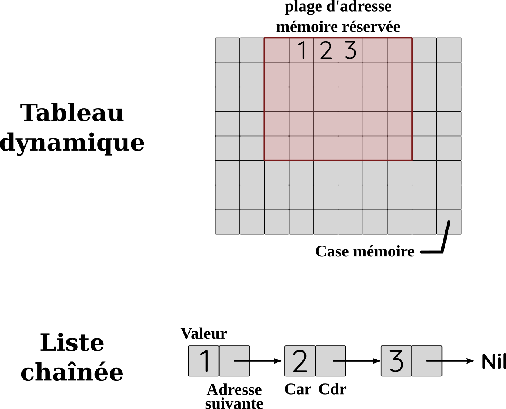

<p class="center-p"> Schéma des implémentations de liste (type abstrait) en tableau et en liste chaînée. </p>

---

## Piles et files

Il existe deux structures de données très utilisées en informatiques : les **files** (aussi appelé **FIFO** pour *First In First Out*) et les **piles** (aussi appelé **LIFO** pour *Last In First Out*). Ces structures sont des types particuliers de **liste**. On peut d'ailleurs facilement utiliser les tableaux pythons comme des piles ou des files (voir la [documentation python](https://docs.python.org/fr/3/tutorial/datastructures.html#using-lists-as-stacks) en français)

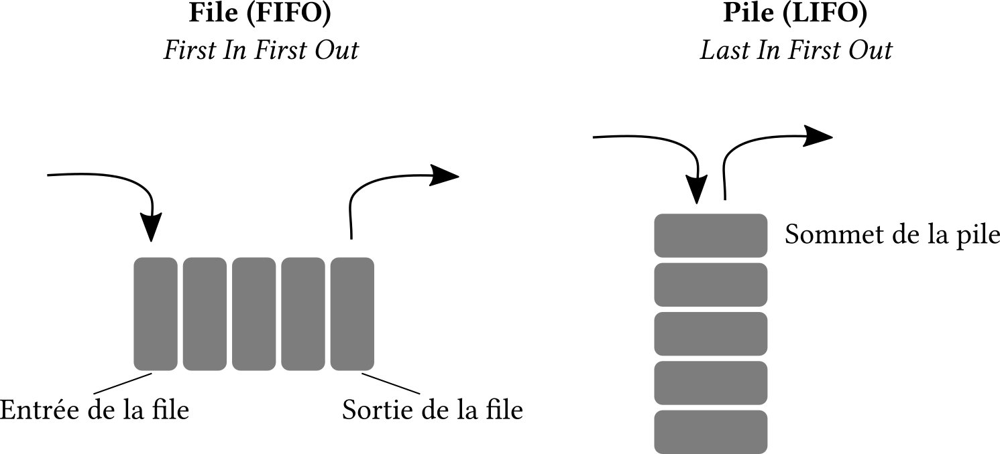

<p class="center-p"> Comparaison des structures <b>File</b> et <b>Pile</b>.</p>

---

### Piles

Une **pile** (**LIFO** pour *Last In First Out*) est une façon de structurer des données qui est très utilisée en informatique. Prenons une analogie: des cartons de déménagement qu'on empile forment une pile. Le dernier carton arrivé (Last In) sur le tas est le premier à être enlever.
En informatique, on utilise par exemple les piles dans les piles d'appels de fonctions ou encore pour parcourir des graphes.

On peut lister quelques opérations courantes sur les piles :

- la création d’une pile,
- l'empilement d’un élément sur une pile,
- le dépilement d’une pile,
- la consultation du sommet d’une pile.

### Files

Une **file** (**FIFO** pour *First In First Out*) est une structure dans laquelle les premiers éléments arrivés sont les premiers à sortir. Une file ressemble à une file d'attente à la boulangerie, le premier arrivé devant la porte sera le premier servi.

On peut lister quelques opérations courantes sur les files :

- la création d’une file,
- l'ajout d’un élément dans une file,
- la suppression du premier élément d'une file (défilement),
- la consultation du début d’une file.

## Dictionnaires

Le dictionnaire est un type abstrait de données qui ressemble à première vue beaucoup à un tableau. La différence est qu'un tableau associe un élément à une position alors qu'un dictionnaire associe un élément (une valeur) à une clé. Un dictionnaire est donc un ensemble de couple clé:valeur. Nous avons déjà vu cette structure [en première](/premiere/types_construits.md#les-dictionnaires).

Les opérations que l'on peut effectuer sur un dictionnaire sont les suivantes :

- Ajout d'un nouveau couple clé:valeur
- Modification d'un couple en changeant la valeur
- Suppression d'un couple
- Recherche d'une valeur grâce à la clé associée

<details class="advanced_level">
<summary> <strong> Niveau avancé :</strong></summary>

L'implémentation des dictionnaires utilise souvent des tables de hachages. Ce n'est pas au programme mais vous pouvez en savoir plus en lisant [c'est quoi le hachage](https://culture-informatique.net/cest-quoi-hachage/) et en visionnant une [vidéo](https://www.youtube.com/watch?v=CkLctGYWFPA) de Dalila Chiadmi.

</details>

## Structure de données

Distinguer interface et implémentation.

!> To do later

## Structures en arbres

En informatique, un **arbre** est une **structure de données** composés de **nœuds** reliés entre eux par des **branches**. Les arbres généalogiques en sont une illustration. Il y a une seul règle pour un arbre : il ne doit pas y avoir deux chemins possibles entre deux nœuds; autrement dit il ne doit **pas** y avoir **de cycle dans un arbre** (dans ce cas on parle de graphe).

Ces structures en arbres sont caractérisés par un ensemble de mots de vocabulaire importants :
Un **arbre** est constitué de **nœuds** reliés par des branches. Un des nœud est appelé **racine** et les nœuds qui sont à l'opposé de la racine sont des **feuilles**. Un nœud peut être caractérisé par sa distance à la racine que l'on appelle **hauteur** (= **profondeur**) et par le nombre de fils qu'il a que l'on appelle **degré**. La **hauteur d'un arbre** correspond à la hauteur du nœud le plus haut (par convention la racine a souvent une hauteur de 0). De même **le degré d'un arbre** correspond à la valeur de degré du nœud ayant le plus grand degré. Enfin la taille d'un arbre se calcul en comptant le nombre de nœuds sur cette arbre. On emprunte le **vocabulaire à la généalogie** pour décrire les relations entre nœuds on parle de nœuds parents, frères, ascendants, descendants, ancêtres.

<div style="margin:auto">

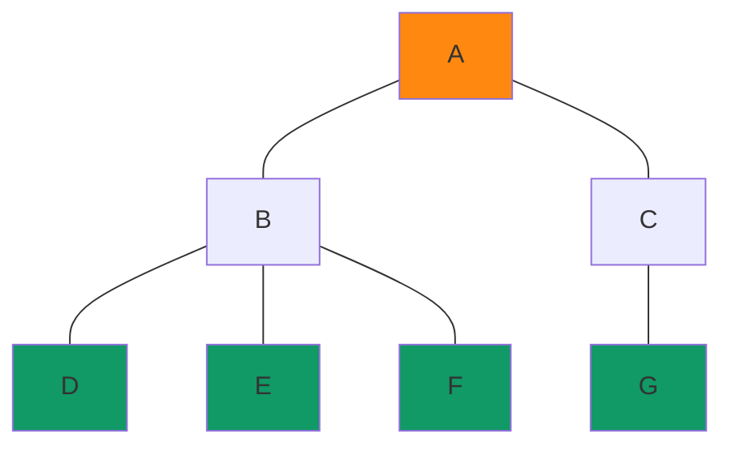

---

<p class="center-p"> Schema d'un arbre avec la racine en orange et les feuilles en vert.</p>

<details class="advanced_level">
<summary> <strong> Niveau avancé :</strong></summary>

?> Voir le cours de [isn-icn-ljm](https://isn-icn-ljm.pagesperso-orange.fr/NSI-TLE/co/section_chapitre3.html)

</details>

?> Donner le degré et la hauteur des arbres ci-dessous ainsi que le degré et la hauteur des nœuds B de chaque arbre.

```text
  +-- B 
A-| 
  +-- C
```

```text
         +-- D
  +-- B--|  
A-|      +-- F
  +-- C
```

```text
         +-- D -- G -- H
  +-- B--|-- E  
A-|      +-- F
  +-- C
```

?> Dessiner un arbre de degré 5 et de hauteur 4.

### Arbres binaires

Un arbre binaire est un arbre de degré 2 (dont les nœuds sont de degré 2 au maximum). On appelle les 2 nœuds descendants d'un nœud parents fils gauche et fils droit. On peut décomposer un arbre binaire de façon récursive en le divisant en sous-arbre gauche et sous-arbre droit.

?> Compléter le texte : L'image ci-dessous représente une forêt avec .... graphe(s) et .... arbre(s) dont .... arbre(s) binaire(s). Les arbres ... et ... sont identiques (ils ont la même structure).

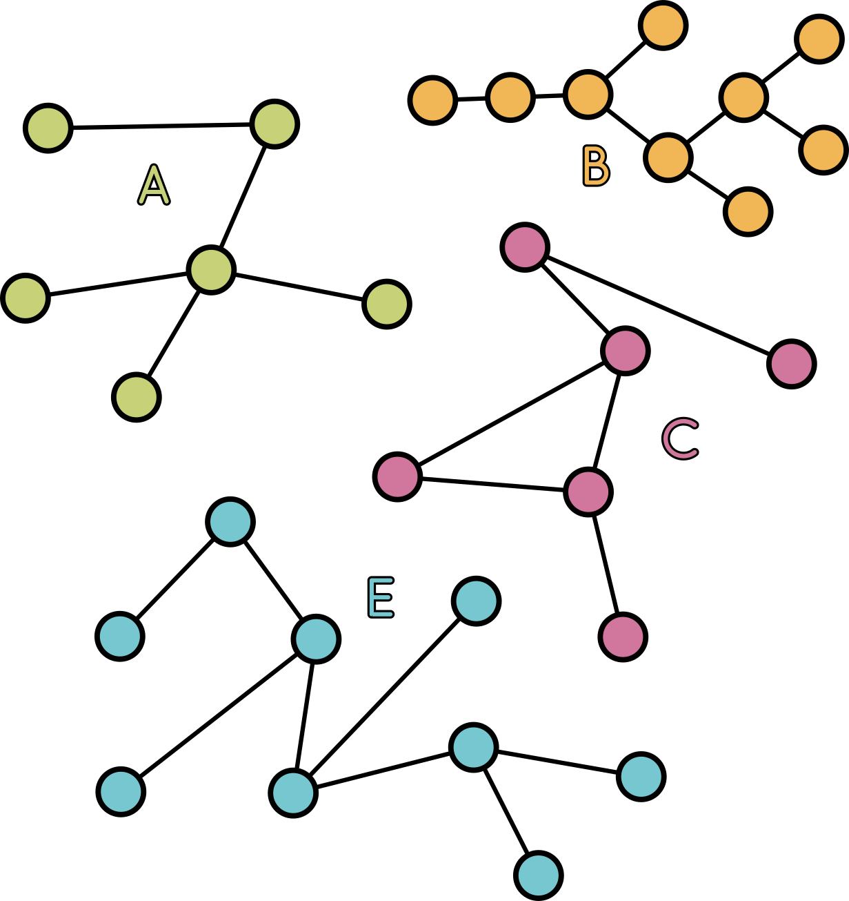

Les arbres binaires forment une structure de données qui peut se définir de façon récursive. Ainsi, un arbre binaire est :

- Soit vide;
- Soit composé d’une racine et d’une paire d’arbres binaires, appelés sous-arbres gauche et droit.

Un arbre binaire peut être parcouru en largeur ou en profondeur. Le parcours en profondeur peut être de type infixe, préfixe ou suffixe.

#### Parcours en largeur

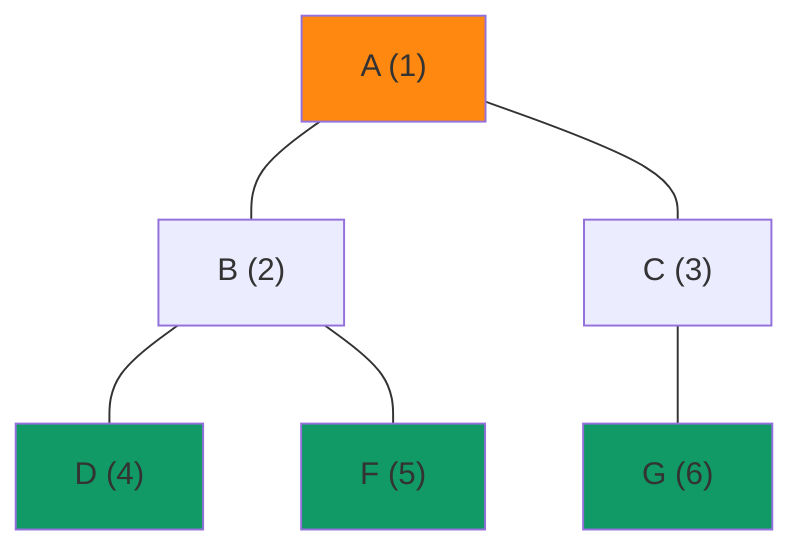

---

<p class="center-p"> Schema du parcours en largeur.</p>

#### Parcours en profondeur

Il existe trois façon de parcourir en profondeur un arbre. En suivant le chemin bleu dans la figure ci-dessous, on passe par chaque nœud 3 fois. On peut alors noter un nœud la première (préfixe), la deuxième (infixe) ou la troisième fois (suffixe) que l'on croise le nœud. Notez que pour cela, nous avons représenter les feuilles fantômes avec des liens qui ne sont liés à aucun nœuds.

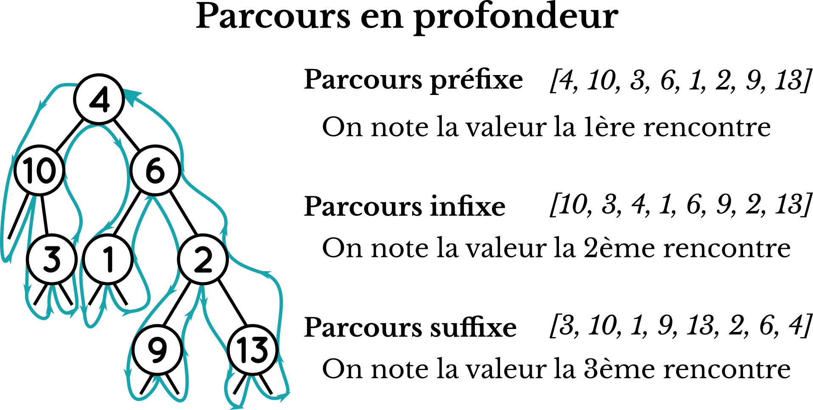

<p class="center-p"> Schéma des parcours en profondeur d'un arbre binaire. </p>

---

##### Prefixe

1. Visite du nœud
1. Parcours branche gauche
1. Parcours branche droite

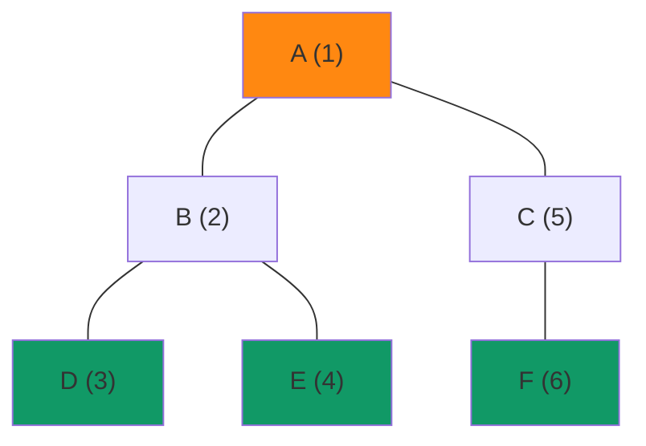

---

<p class="center-p"> Schéma du parcours en profondeur de type infixe.</p>

##### Ordre Infixe

1. Parcours branche gauche
1. Visite du nœud
1. Parcours branche droite


---

<p class="center-p"> Schema du parcours en profondeur de type infixe.</p>

##### Suffixe

1. Parcours branche gauche
1. Parcours branche droite
1. Visite du nœud


---

<p class="center-p"> Schéma du parcours en profondeur de type suffixe.</p>

?> Décrire le parcours en hauteur, en profondeur infixe, prefixe et suffixe de l'arbre binaire ci-dessous.

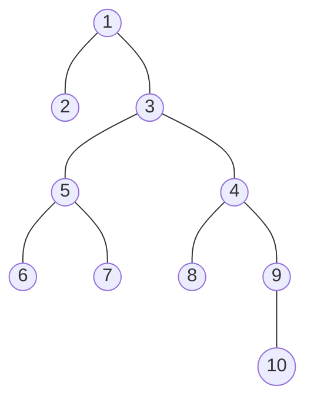

<div class="nutshell">

Un arbre peut être parcouru de 4 façon différentes :

- en largeur
- en profondeur
  - dans un ordre préfixe
  - dans un ordre infixe
  - dans un ordre suffixe

</div>

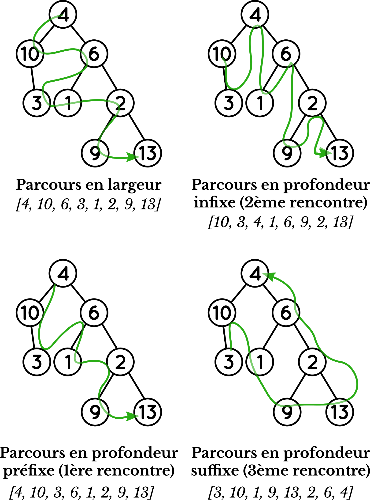

<p class="center-p"> Schéma des parcours d'un arbre binaire. </p>

---

### Implémentation d'un arbre binaire en python

Une implémentation d'arbres binaires doit permettre un certain nombre d'opération :

- Construire un arbre vide
- Tester si un arbre est vide
- Construire un arbre à partir d’un entier et de deux sous-arbres gauche et droit
- Accèder à la racine d’un arbre
- Accèder au sous-arbre gauche et au sous-arbre droit

```python
class Noeud:
    def __init__(self, valeur, gauche, droit):
        self.n = valeur
        self.g = gauche 
        self.d = droit

class ArbreBinaire: 
    def __init__(self, c):
        self.r = c
    def creeVide():
        return ArbreBinaire(None)
    def creeNGD(valeur, gauche = None, droit = None):
        return ArbreBinaire(Noeud(valeur, gauche, droit))
    def estVide(self):
        return self.r is None
    def racine(self):
        assert not(self.r is None), 'Arbre vide'
        return self.r.n
    def filsGauche(self): 
        assert not(self.r is None), 'Arbre vide'
        return self.r.g 
    def filsDroit(self): 
        assert not(self.r is None), 'Arbre vide'
        return self.r.d
```

?> À partir du pseudo-code ci-dessous, écrire une méthode qui permet de calculer la taille de l'arbre et une méthode qui calcul sa hauteur.

```pseudo code
# Calcul de la taille de façon récursive : retourne le nombre de sommets (racine + nœuds + feuilles)

taille(arbre):
    Si arbre est vide 
        Retourner 0 
    Sinon 
        Retourner 1 + taille (fils gauche) + taille (fils droit)

# Calcul de la hauteur de façon récursive

hauteur(arbre):
    Si arbre est vide
        Retourner 0 
    Sinon 
        Retourner 1 + max(hauteur (fils gauche), hauteur(fils droit))
```

### Arbres binaires de recherche

Un arbre binaire de recherche (ABR), est un arbre binaire étiqueté (c'est à dire que les nœuds ont des valeurs) que l'on utilise pour trier des données afin de faire des recherches. Il a la particularité suivante : pour  tout  nœud A,  tous  les  nœuds  situés  dans  le  sous-arbre  gauche de A ont  une  valeur  inférieur ou égale à celle de A, et tous les nœuds situés dans le sous-arbre droit ont une valeur supérieure ou égale à celle de A.

!> Voici 4 arbres, quels sont les arbres binaires de recherche.

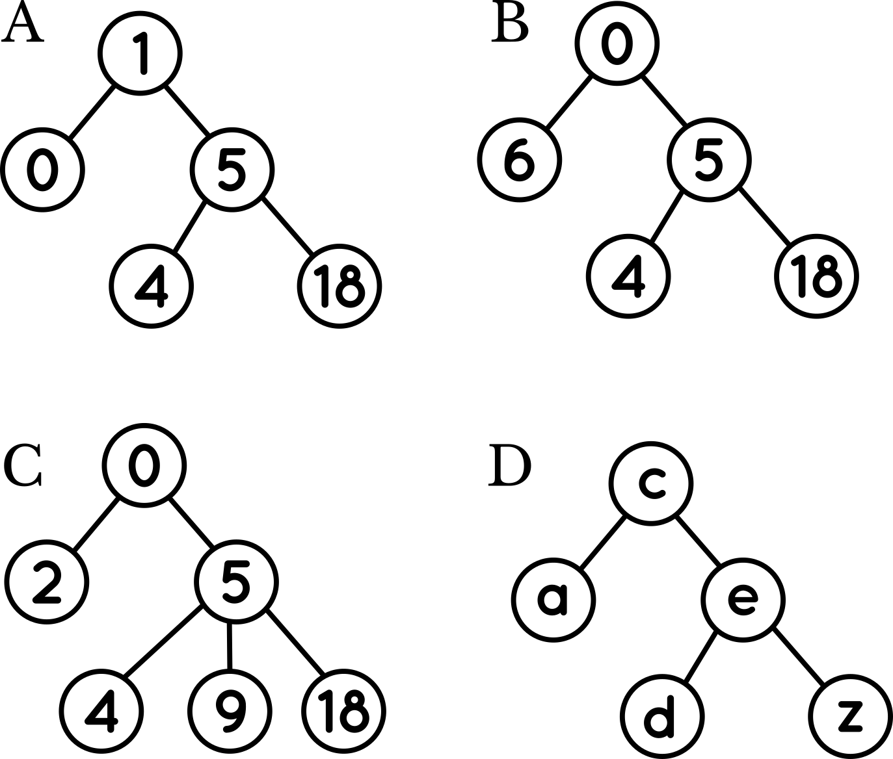

<p class="center-p"> Différents arbres, lesquels sont des ABR? </p>

---

<details class="advanced_level">
<summary> <strong> Niveau avancé :</strong></summary>

Il existe une bibliothèque python pour explorer les Arbres binaire : [binarytree](https://github.com/joowani/binarytree)

</details>

<https://isn-icn-ljm.pagesperso-orange.fr/basthon-notebook/?from=https://isn-icn-ljm.pagesperso-orange.fr/notebook/ABR.ipynb>

### Autres structures arborescentes

<!--  !> To complete later -->

Il existe d'autres structures arborescentes en informatique. Une **arborescence** est un ensemble de nœuds qui sont organisés. Un des nœuds constitue la racine de l'arborescence et cette racine est relié aux racines des arborescences que l'on appelle ses fils (le nombre de fils est indéfini). On est typiquement dans une définition récursive de la structure.

Les documents XML (eXtensible Markup Language) et JSON (JavaScript Notation Object) sont deux exemples d'utilisation de la structure arborescente très utilisé en informatique.

## Graphe

Un arbre est un type particulier de graphe, mais tous les graphes ne sont pas des arbres.

!> To do later

<https://isn-icn-ljm.pagesperso-orange.fr/NSI-TLE/co/section_chapitre4.html>

### Définition d'un graphe

### Parcours en profondeurs et en largeur

## Diviser pour régner

!> TO DO (work in progress)

Lire le cours et regarder la vidéo :
<https://isn-icn-ljm.pagesperso-orange.fr/NSI-TLE/co/section_chapitre6.html>

Faire le TP
<https://isn-icn-ljm.pagesperso-orange.fr/NSI-TLE/res/res_recherche.pdf>

## Programmation dynamique

!> To do later

<https://isn-icn-ljm.pagesperso-orange.fr/NSI-TLE/co/section_chapitre6.html>

## Recherche textuelle

?> Faire le TD sur l'algorithme de Boyer-Moore (modifié de Stéphan Van Zuijlen (CC-BY-NC)).

!> To do later

## Calculabilité/décidabilité

?> Lire le [chapitre 0](https://isn-icn-ljm.pagesperso-orange.fr/NSI-TLE/co/section_chapitre0.html) de Stéphan Van Zuijlen. Expliquer en deux phrases la notion de décidabilité.

!> To do later
