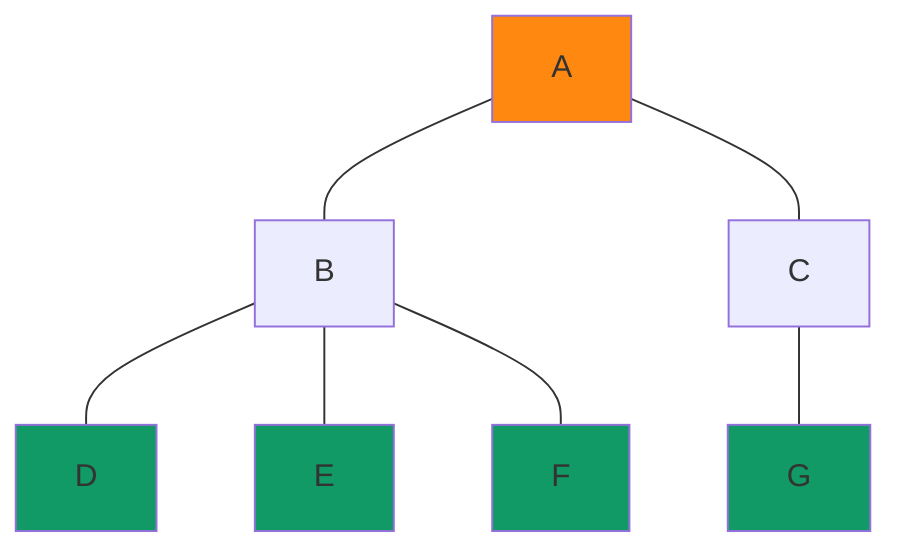
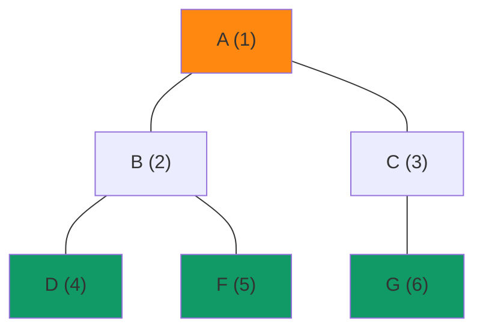
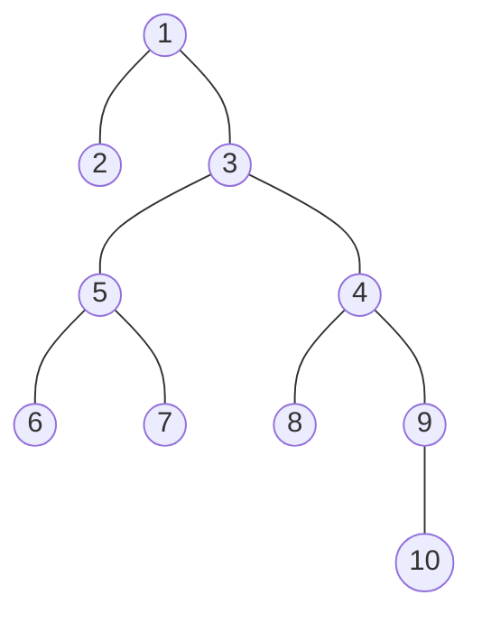

#  Algorithmique <span onclick="window.print()" class="pdf-link"> :fa fa-file-pdf:</span>

!> !! Work in progress !!

!> Réviser le [programme de première](../premiere/types_construits.md) sur les types construits.

## Liste 

https://isn-icn-ljm.pagesperso-orange.fr/NSI-TLE/res/res_listes.pdf

https://pixees.fr/informatiquelycee/term/c5c.html


!> Attention, les listes Python sont en fait des tableaux dynamiques. On parle ici du type abstrait de liste.

Une liste est une structure de données permettant de regrouper des données. Une liste est composée de 2 parties : sa **tête** (souvent notée ***car*** pour : *contents of address register*), qui correspond au dernier élément ajouté à la liste, et sa **queue** (souvent notée ***cdr*** pour *contents of decrement register*) qui correspond au reste de la liste. Voici les opérations qui peuvent être effectuées sur une liste :

- **obtenir une liste vide** (on appelle souvent une liste vide ***nil***)
- **tester si une liste est vide** 
- **obtenir le tête** de la liste (car)
- **obtenir la queue** de la liste (cdr)
- **construire une liste** à partir d'un élément et d'un autre liste (cons)


<p class="center-p"> Schéma d'une liste comprtant les valeurs 1, 2 et 4 dans cet ordre.</p>

---


## Listes chaînées

!> Work in progress

https://isn-icn-ljm.pagesperso-orange.fr/NSI-TLE/res/res_listes.pdf

https://isn-icn-ljm.pagesperso-orange.fr/basthon-notebook/?from=https://isn-icn-ljm.pagesperso-orange.fr/notebook/listes_cha%C3%AEn%C3%A9e_TD.ipynb


https://pixees.fr/informatiquelycee/term/c5c.html

    Les listes, les piles ou les files sont des "vues de l'esprit" présentes uniquement dans la tête des informaticiens, on dit que ce sont des types abstraits de données (ou plus simplement des types abstraits). L'implémentation de ces types abstraits, afin qu'ils soient utilisables par une machine, est loin d'être une chose triviale. L'implémentation d'un type de données dépend du langage de programmation. Il faut, quel que soit le langage utilisé, que le programmeur retrouve les fonctions qui ont été définies pour le type abstrait (pour les listes, les piles et les files cela correspond aux fonctions définies ci-dessus).

    Pour implémenter les listes (ou les piles et les files), beaucoup de langages de programmation utilisent 2 structures : les tableaux et les listes chaînées.


## Piles et files

Il existe deux structures de données très utilisées en informatiques : les files (aussi appelé FIFO pour *First In First Out*) et les piles (aussi appelé LIFO pour *Last In First Out*). Ces structures sont des types particuliers de liste. On peut d'ailleurs facilement utiliser les listes pythons comme des piles ou des files (voir la [documentation python](https://docs.python.org/fr/3/tutorial/datastructures.html#using-lists-as-stacks) en français) 


<p class="center-p"> Comparaison des structures <b>File</b> et <b>Pile</b>.</p>

---


### Piles

Une pile (LIFO pour *Last In First Out*) est une façon de structurer des données qui est très utilisée en informatique. Par exemple, des cartons de déménagement qu'on empile forme une pile. Le dernier carton arrivé (Last In) sur le tas est le premier à être enlever. 
En informatique, on utilise par exemple les piles dans les piles d'appels de fonctions ou encore pour parcourir des graphes.

On peut lister quelques opérations courantes sur les piles :

- la création d’une pile,

- l'empilement d’un élément sur une pile,

- le dépilement d’une pile,

- la consultation du sommet d’une pile.

### files

Une file (FIFO pour *First In First Out*) est une structure dans laquelle les premiers éléments arrivés sont les premiers à sortir. Une file ressemble à une file d'attente à la boulangerie, le premier arrivé devant la porte sera le premier servi. En informatique, on utilise les files,  


##  Dictionnaires

https://pixees.fr/informatiquelycee/term/c6c.html


## Structure de données

Distinguer interface et implémentation 

!> Work in progress


## Structures en arbres

!> Work in progress

En informatique, un **arbre** est une **structure de données** composés de **noeuds** reliés entre eux par des **branches**. Les arbres généalogiques en sont une illustration. Il y a une seul règle pour un arbre : il ne doit pas y avoir deux chemins possibles entre deux noeuds; autrement dit il ne doit **pas** y avoir **de cycle dans un arbre** (dans ce cas on parle de graphe).

Ces structures en arbres sont caractérisés par un ensemble de mots de vocabulaire importants : 
Un **arbre** est constitué de **noeuds** reliés par des branches. Un des noeud est appelé **racine** et les noeuds qui sont à l'opposé de la racine sont des **feuilles**. Un noeud peut être caractérisé par sa distance à la racine que l'on apelle **hauteur** (= **profondeur**) et par le nombre de fils qu'il a que l'on apelle **degré**. La **hauteur d'un arbre** correspond à la hauteur du noeud le plus haut. De même **le degré d'un arbre** correspond à la valeur de degré du noeud ayant le plus grand degré. Enfin la taille d'un arbre se calcul en comptant le nombre de noeuds sur cette arbre. On emprunte le **vocabulaire à la généalogie** pour décrire les relations entre noeuds on parle de noeuds parents, frères, ascendants, descendants, ancêtres.


<div style="margin:auto">



---

<p class="center-p"> Schema d'un arbre avec la racine en orange et les feuilles en vert.</p>


!> https://isn-icn-ljm.pagesperso-orange.fr/NSI-TLE/co/section_chapitre3.html


###  Arbres binaires

Un arbre binaire est un arbre de degré 2 (dont les noeuds sont de degré 2 au maximum). On appelle les 2 noeuds descendants d'un noeud parents fils gauche et fils droit. On peut décomposer un arbre binaire de façon récursive en le divisant en sous-arbre gauche et sous arbre droit. 

#### Parcours en largeur




---

<p class="center-p"> Schema du parcours en largeur.</p>

#### Parcours en profondeur


##### Infixe
Ordre infixe

    Parcours branche gauche
    Visite du nœud
    Parcours branche droite


```mermaid
flowchart TD
  flowchart TD
    A["A (1)"]:::racine --- B["B (2)"]
    A --- C["C (5)"]
    B --- D["D (3)"]:::feuille
    B --- F["F (4)"]:::feuille
    C --- G["G (6)"]:::feuille

    classDef racine fill:#f81;
    classDef feuille fill:#196;

```

---

<p class="center-p"> Schema du parcours en longeur de type infixe.</p>

##### Prefixe

```mermaid
flowchart TD
  flowchart TD
    A["A (1)"]:::racine --- B["B (2)"]
    A --- C["C (6)"]
    B --- D["D (3)"]:::feuille
    B --- E["E (4)"]:::feuille
    B --- F["F (5)"]:::feuille
    C --- G["G (7)"]:::feuille

    classDef racine fill:#f81;
    classDef feuille fill:#196;

```

---

<p class="center-p"> Schema du parcours en longeur de type infixe.</p>

##### Suffixe


?> Décrire le parcours en hauteur, en profondeur infixe, prefixe et suffixe de l'arbre binaire ci-dessous.




###  Arbres binaires de recherche

### Autres structures arborescentes

## Graphe

Un arbre est un type particulier de graphe, mais tous les graphes ne sont pas des arbres.

!> Work in progress

https://isn-icn-ljm.pagesperso-orange.fr/NSI-TLE/co/section_chapitre4.html

### Définition d'un graphe

### Parcours en profondeurs et en largeur

## Diviser pour régner

!> !! Work in progress

https://isn-icn-ljm.pagesperso-orange.fr/NSI-TLE/co/section_chapitre6.html


## Programmation dynamique

!> Work in progress

https://isn-icn-ljm.pagesperso-orange.fr/NSI-TLE/co/section_chapitre6.html

## Recherche textuelle

?> Faire le TD sur l'algorithme de Boyer-Moore (modifié de Stéphan Van Zuijlen (CC-BY-NC)).

## Calculabilité/décidabilité

?> Lire le [chapitre 0](https://isn-icn-ljm.pagesperso-orange.fr/NSI-TLE/co/section_chapitre0.html) de Stéphan Van Zuijlen. Expliquer en deux phrases la notion de décidabilité.
