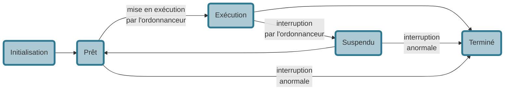

# Architecture materiel, OS et réseaux <span onclick="window.print()" class="pdf-link"> :fa fa-file-pdf:</span>

!> !! Work in progress !!


---

<p class="center-p">

**Understanding computer technology**.
_Sources : Première [version](http://usuarios.arnet.com.ar/ngiunta/pages/EQUIPAMIENTO.htm) en italien, deuxième [version](https://www.owensworld.com/funny-pictures/computers-web/computer-technology) (en anglais). Sources retrouvées grâce à [tineye](https://tineye.com/) qui permet la recherche inversée de photo._

</p>

!> Réviser le [programme de premiere](../premiere/archi_OS.md).

## Circuits intégrés

### Les ordinateurs « classiques »

Le processeur (**CPU** pour _Central Processing Unit_) d'un ordinateur s'occupe des calculs principaux, par exemple pour faire tourner le système d'exploitation et les logiciels. Sa rapidité dépend principalement de sa fréquence (nombre d'instructions traitées à la seconde) et de son nombre de cœur (plusieurs cœurs permettent des calculs en parallèle).

Le processeur graphique (**GPU** pour _Graphical Processing Unit_) assure les calculs pour l'affichages des images. La **carte-mère** relie entre eux tous les composants. Mais ce système classique d'organisation des PC n'est pas le seul. Il coexiste avec :

- **les microcontrôleurs** (très faible puissance de calcul), que l'on utilise tout les jours dans notre électroménager et les transports,
- **les systèmes sur puces** (aussi appelés nano-ordinateurs) qui sont essentiels au fonctionnement de nos téléphones.

### Microcontrôleur

<div class="img-flow" style="max-width:150px;">


**Microcontrôleur** Raspberry pico. [Source](https://www.raspberrypi.org/blog/raspberry-pi-pico-what-did-you-think/)

</div>

La miniaturisation des circuits intégrées a permit l'avènement des microcontrôleurs. Les microcontrôleurs sont des circuits intégrés regroupant sur quelques $cm^2$ un microprocesseur peu puissant, de la mémoire, des ports d'entrées-sorties, des périphériques et des bus de communication. Les microcontrôleurs ont des capacités de calcul et de mémoire très faibles. En revanche, son coût et sa consommation d'energie sont très faibles. On les utilise dans des systèmes informatiques embarqués (voiture, avion, lave linge, montre connectée...).

<div class="img-flow-l" style="max-width:170px;">

<p><a href="https://commons.wikimedia.org/wiki/File:Architecture_Harvard.png#/media/File:Architecture_Harvard.png"></a> <strong>Architecture de Harvard.</strong> <a href="https://creativecommons.org/licenses/by-sa/1.0" title="Creative Commons Attribution-Share Alike 1.0">CC BY-SA 1.0</a>, <a href="https://commons.wikimedia.org/w/index.php?curid=19215968"><i class="fab fa-wikipedia-w"></i></a></p>

</div>

Les microcontrôleurs reposent souvent sur l'**architecture de Harvard** (car inventé à l'université d'Harvard). Dans cette architecture, la mémoire des programmes est dissocié physiquement de la mémoire des données. L'Unité Arithmétique et Logique (UAL) communique avec les deux types de mémoire grâce à deux bus distincts. Cela permet un accès simultanée aux données et aux programmes ce qui accélère le processus mais complexifie l'architecture. Autrement dit l’architecture de type von Neumann (vu en [première](../premiere/archi_OS.md)) s’oppose à celle de Harvard car elle utilise une unique structure pour stocker à la fois le programme et les données. L'architecture de Harvard peut donc se montrer plus rapide que l'architecture de von Neumann au prix d'une complexité accrue de la structure.

### Système sur puce (SoC)

Dans un ordinateur de bureau ou dans des serveurs, le processeur (CPU) ainsi que les différentes **cartes** (carte son, carte graphique (GPU), carte réseau) et les **mémoires** (vives et statiques) sont interconnectés à l'aide d'un **bus** et branchées sur la **carte mère**.

<div class="img-flow" style="max-width:300px;">
<p><a href="https://commons.wikimedia.org/wiki/File:Raspberry_Pi_3_B%2B_(39906369025).png#/media/File:Raspberry_Pi_3_B+_(39906369025).png"></a> <strong>Systèmes sur puce </strong>: le Raspberry pi 3 B+ <a href="https://creativecommons.org/licenses/by-sa/2.0" title="Creative Commons Attribution-Share Alike 2.0">CC BY-SA 2.0</a>, <a href="https://commons.wikimedia.org/w/index.php?curid=67384207"><i class="fab fa-wikipedia-w"></i></a></p>
</div>

Les **systèmes sur puce** (abréviation SoC pour _system on a chip_) et un système informatique complet comprenant l'ensemble des composants d'un ordinateur (CPU, cartes, mémoires, capteurs...). Ces SoC sont très économes en energie et miniatures ce qui explique leur présence dans les smartphones, les nano-ordinateurs (par ex. les [Rasperry Pi](https://fr.wikipedia.org/wiki/Raspberry_Pi)) et certaines consoles de jeux. Le CPU des SoC consommant moins d'energie, il chauffe moins et permet donc de s'affranchir de la présence d'un ventilateur.
La distance réduite entre les composant permet également une circulation plus rapide de l'information.

Le principal inconvénient des SoC est l'impossibilité de mettre à jour une partie de la puce. Si on veux améliorer une partie seulement de son matériel (par ex. changer la GPU pour jouer à de nouveaux jeux), il faut changer toute la puce.

| Type                 | microcontrôleur                                                                | SoC                                                                            |
| -------------------- | ------------------------------------------------------------------------------ | ------------------------------------------------------------------------------ |
| Nom                  | Raspberry Pi pico                                                              | Raspberry Pi 3 Model B+                                                        |
| Consommation de base | 8,50 mA ([source](https://datasheets.raspberrypi.org/pico/pico-datasheet.pdf)) | 350 mA ([source](https://www.pidramble.com/wiki/benchmarks/power-consumption)) |
| Mémoire vive         | 264KB                                                                          | 1GB                                                                            |
| Mémoire flash inclus | 2MB                                                                            | aucune (étendable)                                                             |
| Taille               | 21x51mm                                                                        | 56x85mm                                                                        |
| Prix                 | 4                                                                              | 30                                                                             |

---

<p class="center-p"> <strong> Tableau de comparaison d'un microcontrôleur et d'un Soc.</strong> </p>


---

<p class="center-p"> <strong> Composition du Raspberry pi 4.</strong> <a href="https://creativecommons.org/licenses/by-sa/4.0" title="Creative Commons Attribution-Share Alike 4.0">CC BY-SA 4.0</a>, <a href="https://commons.wikimedia.org/w/index.php?curid=83463602"><i class="fab fa-wikipedia-w"></i></a></p>

---

## Gestion des processus et des ressources

Un **programme informatique** est une description statique d'une tâche. C'est en quelque sorte une recette de cuisine. Un **processus** est une instance d'une tâche en cours d'exécution, c'est la réalisation de la recette de cuisine. La réalisation (le processus) dépend de la recette (du programme) mais également du cuisinier. Ce cuisinier c'est le système d'exploitation qui le fournit. Un **_thread_** (tâche) est une suite d'instruction au sein d'un processus. On les appelles également _processus léger_. La différence fondamentale entre processus et _thread_ est que les processus ne partagent pas leur mémoire alors que les threads d'un même processus peuvent accéder aux variables globales.

### L'ordonnanceur

<div class="img-flow" style="max-width:270px;">
<p class="center-p"><a href="https://commons.wikimedia.org/wiki/File:Diagramme_etat_processus.svg#/media/Fichier:Diagramme_etat_processus.svg"></a>Diagramme état-transition suivi par les processus des systèmes d'exploitation modernes. Domaine public, <a href="https://commons.wikimedia.org/w/index.php?curid=9559518"><i class="fab fa-wikipedia-w"></i></a></p>
</div>

Pour gérer les différents processus en cours sur un ordinateur, il faut un « chef d'orchestre » qui va nommer les processus (les tâches), et décider de l'ordre d'exécution. Lors de la création d'un nouveau processus, il sera identifié par un numéro propre (PID), le numéro du processus père (PPID) et par l'identifiant de l'utilisateur qui a lancé ce processus (UID). Chaque processus se verra allouer de la mémoire virtuelle qui stockera le code du programme à exécuter, les variables (globales, et locales sous formes d'une pile) et les bibliothèques si nécessaire.

Tous les programmes listés précédemment par la commande top semble s'exécuter en même temps. Pourtant on sait que notre ordinateur est limité par le nombre de processeur pour effectuer des calculs. Comment le processeur peux exécuter autant d'instruction en même temps? Cette **exécution concurrente** est rendu possible par les systèmes d'exploitation **multitâches** (tout les OS modernes le sont) qui utilise un **ordonnanceur de processus**.

L'**ordonnanceur** du système d'exploitation va définir les **états** de chaque processus. Les états les plus courants sont :

- Initialisation (processus en cours de création)
- Prêt (= en attente; processus prêt à s'exécuter)
- Exécution (processus en cours d'exécution)
- Bloqué (processus en pause, par ex. quand il attend une réponse de l'utilisateur ou d'un autre processus)
- Terminé



<p class="center-p"><strong>Schéma des états de processus</strong> les plus courants.</p>

---

En tant normal, l'état des processus variera entre prêt, en attente et en exécution. L'ordonnanceur suspend (très) régulièrement les processus pour allouer de la ressource à d'autres processus. Ainsi, plusieurs tâches s'exécutent les une à la suite des autres, mais tellement rapidement qu'on a l'impression que les processus s'exécutent simultanément. On parle de _pseudo-parallélisme_. Le terme de **calcul parallèle** est reservé au processus qui s'exécute sur deux processeurs différents.

Dans certains cas il existe des situations d'interblocage (_deadlock_ en anglais). Cela se produit quand deux processus concurrents s'attendent mutuellement. Par exemple supposons un système possédant les ressources (au sens de ressource informatique) R1 et R2 et avec les processus A et B en cours d'exécution, il y a interblocage dans le cas suivant :

- Le processus A réserve la ressource R1
- Le processus B réserve la ressource R2
- Le processus A demande la ressource R2, et tombe en attente (sans libérer la ressource R1);
- Le processus B demande la ressource R1, et tombe en attente;

Il existe des solutions pour éviter et résoudre ces interblocages qui ne sont pas au programme. Si cela vous intéresse vous pouvez visiter le [site](http://www.uqac.ca/pguerin/8INF341/Cours9_Interblocage.html) de Patrice Guérin de l'UQAC.

### Gestion des processus sous Unix

Sous linux les commandes <a href="https://debian-facile.org/doc:systeme\:ps">ps</a> et <a href="https://debian-facile.org/doc:systeme\:top">top</a> permettent d'avoir accès aux processus en cours et à leurs caractéristiques.

```bash
ps -aef
top
```

?> **Exercice 1** : sur votre ordinateur, lancer firefox puis trouver le PID et le PPID du processus. Avec la commande _kill_, tuer le processus firefox. Est-il toujours présent dans la liste des processus?

## Protocoles de routage

?> Regarder la <a href='https://www.youtube.com/watch?v=dz7Ntp7KQGA' target="_blank" rel=noopener>vidéo</a> suivante qui fait un petit rappel du programme de seconde.

?> Relire la partie sur [internet](https://adrientaudiere.github.io/cours_nsi/#/premiere/IHM#internet-un-protocole-pour-communiquer-dans-un-réseau-informatique-globale) et particulièrement sur les protocoles IP et TCP.

### Routeurs et topologie

Les ordinateurs reliés à internet forment des réseaux de réseaux dont les sommets sont de deux types : des ordinateurs et des **routeurs**. Les routeurs sont des machines dont le rôle est de relayer les paquets d'information dans le réseau internet. Les liens entre les ordinateurs et les routeurs sont établis par des switchs. Les routeurs sont également reliés entre eux. Mais comment les routeurs et les switchs savent à qui transférer les informations?

La première solution consiste à centraliser les informations du réseau vers un ordinateur qui peut alors prendre les meilleurs décisions. Dans le cas des très petits réseaux, on peut même utilisé un routage pré-établis par l'administrateur·ice, c'est le routage statique (sans calcul). Mais cette solution centralisée est très gourmande en information dès lors que le réseau devient grand. La deuxième solution est une solution distribuée (on dit aussi décentralisée) et dynamique (l'administrateur·ice ne). Chaque routeur va entretenir une table de routage qui lui permettra d'avoir des informations sur quels voisins contacter lorsqu'il veux atteindre tel machine. Une table de routage stocke les noms des destinations, le moyen de l'atteindre et la distance à la destination. Les routeurs dynamiques sont plus complexes à mettre en place mais sont plus facile à maintenir. De plus, les protocoles utilisés permettent de recalculer des chemins lorsque certains routeurs sont en pannes.

| Réseau destination | Moyen de l'atteindre | Distance |
| ------------------ | -------------------- | -------- |
| 127.0.0.0/8        | 127.0.0.1            | 1        |
| 192.168.0.0/24     | 192.168.0.100        | 4        |

---

<p class="center-p">

Exemple d'une table de routage simplifiée. Dans les table de routage, le moyen d'atteindre la destination est plus détaillé que ça. En particulier, des masques de sous réseaux ([:fab fa-wikipedia-w:](https://fr.wikipedia.org/wiki/Sous-r%C3%A9seau)) permettent d'assigner un ensemble de nœuds du réseau à un même sous réseau. Cela facilite la gestion des paquets entre des régions très distantes sur le réseau.

</p>

?> Lancer la commande `ip route` dans votre terminal Linux. À l'aide de recherche en ligne si besoin, décrire le résultat de cette commande.

> Par **analogie**, le **routeur** peut être vu comme un **bureau de poste**. Les courriers représentent les paquets de données qui transitent dans le réseau. Le bureau de poste établie vers quelle bureau de poste plus proche de la destination il doit envoyer le courrier. Ainsi, pour filer l'analogie, vous postez une lettre à Saint-Hippolyte-du-Fort à destination de Montretout dans les Hauts-de-Seine. Le bureau de poste de St Hippolyte ferait transiter cette lettre par Montpellier qui lui est recommandé pour les destinations hors de sa région. Puis le bureau de poste de Montpellier, en regardant sa « table de routage » ferait suivre au bureau de poste de Paris qui pourrait enfin livrer la lettre à Montretout.

Une fois que l'on a compris le rôle des routeurs, il reste à expliquer comment les routeurs choisissent les « meilleurs » chemins dans le réseau.
C'est le rôle des protocoles de routages qui utilisent des algorithmes issus de la théorie de graphes. Nous allons voir deux protocoles courant le **RIP** (Routing Information Protocol) et l'**OSPF** (Open Shortest Path First).

### Protocole RIP (Routing Information Protocol)

Dans le protocole **RIP** (Routing Information Protocol), les **routeurs s'envoient périodiquement des messages** entre voisins. Ces messages contiennent **la liste de tous les réseaux connus** par le routeur. Les routeurs voisins peuvent ainsi **mettre à jour régulièrement leur table de routage** puis transmettrons ces changement lors de l'envoie des messages périodiques. La métrique de distance utilisée par le protocole RIP est simple : il suffit de compter le **nombre de pas** dans le réseau entre le routeur et la destination, c'est à dire le nombre de routeur traversé.

Pour calculer les plus courts chemins dans un graphe, le protocole RIP utilise l'algorithme de **Bellman-Ford**. Le problème du protocole RIP sur des gros réseaux est que le nombre d'information que doivent s'envoyer les routeurs est très importants, surtout si on a des tables de routage avec beaucoup d'entrée, ce qui est important si on veux fluidifier le traffic de paquets.

?> Faire les activités (_À faire vous-même_) du document protocoles de routage sur [pixees](https://pixees.fr/informatiquelycee/n_site/nsi_term_archi_routage.html).

### Protocole OSPF (Open Shortest Path First)

Le protocole **OSPF** (Open Shortest Path First) repose aussi sur l'**échanges d'informations entre les routeurs**, mais de façon plus parcimonieuse que dans le protocole RIP. La principale différence qu'il faut retenir entre ces deux protocoles et la manière de **calculer les distances entre les nœuds** du réseau. Le protocole OSPF ne se base pas sur le nombre de saut mais sur le coût effectif de la route. Pour cela, le protocole OSPF calcul les **débits** entre les routeurs. Lorsqu'un chemin entre deux routeurs empruntent des liaisons à fort débits le coût de la route sera faible. Donc la distance calculée sera faible et ce chemin sera privilégié. À l'inverse, lorsque les liaisons entre deux routeurs ont des faibles débits, leur distance calculé dans la table de routage est forte et donc ce chemin ne sera pas privilégié. Le protocole OSPF repose sur l'**algorithme de Dijkstra** pour calculer le chemin le plus court.

Ce protocole a également l'avantage de s'appuyer sur les débits réels et non sur un nombre de routeur. Ainsi, si une liaison entre deux routeurs directement reliés est très lente, alors qu'une liaison via un troisième routeur est plus rapide, le protocole OSPF choisira le chemin le plus rapide au contraire du protocole RIP. C'est d'autant plus important que les débits au sein d'un réseau sont aujourd'hui très variables selon les liaisons.

> RIP c'est un peu une application GPS qui vous ferez passer par une petite route de montagne pour vous faire gagner du temps car elle ne sait pas prendre en compte la différence entre une route de montagne et une autoroute. Le problème c'est que notre GPS RIP fait l'hypothèse que la distance de trajet est suffisante pour estimer le temps de trajet. Au contraire, OSPF est une application qui sait que passer par l'autoroute prend tant de temps et que c'est plus rapide que par la route de montagne.

<details class="advanced_level">
<summary> <strong> Niveau avancé :</strong></summary>

- Une suite de [vidéos](https://www.youtube.com/watch?v=e3I4opl8EH4&list=PLjXls-kqM6JDyMO3Llm5olS_U2I_P6OHG) qui reprend tout les concepts de routage vu en cours.

</details>

### Commande UNIX de gestion des protocoles

!> Work in progress

On a déjà vu la commande `ip route` qui permet d'afficher le routage statique de notre ordinateur.
Cette commande permet également de modifier notre routage, par exemple en ajoutant une route (`ip route add`).

Il existe aussi deux autres commandes UNIX très utiles pour gérer les réseaux : `ping` et `traceroute`. La commande `ping` permet de
tester l'accessibilité à une autre machine via le réseau. On donne en entrée l'IP ou l'url d'une autre machine.

?> Tester la commande suivante et trouver l'équivalent en changeant l'url par l'IP.

```bash
ping fr.wikipedia.org -c 5
```

?> À l'aide de la commande suivante (`traceroute`) trouver par quel(s) pays nos paquets passent lorsque l'on navigue sur le site français de wikipedia. Essayer la même chose avec en.wikipedia.org.

<details >
<summary> <strong> Astuce:</strong></summary>
Il faut rechercher des initiales.
</details>

```bash
traceroute fr.wikipedia.org
```

## Sécurisation des communications

!> Work in progress

<!-- https://isn-icn-ljm.pagesperso-orange.fr/NSI-TLE/res/res_chiffrage.pdf -->

---

https://www.nextinpact.com/article/24930/99777-chiffrement-notre-antiseche-pour-expliquer-a-vos-parents

https://chiffrer.info/

https://chiffrer.info/cryptris/

https://youtu.be/8BM9LPDjOw0

https://encipher.it/

    Chiffrer : il s’agit de rendre un document illisible avec une clef de chiffrement, excepté pour son destinataire
    Déchiffrer : il s’agit de rendre lisible un document chiffré, en ayant connaissance de la clef de chiffrement
    Décrypter : il s’agit de rendre lisible un document chiffré, sans avoir connaissance de la clef de chiffrement

    Cryptologie : il s’agit de la science du secret, c’est son sens étymologique. Elle regroupe plusieurs disciplines :
        La cryptographie : vise à étudier comment protéger par le chiffrement
        La cryptanalyse : vise à analyser les méthodes de chiffrement pour les casser

    Crypter : cela n’existe pas
    Chiffrage : cela existe, dans le domaine de la comptabilité ou de la musique

https://fr.wikipedia.org/wiki/Atbash

### Cryptographie symétrique

### Cryptographie asymétrique

### Authentification des participants

### Protocole HTTPS
