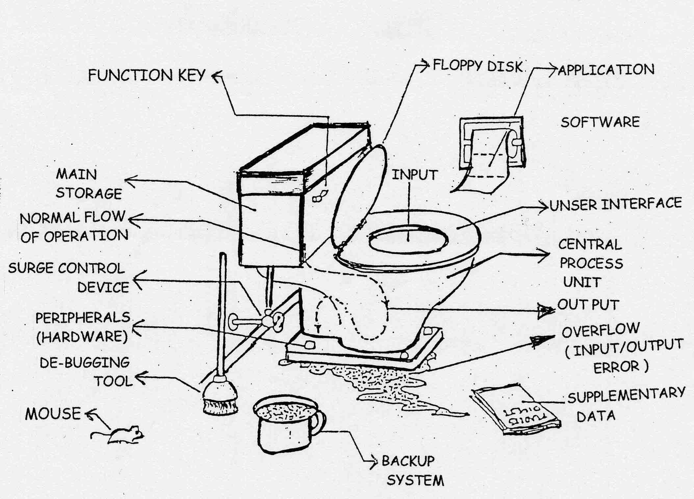
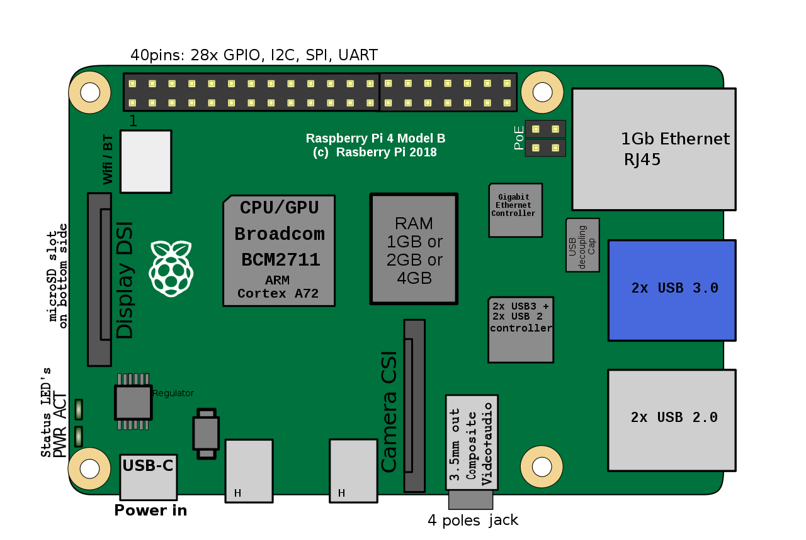
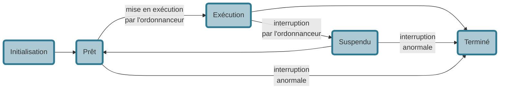
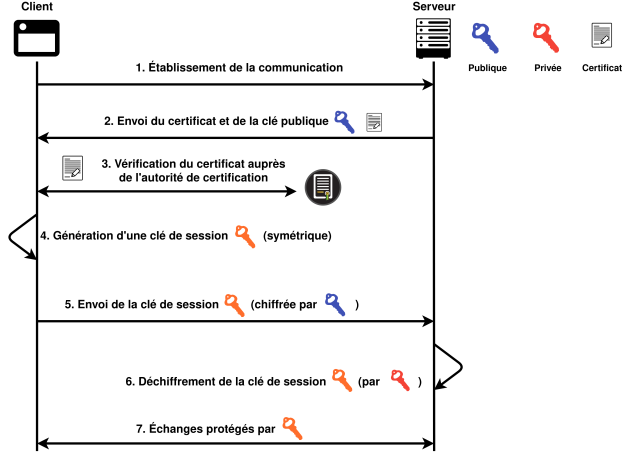

# Architecture materiel, OS et réseaux <span onclick="window.print()" class="pdf-link"> :fa fa-file-pdf:</span>



---

<!-- pdf sur la découverte des sockets avec python 
https://github.com/prologin/gcc-resources/raw/gh-pages/03_reseau.pdf 
-->

<p class="center-p">

**Understanding computer technology**.
_Sources : Première [version](http://usuarios.arnet.com.ar/ngiunta/pages/EQUIPAMIENTO.htm) en italien, deuxième [version](https://www.owensworld.com/funny-pictures/computers-web/computer-technology) (en anglais). Sources retrouvées grâce à [tineye](https://tineye.com/) qui permet la recherche inversée de photo._

</p>

!> Réviser le [programme de première](../premiere/archi_OS.md).

## Circuits intégrés

### Les ordinateurs « classiques »

Le processeur (**CPU** pour _Central Processing Unit_) d'un ordinateur s'occupe des calculs principaux, par exemple pour faire tourner le système d'exploitation et les logiciels. Sa rapidité dépend principalement de sa fréquence (nombre d'instructions traitées à la seconde) et de son nombre de cœur (plusieurs cœurs permettent des calculs en parallèle).

Le processeur graphique (**GPU** pour _Graphical Processing Unit_) assure les calculs pour l'affichages des images. La **carte-mère** relie entre eux tous les composants. Mais ce système classique d'organisation des PC n'est pas le seul. Il coexiste avec :

- **les microcontrôleurs** (très faible puissance de calcul), que l'on utilise tout les jours dans notre électroménager et les transports,
- **les systèmes sur puces** (aussi appelés nano-ordinateurs) qui sont essentiels au fonctionnement de nos téléphones.

### Microcontrôleur

<div class="img-flow" style="max-width:150px;">


**Microcontrôleur** Raspberry pico. [Source](https://www.raspberrypi.org/blog/raspberry-pi-pico-what-did-you-think/)

</div>

La miniaturisation des circuits intégrées a permit l'avènement des microcontrôleurs. Les microcontrôleurs sont des circuits intégrés regroupant sur quelques $cm^2$ un microprocesseur peu puissant, de la mémoire, des ports d'entrées-sorties, des périphériques et des bus de communication. Les microcontrôleurs ont des capacités de calcul et de mémoire très faibles. En revanche, son coût et sa consommation d'energie sont très faibles. On les utilise dans des systèmes informatiques embarqués (voiture, avion, lave linge, montre connectée...).

<div class="img-flow-l" style="max-width:170px;">

<p><a href="https://commons.wikimedia.org/wiki/File:Architecture_Harvard.png#/media/File:Architecture_Harvard.png"></a> <strong>Architecture de Harvard.</strong> <a href="https://creativecommons.org/licenses/by-sa/1.0" title="Creative Commons Attribution-Share Alike 1.0">CC BY-SA 1.0</a>, <a href="https://commons.wikimedia.org/w/index.php?curid=19215968"><i class="fab fa-wikipedia-w"></i></a></p>

</div>

Les microcontrôleurs reposent souvent sur l'**architecture de Harvard** (car inventé à l'université d'Harvard). Dans cette architecture, la mémoire des programmes est dissocié physiquement de la mémoire des données. L'Unité Arithmétique et Logique (UAL) communique avec les deux types de mémoire grâce à deux bus distincts. Cela permet un accès simultanée aux données et aux programmes ce qui accélère le processus mais complexifie l'architecture. Autrement dit l’architecture de type von Neumann (vu en [première](../premiere/archi_OS.md)) s’oppose à celle de Harvard car elle utilise une unique structure pour stocker à la fois le programme et les données. L'architecture de Harvard peut donc se montrer plus rapide que l'architecture de von Neumann au prix d'une complexité accrue de la structure.

### Système sur puce (SoC)

Dans un ordinateur de bureau ou dans des serveurs, le processeur (CPU) ainsi que les différentes **cartes** (carte son, carte graphique (GPU), carte réseau) et les **mémoires** (vives et statiques) sont interconnectés à l'aide d'un **bus** et branchées sur la **carte mère**.

<div class="img-flow" style="max-width:300px;">
<p><a href="https://commons.wikimedia.org/wiki/File:Raspberry_Pi_3_B%2B_(39906369025).png#/media/File:Raspberry_Pi_3_B+_(39906369025).png"></a> <strong>Systèmes sur puce </strong>: le Raspberry pi 3 B+ <a href="https://creativecommons.org/licenses/by-sa/2.0" title="Creative Commons Attribution-Share Alike 2.0">CC BY-SA 2.0</a>, <a href="https://commons.wikimedia.org/w/index.php?curid=67384207"><i class="fab fa-wikipedia-w"></i></a></p>
</div>

Les **systèmes sur puce** (abréviation SoC pour _system on a chip_) et un système informatique complet comprenant l'ensemble des composants d'un ordinateur (CPU, cartes, mémoires, capteurs...). Ces SoC sont très économes en energie et miniatures ce qui explique leur présence dans les smartphones, les nano-ordinateurs (par ex. les [Rasperry Pi](https://fr.wikipedia.org/wiki/Raspberry_Pi)) et certaines consoles de jeux. Le CPU des SoC consommant moins d'energie, il chauffe moins et permet donc de s'affranchir de la présence d'un ventilateur.
La distance réduite entre les composant permet également une circulation plus rapide de l'information.

Le principal inconvénient des SoC est l'impossibilité de mettre à jour une partie de la puce. Si on veux améliorer une partie seulement de son matériel (par ex. changer la GPU pour jouer à de nouveaux jeux), il faut changer toute la puce.

| Type                 | microcontrôleur                                                                | SoC                                                                            |
| -------------------- | ------------------------------------------------------------------------------ | ------------------------------------------------------------------------------ |
| Nom                  | Raspberry Pi pico                                                              | Raspberry Pi 3 Model B+                                                        |
| Consommation de base | 8,50 mA ([source](https://datasheets.raspberrypi.org/pico/pico-datasheet.pdf)) | 350 mA ([source](https://www.pidramble.com/wiki/benchmarks/power-consumption)) |
| Mémoire vive         | 264KB                                                                          | 1GB                                                                            |
| Mémoire flash inclus | 2MB                                                                            | aucune (étendable)                                                             |
| Taille               | 21x51mm                                                                        | 56x85mm                                                                        |
| Prix                 | 4                                                                              | 30                                                                             |

---

<p class="center-p"> <strong> Tableau de comparaison d'un microcontrôleur et d'un Soc.</strong> </p>



---

<p class="center-p"> <strong> Composition du Raspberry pi 4.</strong> <a href="https://creativecommons.org/licenses/by-sa/4.0" title="Creative Commons Attribution-Share Alike 4.0">CC BY-SA 4.0</a>, <a href="https://commons.wikimedia.org/w/index.php?curid=83463602"><i class="fab fa-wikipedia-w"></i></a></p>

---

## Gestion des processus et des ressources

Un **programme informatique** est une description statique d'une tâche. C'est en quelque sorte une recette de cuisine. Un **processus** est une instance d'une tâche en cours d'exécution, c'est la réalisation de la recette de cuisine. La réalisation (le processus) dépend de la recette (du programme) mais également du cuisinier. Ce cuisinier c'est le système d'exploitation qui le fournit. Un **_thread_** (tâche) est une suite d'instruction au sein d'un processus. On les appelles également _processus léger_. La différence fondamentale entre processus et _thread_ est que les processus ne partagent pas leur mémoire alors que les threads d'un même processus peuvent accéder aux variables globales.

### L'ordonnanceur

<div class="img-flow" style="max-width:270px;">
<p class="center-p"><a href="https://commons.wikimedia.org/wiki/File:Diagramme_etat_processus.svg#/media/Fichier:Diagramme_etat_processus.svg"></a>Diagramme état-transition suivi par les processus des systèmes d'exploitation modernes. Domaine public, <a href="https://commons.wikimedia.org/w/index.php?curid=9559518"><i class="fab fa-wikipedia-w"></i></a></p>
</div>

Pour gérer les différents processus en cours sur un ordinateur, il faut un « chef d'orchestre » qui va nommer les processus (les tâches), et décider de l'ordre d'exécution. Lors de la création d'un nouveau processus, il sera identifié par un numéro propre (PID), le numéro du processus père (PPID) et par l'identifiant de l'utilisateur qui a lancé ce processus (UID). Chaque processus se verra allouer de la mémoire virtuelle qui stockera le code du programme à exécuter, les variables (globales, et locales sous formes d'une pile) et les bibliothèques si nécessaire.

Tous les programmes listés précédemment par la commande top semble s'exécuter en même temps. Pourtant on sait que notre ordinateur est limité par le nombre de processeur pour effectuer des calculs. Comment le processeur peux exécuter autant d'instruction en même temps? Cette **exécution concurrente** est rendu possible par les systèmes d'exploitation **multitâches** (tout les OS modernes le sont) qui utilise un **ordonnanceur de processus**.

L'**ordonnanceur** du système d'exploitation va définir les **états** de chaque processus. Les états les plus courants sont :

- Initialisation (processus en cours de création)
- Prêt (= en attente; processus prêt à s'exécuter)
- Exécution (processus en cours d'exécution)
- Bloqué (processus en pause, par ex. quand il attend une réponse de l'utilisateur ou d'un autre processus)
- Terminé



<p class="center-p"><strong>Schéma des états de processus</strong> les plus courants.</p>

---

En tant normal, l'état des processus variera entre prêt, en attente et en exécution. L'ordonnanceur suspend (très) régulièrement les processus pour allouer de la ressource à d'autres processus. Ainsi, plusieurs tâches s'exécutent les une à la suite des autres, mais tellement rapidement qu'on a l'impression que les processus s'exécutent simultanément. On parle de _pseudo-parallélisme_. Le terme de **calcul parallèle** est réservé au processus qui s'exécute sur deux processeurs différents.

Dans certains cas il existe des situations d'interblocage (_deadlock_ en anglais). Cela se produit quand deux processus concurrents s'attendent mutuellement. Par exemple supposons un système possédant les ressources (au sens de ressource informatique) R1 et R2 et avec les processus A et B en cours d'exécution, il y a interblocage dans le cas suivant :

- Le processus A réserve la ressource R1
- Le processus B réserve la ressource R2
- Le processus A demande la ressource R2, et tombe en attente (sans libérer la ressource R1);
- Le processus B demande la ressource R1, et tombe en attente;

Il existe des solutions pour éviter et résoudre ces interblocages qui ne sont pas au programme. Si cela vous intéresse vous pouvez visiter le [site](http://www.uqac.ca/pguerin/8INF341/Cours9_Interblocage.html) de Patrice Guérin de l'UQAC.

### Gestion des processus sous Unix

Sous linux les commandes <a href="https://debian-facile.org/doc:systeme\:ps">ps</a> et <a href="https://debian-facile.org/doc:systeme\:top">top</a> permettent d'avoir accès aux processus en cours et à leurs caractéristiques.

```bash
ps -aef
top
```

?> **Exercice 1** : sur votre ordinateur, lancer firefox puis trouver le PID et le PPID du processus. Avec la commande _kill_, tuer le processus firefox. Est-il toujours présent dans la liste des processus?

## Protocoles de routage

?> Regarder la <a href='https://invidious.fdn.fr/watch?v=DI3xmtAKZJA' target="_blank" rel=noopener>vidéo</a> suivante qui fait un petit rappel du programme de seconde.

?> Relire la partie sur [internet](https://adrientaudiere.github.io/cours_nsi/#/premiere/IHM#internet-un-protocole-pour-communiquer-dans-un-réseau-informatique-globale) et particulièrement sur les protocoles IP et TCP.

### Routeurs et topologie

Les ordinateurs reliés à internet forment des réseaux de réseaux dont les sommets sont de deux types : des ordinateurs et des **routeurs**. Les routeurs sont des machines dont le rôle est de relayer les paquets d'information dans le réseau internet. Les liens entre les ordinateurs et les routeurs sont établis par des switchs. Les routeurs sont également reliés entre eux. Mais comment les routeurs et les switchs savent à qui transférer les informations?

La première solution consiste à centraliser les informations du réseau vers un ordinateur qui peut alors prendre les meilleurs décisions. Dans le cas des très petits réseaux, on peut même utilisé un routage pré-établis par l'administrateur·ice, c'est le routage statique (sans calcul). Mais cette solution centralisée est très gourmande en information dès lors que le réseau devient grand. La deuxième solution est une solution distribuée (on dit aussi décentralisée) et dynamique (l'administrateur·ice ne). Chaque routeur va entretenir une table de routage qui lui permettra d'avoir des informations sur quels voisins contacter lorsqu'il veux atteindre tel machine. Une table de routage stocke les noms des destinations, le moyen de l'atteindre et la distance à la destination. Les routeurs dynamiques sont plus complexes à mettre en place mais sont plus facile à maintenir. De plus, les protocoles utilisés permettent de recalculer des chemins lorsque certains routeurs sont en pannes.

| Réseau destination | Moyen de l'atteindre | Distance |
| ------------------ | -------------------- | -------- |
| 127.0.0.0/8        | 127.0.0.1            | 1        |
| 192.168.0.0/24     | 192.168.0.100        | 4        |

---

<p class="center-p">

Exemple d'une table de routage simplifiée. Dans les table de routage, le moyen d'atteindre la destination est plus détaillé que ça. En particulier, des masques de sous réseaux ([:fab fa-wikipedia-w:](https://fr.wikipedia.org/wiki/Sous-r%C3%A9seau)) permettent d'assigner un ensemble de nœuds du réseau à un même sous réseau. Cela facilite la gestion des paquets entre des régions très distantes sur le réseau.

</p>

?> Lancer la commande `ip route` dans votre terminal Linux. À l'aide de recherche en ligne si besoin, décrire le résultat de cette commande.

> Par **analogie**, le **routeur** peut être vu comme un **bureau de poste**. Les courriers représentent les paquets de données qui transitent dans le réseau. Le bureau de poste établie vers quelle bureau de poste plus proche de la destination il doit envoyer le courrier. Ainsi, pour filer l'analogie, vous postez une lettre à Saint-Hippolyte-du-Fort à destination de Montretout dans les Hauts-de-Seine. Le bureau de poste de St Hippolyte ferait transiter cette lettre par Montpellier qui lui est recommandé pour les destinations hors de sa région. Puis le bureau de poste de Montpellier, en regardant sa « table de routage » ferait suivre au bureau de poste de Paris qui pourrait enfin livrer la lettre à Montretout.

Une fois que l'on a compris le rôle des routeurs, il reste à expliquer comment les routeurs choisissent les « meilleurs » chemins dans le réseau.
C'est le rôle des protocoles de routages qui utilisent des algorithmes issus de la théorie de graphes. Nous allons voir deux protocoles courant le **RIP** (Routing Information Protocol) et l'**OSPF** (Open Shortest Path First).

### Protocole RIP (Routing Information Protocol)

Dans le protocole **RIP** (Routing Information Protocol), les **routeurs s'envoient périodiquement des messages** entre voisins. Ces messages contiennent **la liste de tous les réseaux connus** par le routeur. Les routeurs voisins peuvent ainsi **mettre à jour régulièrement leur table de routage** puis transmettrons ces changement lors de l'envoie des messages périodiques. La métrique de distance utilisée par le protocole RIP est simple : il suffit de compter le **nombre de pas** dans le réseau entre le routeur et la destination, c'est à dire le nombre de routeur traversé.

Pour calculer les plus courts chemins dans un graphe, le protocole RIP utilise l'algorithme de **Bellman-Ford**. Le problème du protocole RIP sur des gros réseaux est que le nombre d'information que doivent s'envoyer les routeurs est très importants, surtout si on a des tables de routage avec beaucoup d'entrée, ce qui est important si on veux fluidifier le traffic de paquets.

?> Faire les activités (_À faire vous-même_) du document protocoles de routage sur [pixees](https://pixees.fr/informatiquelycee/n_site/nsi_term_archi_routage.html).

### Protocole OSPF (Open Shortest Path First)

Le protocole **OSPF** (Open Shortest Path First) repose aussi sur l'**échanges d'informations entre les routeurs**, mais de façon plus parcimonieuse que dans le protocole RIP. La principale différence qu'il faut retenir entre ces deux protocoles et la manière de **calculer les distances entre les nœuds** du réseau. Le protocole OSPF ne se base pas sur le nombre de saut mais sur le coût effectif de la route. Pour cela, le protocole OSPF calcul les **débits** entre les routeurs. Lorsqu'un chemin entre deux routeurs empruntent des liaisons à fort débits le coût de la route sera faible. Donc la distance calculée sera faible et ce chemin sera privilégié. À l'inverse, lorsque les liaisons entre deux routeurs ont des faibles débits, leur distance calculé dans la table de routage est forte et donc ce chemin ne sera pas privilégié. Le protocole OSPF repose sur l'**algorithme de Dijkstra** pour calculer le chemin le plus court.

Ce protocole a également l'avantage de s'appuyer sur les débits réels et non sur un nombre de routeur. Ainsi, si une liaison entre deux routeurs directement reliés est très lente, alors qu'une liaison via un troisième routeur est plus rapide, le protocole OSPF choisira le chemin le plus rapide au contraire du protocole RIP. C'est d'autant plus important que les débits au sein d'un réseau sont aujourd'hui très variables selon les liaisons.

> RIP c'est un peu une application GPS qui vous ferez passer par une petite route de montagne pour vous faire gagner du temps car elle ne sait pas prendre en compte la différence entre une route de montagne et une autoroute. Le problème c'est que notre GPS RIP fait l'hypothèse que la distance de trajet est suffisante pour estimer le temps de trajet. Au contraire, OSPF est une application qui sait que passer par l'autoroute prend tant de temps et que c'est plus rapide que par la route de montagne.

<details class="advanced_level">
<summary> <strong> Niveau avancé :</strong></summary>

- Une suite de [vidéos](https://www.youtube.com/watch?v=e3I4opl8EH4&list=PLjXls-kqM6JDyMO3Llm5olS_U2I_P6OHG) qui reprend tout les concepts de routage vu en cours.

</details>

### Commande UNIX de gestion des protocoles

On a déjà vu la commande `ip route` qui permet d'afficher le routage statique de notre ordinateur.
Cette commande permet également de modifier notre routage, par exemple en ajoutant une route (`ip route add`).

Il existe aussi deux autres commandes UNIX très utiles pour gérer les réseaux : `ping` et `traceroute`. La commande `ping` permet de
tester l'accessibilité à une autre machine via le réseau. On donne en entrée l'IP ou l'url d'une autre machine.

?> Tester la commande suivante et trouver l'équivalent en changeant l'url par l'IP.

```bash
ping fr.wikipedia.org -c 5
```

?> À l'aide de la commande suivante (`traceroute`) trouver par quel(s) pays nos paquets passent lorsque l'on navigue sur le site français de wikipedia. Essayer la même chose avec en.wikipedia.org. Si la commande ne fonctionne pas, vous pouvez utiliser le site [tools.keycdn.com](https://tools.keycdn.com/traceroute) pour lancer l'analyse.

<details >
<summary> <strong> Astuce:</strong></summary>
Il faut rechercher des initiales.
</details>

```bash
traceroute fr.wikipedia.org
```

## Sécurisation des communications

### Un peu d'histoire

Rendre illisible une information pour un ennemi est un sport qui est apparu sans doute très tôt après l'apparition de l'écriture. David Kahn (_The Codebreakers : A Comprehensive History of Secret Communication from Ancient Times to the Internet, Revised and Updated_) cite comme premier exemple de document chiffré une recette de poterie sur une tablette d'argile dès le XVIe siècle av. J.-C. Le potier avait modifier l'orthographe de certains mots et avait supprimer les consonne. Dès le IVe siècle av. J.-C., Énée le Tacticien écrit un chapitre dans la Poliorcétique sur les procédés de cryptographie.

Par la suite Jules César utilisa une technique de substitution mono-alphabétique en décalant les lettres de l'alphabet. Par exemple le code de César avec une valeur de 3 consiste à écrire 'Je t'aime' : _mh w dlph_. Vous pouvez vous amuser a faire des essais sur un [générateur en ligne](https://calculis.net/code-cesar).

<details class="advanced_level">
<summary> <strong> En savoir plus :</strong></summary>
La page wikipedia d'[histoire de la cryptologie](https://fr.wikipedia.org/wiki/Histoire_de_la_cryptologie) est très complet.
Vous pouvez aussi faire le TP des *Girls Can Code* sur la [cryptologie sous python](https://github.com/prologin/gcc-resources/raw/gh-pages/08_cryptologie.pdf). 
</details>

?> Écrire une fonction python `chiffrer` qui chiffre un texte avec la technique de César. Il faudra mettre un paramètre qui correspond au nombre du décalage.

?> Compléter la fonction `chiffrer` sous python en ajoutant un paramètre méthode qui permet de choisir entre la méthode de césar et la méthode [Atbash](https://fr.wikipedia.org/wiki/Atbash). Il faudra donc coder la méthode Atbash dont le nom est formé par les initiales des premières et dernières lettres de l'alphabet hébreu **a**leph, **t**av, **b**eth, **sh**in.

### Quelques précisions sémantiques ([source](https://www.nextinpact.com/article/24930/99777-chiffrement-notre-antiseche-pour-expliquer-a-vos-parents))

Un site entier est dédié à la terminologie de la cryptologie : [On dit chiffrer, et pas crypter](https://chiffrer.info/)

- **Chiffrer** : il s’agit de rendre un document illisible avec une clef de chiffrement, excepté pour son destinataire
- **Déchiffrer** : il s’agit de rendre lisible un document chiffré, en ayant connaissance de la clef de chiffrement
- **Décrypter** : il s’agit de rendre lisible un document chiffré, sans avoir connaissance de la clef de chiffrement
- **Cryptologie** : il s’agit de la science du secret, c’est son sens étymologique. Elle regroupe plusieurs disciplines :

  - La cryptographie : vise à étudier comment protéger par le chiffrement
  - La cryptanalyse : vise à analyser les méthodes de chiffrement pour les casser

- **~~Crypter~~** : cela n’existe pas
- **Chiffrage** : cela existe, mais uniquement dans le domaine de la comptabilité ou de la musique

### Cryptographie symétrique

On dit qu'un algorithme de chiffrement est symétrique lorsque c'est la même clé qui permet de chiffrer et de déchiffrer les messages. Cette clé doit être tenu secrète pour éviter que quelqu'un qui intercepte le message puisse le lire. Le code de César est un exemple d'algorithme de chiffrement symétrique : on envoie un message ainsi qu'une clé pour le déchiffrer. Dans le cas du code de César la clé est un nombres qui correspond au décalage dans l'alphabet. La clé qui sert à chiffrer est la même que celle qui permet de déchiffrer.

Dans le cas du code de César, il est assez facile de trouver la clé. Mais il existe des techniques de chiffrement symétrique ([AES](https://fr.wikipedia.org/wiki/Advanced_Encryption_Standard) et [ChaCha20](https://fr.wikipedia.org/wiki/Salsa20) par exemple) plus complexes qui se basent sur des clés composées de nombreux caractères qui sont mélangés au message initial. Ces algorithmes symétriques sont très efficaces, c'est à dire qu'ils sont difficiles à casser/décrypter sans la clé tout en étant très rapide à déchiffrer (avec la clé). Tout le problème de ces méthodes est de se communiquer la clé de façon sûre. C'est tout l'enjeux des algorithmes asymétrique.

?> À l'aide du site [encipher.it](https://encipher.it/), envoyer un message chiffré à un autre élève puis donner lui à l'oral la clé de déchiffrement pour qu'il puisse la lire.

Un autre exemple de cryptographie symétrique plus complexe à retrouver à la main utilise la fonction XOR (ou exclusif).

?> Lire les pages 2 et 3 du [document](https://isn-icn-ljm.pagesperso-orange.fr/NSI-TLE/res/res_chiffrage.pdf) écrit par Van Zuijlen Stéphan (CC-BY-NC).

### Cryptographie asymétrique

Les algorithmes de chiffrement asymétriques utilisent deux clés : une clé publique qui permet de chiffrer et une clé privée qui permet de déchiffrer. Ils sont très coûteux en tant de calcul. On les utilise donc surtout pour faire passer des petits messages, en particulier des clés partagées qui permettront ensuite de communiquer plus efficacement.

?> Dessiner un schéma de résumé des chiffrements symétriques et asymétriques. Vous devez faire apparaître notamment les mots : clé privée, clé publique, clé secrète, message lisible, message chiffré, algorithme de chiffrement, algorithme de déchiffrement

?> Jouer au jeu [Cryptris](https://chiffrer.info/cryptris/).

#### Protocole de Diffie-Hellman

?> Lire les métaphores du druide [Gépépix](https://adrientaudiere.github.io/cours_nsi/_doc/gepepix.pdf) (Source : <https://picasoft.net>, CC-BY-SA)

Ce protocole résout le problème de l'échange de clé avec un système de clé privé et de clé publique. En revanche, il ne permet pas d'être certain de l'authenticité de la personne avec laquelle on interagit. Cela rend ce protocole vulnérable à une « attaque de l'homme du milieu ». Le protocole RSA résout ce problème d'authentification.

?> Pour comprendre le principe du protocole de Diffie-Hellman, lire la partie « Principe expliqué avec des couleurs » de la page [wikipedia](https://fr.wikipedia.org/wiki/%C3%89change_de_cl%C3%A9s_Diffie-Hellman).

#### Protocole RSA

?> Regarder la [vidéo](https://invidious.fdn.fr/watch?v=8BM9LPDjOw0) de *ScienceEtonnante* sur les codes secrets. Expliquez pourquoi les méthodes par substitution sont assez facile à déchiffrer. Expliquer en trois phrases le protocole RSA avec vos mots.

Ce protocole repose sur des théorèmes mathématiques complexes. Le chiffrement RSA est surtout utilisé pour transmettre des clé de chiffrement symétrique (par ex. dans le protocole HTTPS avec les tiers de confiance), mais il est aussi utilisé par des protocoles entiers comme le protocole SSH (_Secure SHell_) qui permet d'accéder de façon sécurisé à un serveur distant depuis un ordinateur client.

### Protocole HTTPS

#### HTTP n'est pas sécurisé

Le protocole HTTP (_HyperText Transfert Protocol_) est un protocole de communication que nous avons déjà vu en première ([Interface homme-machine](../premiere/IHM.md)).

?> Relire la partie HTTP du cours de première ([Interface homme-machine](../premiere/IHM.md))

Le protocole HTTP n'est pas sécurisé, les communications entre le client et le serveur peuvent être interceptées et lues puisque les paquets sont envoyés en clair.

> L'attaque de l'[homme du milieu](https://fr.wikipedia.org/wiki/Attaque_de_l%27homme_du_milieu) (_man in the middle_) consiste pour un acteur malveillant à intercepter la communication entre le client et le serveur et même à modifier les messages entre les deux machines. Si aucune des deux parties ne se rendent comptent de l'attaque, cela peux permettre à l'homme du milieu de se faire passer pour un serveur (par ex. pour demander des codes de carte bancaire). L'homme du milieu peut également alterer le serveur en se faisant passer pour un client (par ex. en créant plein de fausse requête sur le serveur).

#### Fonctionnement du protocole HTTPS

Le S de HTTPS signifie _secure_. Il s'agit d'un protocole HTTP sur lequel on rajoute une couche de chiffrement (le protocole **TSL** (_Transport Layer Security_)). La communication HTTPS implique (i) un certificat délivré par une **autorité de certification** et (ii) une paire de clés asymétriques.


<p class="center-p"> <strong> Schéma d'une communication HTTPS </strong> . Licence <a href="https://creativecommons.org/licenses/by-sa/3.0/">CC-BY-SA 3.0</a><abbr title="Quentin Duchemin, logos de Assaf Katz, Stalinsunnykvj, MGalloway (WMF), Artdabana@Design.">. Source</abbr>.
</p>

Lors de la communication client-serveur une première étape (**poignée de main TSL**) qui consiste à instaurer la confiance entre le client et le serveur avant de communiquer. Le client envoie une requête HTTPS (du genre : « Salut serveur, j'aimerai discuter avec toi de façon sécurisé »). Le serveur répond avec un certificat et une clé publique (« Ok, tu peux me croire je suis un pote de quelqu'un de confiance. Ma clé publique c'est XXX »). Le client vérifie auprès de l'autorité de certification que le certificat est bien valide (« Salut quelqu'un de confiance, Machin m'a dis que je pouvais lui faire confiance, c'est vrai? »).

À la suite d'une poignée de main réussie, la communication entre le client et le serveur va utiliser le protocole RSA ou Diffie-Hellman pour partager une clé secrète qui chiffrera les informations.

Les autorités de certification sont des tiers de confiance pouvant être des entreprises spécialisées, des états ou même des associations à but non lucratif. L'initiative [Let's encrypt](https://letsencrypt.org/fr/) fut lancée en 2015 par l'université du Michigan, la fondation Mozilla (à l'origine du navigateur web firefox) et l'Electronic Frontier Foundation. Let's encrypt propose des certificats TSL/SSL gratuits ce qui a grandement facilité l'adoption du protocole HTTPS pour un grand nombre de sites.



<p class="center-p"> <strong> Schéma d'un transfert de données par TLS</strong> . Licence <a href="https://creativecommons.org/licenses/by-sa/3.0/">CC-BY-SA 3.0</a><abbr title="Quentin Duchemin, logos de Assaf Katz, Stalinsunnykvj, MGalloway (WMF), Artdabana@Design.">. Source</abbr>.
</p>

?> Trouver l'autorité de certification du site de cours. Trouver la version de TLS utilisée.

?> À l'aide des métaphores du druide [Gépépix](https://adrientaudiere.github.io/cours_nsi/_doc/gepepix.pdf), faire une métaphore du protocole HTTPS (chiffrement asymétrique (paire de clés) pour échanger une clé commune qui sera ensuite utilisé pour un chiffrement symétrique).

#### Ce que HTTPS laisse visible

« Techniquement, le protocole HTTPS laissent visible les méta-données de la communication, en particulier la source et la destination. Ainsi, il ne garantit pas l'anonymat. Un fournisseur d'accès internet pourra sans problème connaître l'identité de tout utilisateur effectuant une communication HTTPS à l'aide de l'adresse IP contenue dans les méta-données. [...] Le navigateur et le protocole Tor permettent de garantir une anonymisation du flux réseau. Ainsi, la connexion est sécurisée et l'identité de l'utilisateur protégée. Cet outil est très précieux pour des journalistes ou des opposants politiques vivant dans des régimes autoritaires.» ([Source](https://librecours.net/module/culture/chiffrement-web/https.xhtml) : CC-BY-SA)

## :fa fa-brain: Exercices

1. Quels sont les éléments essentiels d'un microcontrôleur?
2. Quelles sont les spécificités et les avantages d'un système sur puce?
