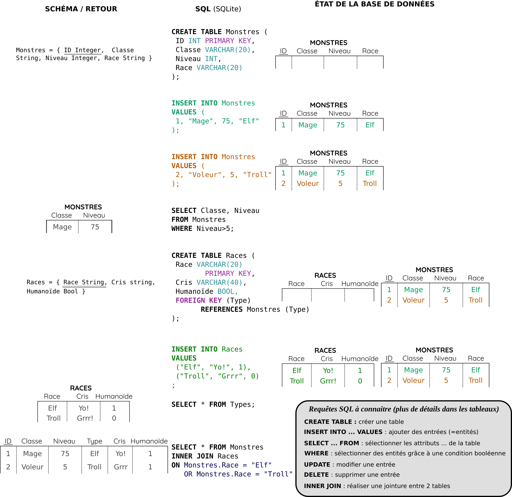

# Bases de données <span onclick="window.print()" class="pdf-link"> :fa fa-file-pdf:</span>

## Un peu d'histoire

Sauvegarder des informations sous la forme de données est une activité fondamentale des sociétés humaines. Les premières traces d'écriture sont liées aux besoins de stocker des valeurs (par ex. l'[écriture cunéiforme](https://fr.wikipedia.org/wiki/Cun%C3%A9iforme) des livres de comptes de la cité d'Uruk et Lagash vers 3400 av. J.-C.). L'objectif de stocker des données est donc intimement lié à l'évolution de l'Humanité.

<div class="timeline">
<div class="container right">
    <i class="icon fa fa-feather-alt"></i>
    <div class="content-timeline">
      <strong>Première écriture </strong>
      <p>
        Les premières écritures (~3400 av. J.-C.) sont en lien directes avec le besoin de recenser des données. Les premiers supports étaient en argile, pierre, parchemin...
      </p>
    </div>
  </div>
  <div class="container left">
    <i class="icon fa fa-scroll"></i>
    <div class="content-timeline">
      <strong>Fiche Papier</strong>
      <p>
        Grâce à l'invention du papier (il y a 2000 ans en Chine), puis de l'imprimerie avec des morceaux de bois (<em>xylographie</em>, VIIe siècle en Asie) et de la presse d'imprimerie par Gutenberg (1451), il est facile produire des feuilles pour stocker des données.
      </p>
    </div>
  </div>
  <div class="container right">
    <div class="date">1960</div>
    <i class="icon fa fa-laptop"></i>
    <div class="content-timeline">
      <strong>Fichier informatique </strong>
      <p>Les premiers fichiers informatiques varient beaucoup selon les logiciels.</p>
    </div>
  </div>
  <div class="container left">
    <div class="date">1970</div>
    <i class="icon fa fa-database"></i>
    <div class="content-timeline">
      <strong>Modèle relationnel</strong> (<em>E.F. Codd.</em>)
      <p>
        Les modèles relationnels permettent des bases de données + complexe, + sécurisé, avec - d'erreurs, et un meilleur contrôle.
      </p>
    </div>
  </div>
  <div class="container right">
    <div class="date">1978</div>
    <i class="icon fa fa-table"></i>
    <div class="content-timeline">
      <strong>Invention des logiciels de type tableurs</strong> (<em>D. Bricklin.</em>)
    </div>
  </div>
  <div class="container left">
    <div class="date period">1980-1990</div>
    <i class="icon fa fa-database"></i>
    <div class="content-timeline">
      <strong>SQL</strong> (<em>Structured Query Language</em>)
      <p>
        SQL devient le langage standard (standardisation <abbr title="American National Standards Institute">ANSI</abbr> en 1986). C'est le début de la commercialisation à grande échelle des bases de données.
      </p>
    </div>
  </div>
   <div class="container right">
    <div class="date">2010</div>
    <i class="icon fa fa-database"></i>
    <div class="content-timeline">
      <strong>NoSQL (<em>Not only SQL</em>)</strong>
      <p>Apparition d'une nouvelle famille de base de données (pas au programme)</p>
    </div>
  </div>
</div>

<p class="center-p"> <strong> Frise historique </strong> des outils de gestions de bases de données (très simplifiées) </p>

---

Les logiciels types tableurs (par ex. Excel ou LibreOffice Calc) sont apparus à peu près en même temps que les premiers logiciels basés sur les modèles relationnels. Les tableurs sont souvent plus intuitifs et simples au premiers abord mais comportent quand même quelques désavantages quand il s'agit de modéliser des données relativement complexes.


<p class="center-p"> <strong> Table de comparaison  </strong> entre le modèle par tableur et le modèle relationnel </p>

---

## Le modèle relationnel

?> Regarder la [vidéo en ligne](https://invidious.fdn.fr/watch?v=iu8z5QtDQhY) d'introduction à la base de données.

### Modéliser la bibliothèque du lycée

?> Vous avez pour mission collective de stocker les informations concernant les livres de la bibliothèque du lycée. Prenons 10 livres au hasard pour l'exemple. Proposez une façon de stocker ces informations.

?> Dans un second temps, on voudrait permettre à toute personne de Scholae d'emprunter des livres. Comment mettre cela en place?

### Contraintes d'intégrité (=règle de cohérence)

- **Entité** : chaque enregistrement (chaque entité) est unique (=> clef primaire)
- **Référence** : les relations (tables) sont liés par des attributs (=> clef étrangère)
- **Domaine** : les attributs sont typés (INT, BOOL, CHAR ...)
- **Métier** : toutes autres contraintes (par ex. un mail doit contenir un @)


<p class="center-p"> <strong> Modèle de relation entre deux tables </strong> </p>

---

### Écrire le schéma d'une base de données relationnelle

On peut représenter la structure d'une base données relationnelle à partir d'un **schéma**, sorte de pseudocode qui résume la structure de la base de données et donne quelques indication sur le domaine et les clés des relations.

On écrit une ligne par relation avec ces attributs entre parenthèse et séparés par des virgules. On note également le type des attributs. Par exemple, la base de données des joueurs de football de Ligue 1 pourrait s'écrire :

- *Joueur*(<u><em>Nom</u></em> STRING, *Prénom* STRING, *Age* INT, *Ratio_ _but_par_tir* FLOAT, *Date_naissance* INT, <u style="text-decoration: none; border-bottom: 1px dotted; cursor: help;"><em>Club</em></u> STRING)

- *Club*(<u style="border-bottom: 1px dotted; cursor: help;"><em>Acronyme</em></u>, STRING, *Nb_joueurs* INT, *Année_création* DATE)

On remarque que les clés primaires sont soulignées et que les clés étrangères sont soulignées en pointillé.

## Le language SQL

?> Faire les parties 1 à 4 des [exercices en ligne](https://fxjollois.github.io/cours-sql/) de FX Jollois (IUT Paris Descartes). Prenez des notes à chaque fois qu'une information vous semble importante.



<p class="center-p"> <strong> Exemple de code SQL </strong> avec à gauche les schémas ou les retours de fonction, et à droite l'état de la base de données. </p>

---

Le code complet de la figure ci-dessus est présenté ci-dessous. Vous pouvez le copier-coller et faire des tests en ligne avec l'[interpréteur SQLite](https://sql.js.org/examples/GUI/index.html).

```sql
DROP TABLE IF EXISTS Monstres;
DROP TABLE IF EXISTS Races;

CREATE TABLE Monstres (
ID INT PRIMARY KEY,
Classe VARCHAR(20),
Niveau INT,
Race VARCHAR(20)
);

INSERT INTO Monstres VALUES (
  1, "Mage", 75, "Elf"
);
INSERT INTO Monstres VALUES (
  2, "Voleur", 5, "Troll"
);

SELECT Classe, Niveau
FROM Monstres
WHERE Niveau>5;

CREATE TABLE Races (
 Race VARCHAR(20)
        PRIMARY KEY,
 Cris VARCHAR(40),
 Humain INT,
 FOREIGN KEY (Type)
       REFERENCES Monstres (Type)
);

INSERT INTO Races
VALUES
  ("Elf", "Yo!", 1),
  ("Troll", "Grrr", 0);

SELECT * From Races;

SELECT * FROM Monstres
INNER JOIN Races
ON Monstres.Race = Races.Race
```

<details class="advanced_level">
<summary> <strong> Niveau avancé :</strong></summary>

?> Pour s'exercer au SQL vous pouvez suivre les cours du [COLIBRI](https://colibri.unistra.fr/fr/course/list/notions-de-base-en-sql) de Strasbourg et vous entraîner sur la [Khan academy](https://fr.khanacademy.org/computing/computer-programming/sql).

</details>

## Systèmes de Gestion de Bases de Données (SGBD)

Un **SGBD** (**Systèmes de Gestion de Bases de Données**) est un logiciel qui permet … la gestion de bases de données en facilitant :

- la **création** de nouvelles bases de données et des relations (tables) qui s'y trouve,
- la **spécification des contraintes d'intégrités** et leur **respect** lors des modifications,
- la **modification** (ajout, suppression, mise à jour) de ces bases de données (modification d'entité, d'attribut ou de valeur),
- l'**interrogation** de la base de données (par ex. avec le langage SQL).

Les SGBD permettent souvent de définir plusieurs **niveaux d'utilisateurs** qui ont accès à des données/fonctions différentes. Ils sont souvent organisés sur un modèle **client-serveur** pour permettre à plusieurs utilisateurs d'avoir un **accès simultanés aux données**. Un autre aspect fondamental des SGBD modernes qui utilisent le langage SQL est que l'utilisateur peut demander des résultats sans coder la manière dont ils vont lui être donnés. Par exemple, si vous demandez une liste triée des livres d'une médiathèque datant de l'année 2000, vous ne faîtes aucune recommendation sur les algorithmes qui vont être utilisés (tri fusion par exemple). C'est le SGBD qui se charge de décider de la meilleure manière de calculer la réponse à votre question. C'est la raison pour laquelle le langage SQL est parfois qualifié de **langage déclaratif**.

### Propriétés ACID

En informatique, les propriétés ACID (atomicité, cohérence, isolation et durabilité) sont un ensemble de propriétés qui garantissent qu'une transaction informatique est exécutée de façon fiable ([:fab fa-wikipedia-w:](https://fr.wikipedia.org/wiki/Propri%C3%A9t%C3%A9s_ACID)).

- **Atomicité** : il faut qu'une transaction informatique se fasse complètement ou ne se fasse pas du tout. Cette propriété permet d'éviter des erreurs dûs à des transactions incomplètes. Par exemple, si une requête SQL d'ajout d'une entité n'ajoute qu'une partie des attributs (par ex. à cause d'une coupure de courant), alors il faut annuler la transaction.

- **Cohérence** : chaque transaction doit amener le système d'un état valide à un autre état valide. Par exemple, les contraintes d'intégrité d'une base de données doivent être respectées avant et après une requête.
- **Isolation** : chaque transaction est indépendante, elles s’exécutent comme si elles étaient seules sur le système. Ainsi une transaction T1 ne peux pas accéder à un état intermédiaire d'une transaction T2 qui est exécuté au même moment. Cela revient à dire que l'exécution de T1 et T2 simultanément doit produire le même résultat que leur exécution successive.

- **Durabilité** : la propriété de durabilité assure qu'une fois confirmée, une transaction demeure enregistré même en cas de panne informatique ou d'un autre problème. Par exemple, dans le cas d'une base de données relationnelle, une fois une requête SQL effectuée, la base modifiée doit être sauvegardée de façon permanente.

> À noter qu'en informatique, la sauvegarde de façon permanente est un sujet complexe puisque que les différents supports de stockages informatiques les plus courants on des durées de vies assez courtes (voir une [Infographie](https://www.silkhom.com/quels-supports-de-stockage-pour-conserver-nos-donnees/) de 2012).

## Un peu de SQL sous python

On peut utiliser le langage SQL sous python dans sa version SQLite grâce à la bibliothèque `sqlite3`.

```python
import sqlite3
# Connexion à la base de données
## Créé une nouvelle BD si elle n'existais pas
connexion = sqlite3.connect('maBD.db')
curseur = connexion.cursor()
# l'utilisation du nom cursor n'est pas au programme

# Exécution d'une requête
curseur.execute ("MA REQUÊTE SQL")

# Affichage des résultats de la requête
for element in curseur:
  print(element)

# Fermeture de la connexion
connexion.close()
```

?> Créer une base de données de vos 5 jeux préférés (ordinateurs, jeux de sociétés, sports...) entièrement sous python.

## Attaque par injection de code SQL

?> À l'aide d'une recherche sur le web, faire un schéma du processus à l'oeuvre lors d'une attaque informatique par injection de code SQL.

## :fa fa-brain: Exercices

### Modèle relationnel

1. Ci dessous est écrit le schéma d'une base de données relationnelle d'une médiathèque. À l'aide de ce schéma, trouver le nombre de relations et leur noms. Citer trois attributs qui ont des domaines différents et expliquer pourquoi ils ont des domaines différents. Identifier la ou les clés primaires et étrangères.

   - _Livre_(_titre_ String, _auteur_ String, _éditeur_ String, _année_ Int, <u><em>ISBN</em></u> String, <u style="text-decoration: none; border-bottom: 1px dotted; cursor: help;"><em>emprunté\_par</em></u> Int, _emprunté\_le_ Date)
   - _Usager_(<u><em>id</em></u> Int, _nom_ String, _prénom_ String)

1. À l'aide l'exemple précédent, modéliser sous la forme d'un schéma la base de données d'un bulletin scolaire qui doit mentionner (i) les élèves qui possèdent un numéro d'étudiant unique, (ii) un ensemble de matières fixées, et (iii) une note sur 20 par matière et par élève.

1. Dire si les affirmations suivantes sont vraies dans le cadre de notre base de données relationnelle de la médiathèque :
   1. Il ne peut pas y avoir plusieurs livres qui ont le même titre
   2. Il ne peux pas y avoir plusieurs livres qui ont le même ISBN
   3. Il ne peux pas y avoir plusieurs usager qui ont le même couple de valeur Nom/Prénom
   4. L'attribut *emprunté_par* ne peux pas prendre de valeurs qui ne sont pas dans l'*id* de la table usager.

1. Faire le schéma d'un annuaire téléphonique simple (nom, prénom, téléphone). Attention, le téléphone doit pouvoir commencer par un +. À partir de ce schéma, dire si les proposition ci dessous sont des relations valides pour votre schéma.
  
   1. {}
   1. {('Ronald', 'MacDo', '0123728938')}
   1. {('Oscar', 'White', '0123728938'), ('Deau', 'Roro', '')}
   1. {('Oscar', 'White', '0123728938'), ('Deau', 'Roro', '0123728938')}
   1. {('Doe', 'John', +331829900)}
   1. {('Doe', 'White', '+3318299EE')}

### Base de données relationnelle et langage SQL

1. Regrouper les mots synonymes : relation, colonne, entité, column, entité, attribut, table, schéma, base de données, domaine, ligne, type, row

1. Créer la base de données relationnelle de la médiathèque schématiser dans les exercices précédents à l'aide de la requête CREATE TABLE en ajoutant un maximum de contrainte d'intégrité.

1. Écrire les requêtes SQL sur la base de données de la médiathèque permettant de :
   1. Tous les titres des livres,
   2. Les noms des usagers en retirant les doublons,
   3. Les titres des livres publiés avant 1990,
   4. Les ISBN des livres à rendre avant le 01/09/2022,
   5. Les noms d'usagers qui commence par B,
   6. Les titres de livres dont le nom d'éditeur est composé de plusieurs mots.

2. Dans la BDR mondial se trouve une table economy qui possède les attributs suivants : Country (le code du pays), GDP (le PIB, en millions de dollars), agriculture (la part de l'agriculture dans le PIB, en pourcentage), Service (la part des services dans le PIB), Industry (la part de l'industrie dans le PIB), Inflation (le taux d'inflation) et Unemployment (le taux de chômage).

Par exemple, la requête suivante affiche les pays majoritairement agricole.

```SQL
SELECT country.name, economy.agriculture FROM country
JOIN economy ON country.code = economy.country
WHERE economy.agriculture>economy.industry AND economy.agriculture > economy.service;
```

Écrire la requête qui va filtrer les pays dont l'inflation est positive et qui va les trier par le taux de chômage.
