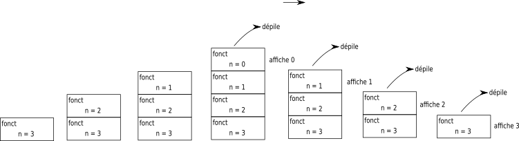
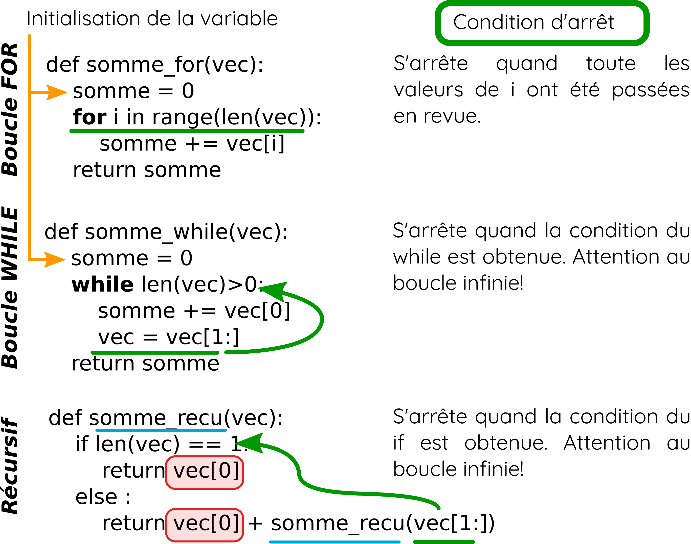
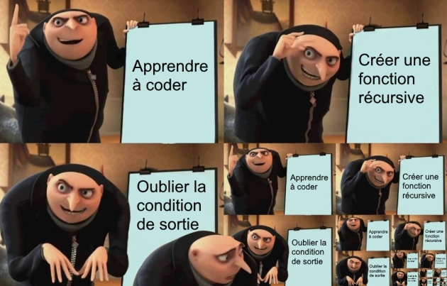

# Programmation <span onclick="window.print()" class="pdf-link"> :fa fa-file-pdf:</span>

## Récursivité

Résoudre un problème de façon récursive c'est **décomposer un problème en sous-problèmes identiques** de plus en plus petits jusqu’à obtenir un problème suffisamment petit pour qu’il puisse être résolu de manière triviale.

?> Regarder la [vidéo](https://www.youtube.com/watch?v=U3nGNJTxYc4&feature=emb_imp_woyt) sur la tour de Hanoï vue comme un processus récursif.

<div class="nutshell">

Les trois règles d'un **algorithme récursif** :

- Il s’**appelle lui même**;
- Il doit avoir un **état trivial**, ce qui permet de définir une condition d’arrêt;
- Il doit conduire vers cet **état d’arrêt**, pour éviter les boucles infinis.

</div>

### Fonction récursive

Une fonction **récursive** est donc une fonction qui va **s’appeler elle-même**. Comme dans le cas des boucle "while", il est crucial de penser à la condition d'arrêt de la fonction au risque de tomber dans une boucle infini. L'utilisation des fonctions récursives est souvent liée à la notion de récurrence en mathématiques.

?> Examiner le programme ci-dessous et tenter de prévoir son résultat avant de l'exécuter sous [pythontutor](https://pythontutor.com/) pour vérifier votre prévision et comprendre la suite du processus de pile/dépiler.

```python
def fonct(n):
    if n>0:
        fonct(n-1)
    print(n)

fonct(5)
```

<details>
<summary> <strong> Réponse </strong></summary>

- On appelle la fonction *fonct* avec le paramètre n = 3 ; n est supérieur à 0 donc appel de la fonction *fonct* avec le paramètre n = 2

- 2e appel de la fonction *fonct* avec le paramètre n = 2 ; n est toujours supérieur à 0 donc appel de la fonction *fonct* avec le paramètre n = 1

- 3e appel de la fonction *fonct* avec le paramètre n = 1 ; n > 0 donc appel de la fonction *fonct* avec le paramètre n = 0

- 4e appel de la fonction *fonct* avec le paramètre n = 0 ; n = 0 donc on exécute l'instruction *print(n)* => affichage : 0

- on "dépile" (3e appel, n = 1) : on exécute l'instruction print(n) => affichage : 1

- on "dépile" (2e appel, n = 2) : on exécute l'instruction print(n) => affichage : 2

- on "dépile" (1er appel, n = 3) : on exécute l'instruction print(n) => affichage : 3

Il ne faut jamais perdre de vu qu'à chaque nouvel appel de la fonction fonct le paramètre n est différent.
Voici un schéma expliquant le processus en termes de pile d'exécution :



<p class="center-p"> <strong> Schéma d'explication de la pile d'exécution (David Roche - CC-BY-CA) </strong>
</p>

</details>

?> Expliquez pour chaque script ci-dessous (f, g, h, p) pourquoi on obtient une erreur.

```python
def f(n):
    return n * f(n-1)

print(f(3))
```

```python
def h(n):
    if(n==0):
        return 1
    return n * h(n)-1

print(h(3))
```

```python
def g(n):
    if(n==0):
        return 1
    return n * g(n+1)

print(g(3))
```

```python
def p(n):
    if(n==0):
        return 1
    return n * p(n-2)

print(p(3))
```

?> À l'aide de la fonction *fonct* vu précédement, écrire une fonction *fact(x)* qui calcule la factorielle d'un nombre x.

?> La figure ci-dessous vous présente une fonction qui calcule la somme des valeurs d'une variable de trois façons différentes. Expliquez chacune de ses fonctions puis tester à l'aide de site [pythontutor](https://pythontutor.com/).



<p class="center-p"> <strong> Comparaison des boucles while et For avec une implémentation récursive. </strong>
</p>

<details class="advanced_level">
<summary> <strong> Niveau avancé :</strong></summary>

?> À l'aide du script ci-dessous calculer puis comparer les vitesses de calcul.

```python
from timeit import default_timer as timer 
from random import randint
# les deux fonctions ici
L=[randint(0,100) for i in range(1000)]

debut=timer()
print(sommeliste(L))
fin=timer()
print(fin-debut)

debut=timer()
print(somme(L))
fin=timer()
print(fin-debut)
```

</details>

<details class="advanced_level">
<summary> <strong> Niveau avancé :</strong></summary>

?> Regarder la [vidéo](https://www.youtube.com/watch?v=PW_Pka9iBko) sur le flocon de Koch. Lancer ensuite le programme ci-dessous.

```python
import turtle as t

def koch(longueur, n):
    if n == 0:
        t.forward(longueur)
    else:
        koch(longueur/3, n-1)
        t.left(60)
        koch(longueur/3, n-1)
        t.right(120)
        koch(longueur/3, n-1)
        t.left(60)
        koch(longueur/3, n-1)

def flocon(taille, etape):
    koch(taille, etape)
    t.right(120)
    koch(taille, etape)
    t.right(120)
    koch(taille, etape)

flocon(100, 3)
```

</details>



<p class="center-p"> <strong> Mème (Van Zuijlen Stéphan - CC-BY-NC). </strong>
</p>

### Exercices récursivité

1. La fonction ci-dessous permet de tester si un mot est un palindrome (mot qui se lit dans les deux sens, [:fab fa-wikipedia-w:](https://fr.wikipedia.org/wiki/Palindrome). Que renvoient *est_palindrome("selles")* ; *est_palindrome("radar")* ; *est_palindrome("selle")*?

```python
def est_palindrome(mot):
    mot=mot.lower()
    for i in range(len(mot)//2): 
        if mot[i]!=mot[-i-1]:
            return False
    return True
```

2. Écrire une version récursive *rec_est_palindrome*. Pour cela identifier l'état trivial (donc la condition d'arrêt) et utiliser l'idée que "selles" est un palindrome si "s"= "s" et "elle" est un palindrome.

3. Modifier votre programme pour qu’il considère que la phrase "Karine alla en Irak" soit un palindrome.

<details class="advanced_level">
<summary> <strong> Niveau avancé :</strong></summary>

?> Faire le [TP](https://isn-icn-ljm.pagesperso-orange.fr/NSI-TLE/res/res_tp_tour_de_hanoi.pdf) sur la tour de Hanoï du site isn-icn-ljm.

</details>

## Modularité

### Rappels de première

Dans tout les langages informatiques avec une communauté conséquente, il existe vite un problème à résoudre : comment ne pas recoder (mal) ce qui a déjà été (bien) codé tout en gardant une langage qui ne deviennent pas trop imposant à installer? Autrement dit comment ne pas réinventer la roue tout en permettant aux codeurs qui n'ont pas besoins de roues de ne pas avoir à télécharger cette roue avec le langage. Une solution très utilisée est l'utilisation de **bibliothèques** (aussi appelées modules ou packages). Ces bibliothèques sont des ensembles de fonctions cohérentes.

Par exemple, la bibliothèque « math » permet de calculer, entre autres, des cosinus et des racines carrées. La bibliothèque « random » est utilisé pour générer des nombres aléatoires. Pour charger une bibliothèque on utilise la code **from** nom_bibliotheque **import** \*. Ici l'étoile indique que l'on veut charger toute la bibliothèque. Si on a seulement besoins d'une ou quelques fonction(s) on remplace l'étoile par le nom des fonctions souhaitées.

```python
from math import * # importation de toute les fonctions de la bibliothèque math
from random import uniform # importation de la fonction uniform de la bibliothèque random
```

Un **module** est un fichier qui contient des variables, fonctions, objets, méthodes... En python, il est importé par l'instruction `import nom_module`. Un **package** est un ensemble de fichier qui peut contenir un ou plusieurs modules.
Une **bibliothèque** est constituée de plusieurs packages. On utilise également le mot library pour désigner une bibliothèque.

Dans les fait, les développeurs python utilisent beaucoup le terme de module pour parler indifféremment de module, package et bibliothèque.

### API

Une **API** (Application Programming Interface) est une interface de programmation d'application. Une API est composé de fonctions, constantes, classes qui sont bien **documentés**. L'objectif est de faciliter l'interface, les échanges entre différents programmes informatiques.

Les API web utilisent internet pour échanger de données. Les formats d'échanges sur le web se sont standardisés au fur et à mesures. Aujourd'hui, deux formats sont principalement utilisés dans les API web : **XML**(Extensible Markup Language) et **JSON** (JavaScript Objet Notation).

Quelques API (gratuites) disponibles sur le web pour faire des tests (une liste plus complète d'API gratuite est disponible [en anglais](https://github.com/public-apis/public-apis)).

- https://geo.api.gouv.fr/
- https://api.gouv.fr/
- https://geodatamine.fr/boundaries
- https://fr.openfoodfacts.org/data

?> Trouver l'adresse qui se trouve au point GPS de latitude 43.977 et de longitude 3.85 grâce à l'[API](https://adresse.data.gouv.fr/api-doc/adresse) du gouvernement.


?> TP météo : https://www.lecluse.fr/nsi/NSI_T/langages/modularite/


## Programmation orientée objet

Jusqu'à maintenant, nous avons principalement utilisé le paradigme de programmation impérative qui repose sur les notions de :

- **séquence d'instructions** (les instructions d'un programme s'exécutent dans l'ordre dans lequel on les écrit)
- **affectation** (on attribue une valeur à une variable, par exemple : texte = "Youpi")
- les instructions conditionnelles (if / else) et les boucles (while et for)

Il existe d'autres manières de programmer, le paradigme de la programmation orienté objet (abrégée *poo*) en est un. La poo repose sur les notions de **classe**, d’**attribut** et de **méthode**. Les notions d’héritage et de polymorphisme sont également caractéristiques de la poo mais ne sont pas au programme.

!> Une classe définit la façon dont seront créés et gérés les objets de cette classe. Une instance est une version d'un objet créé grâce à une classe. La différence entre un objet et une instance est subtile et n'est pas au programme. Une instance (=un objet) possède (le plus souvent) des **attributs** (des caractéristiques propres à la classe) et des **méthodes** (des fonctions spécifiques aux objets de cette classe).

En fait vous avez déjà utilisé la poo. Par exemple en première on avait vu que le code  `ma_chaine_minuscule = ma_chaine.lower()` permettait de convertir une chaîne de caractère en minuscule. En fait on utilisait une méthode (`.lower()`) d'une instance de classe *str*. Python est donc déjà codé en partie dans le paradigme de la poo. Il est cependant intéressant de pouvoir créer de nouvelles classes pour nos besoins spécifiques. Voici comment on définit une nouvelle classe. 

```python
class Eleve:
    '''
    La classe élève définit des objets élèves qui ont un nom, un prénon, une date de naissance et des notes. 
    La méthode calcul_moyenne() permet de calculer la moyenne des notes de l'élève.
    '''

    # constructeur (attention deux underscores de chaque côté !!)
    def __init__(self,Nom,Prenom,Date,Notes):
        # Attributs 
        self.nom=Nom
        self.prenom=Prenom
        self.date=Date
        self.notes=Notes
    
    # Accesseur
    def qui(self):
        return self.nom + " " + self.prenom

    # Mutateur
    def set_notes(self, Notes):
        self.notes = Notes

    # Autres méthodes
    def calcul_moyenne(self):
        return sum(self.notes)/len(self.notes)
    
    # Méthode d'affichage
    def __repr__(self):
        return self.qui() + " a une moyenne de " + str(self.calcul_moyenne())
```

?> À partir du code ci-dessus, trouver la manière (i) de définir la création d'une nouvelle instance, (ii) de documenter votre classe, et (iii) de définir l'affichage par défaut des instances de la classe.

?> Après avoir bien lu le code ci-dessus, lancer le code ci-dessous pour tester la classe élève.

```python
eleve1=Eleve("Féfé","Yoplait","01/11/2000",[12,12,15])
print(eleve1.calcul_moyenne())
print(eleve1)
```

?> Écrire une classe *Rectangle*, permettant de construire un rectangle doté d’attributs longueur et largeur. Ajouter deux méthodes *perimetre*(self) et *surface*(self).

?> Comprendre la construction des classes [personnage](https://github.com/courumix/pySCHO/blob/main/python/class_perso.py) et [monstre](https://github.com/courumix/pySCHO/blob/main/python/class_monstre.py) du jeux de rôle pyScho (en cours de dév.).

?> Créer une classe plante avec au moins les attributs _nom_, *points_de_santé*, *attaque*, *cris_guerre*. Vous devez également définir les méthodes _attaquer()_ (fait baisser les points de santé d’une autre plante), _photosynthèse_ (augmente les points de santé), _menacer_ (renvoie le cris de guerre), _enlacer(texte)_(renvoie la chaîne de caractères mélangée) ainsi qu'une méthode_\_\_repr\_\__.

<details class="advanced_level">
<summary> <strong> Niveau avancé :</strong></summary>

?> Créer une classe chien qui à les attributs _nom_, *points_de_santé* et _aboiement_ (chaîne de caractères). Vous devez également définir les méthodes _mordre(autre_chien)_ (fait baisser les points de santé d’un autre chien), _manger_ (augmente les points de santé), _grogner_ (renvoie « Grrr... » + son aboiement),_machouiller(chaîne)_(renvoie la chaîne de caractères mélangée) ainsi qu'une méthode_\_\_repr\_\__.

?> Créer un combat automatique entre deux chiens: les valeurs de dégâts et de PVs gagnés quand ils mangent sont tirées au hasard (vous aurez besoin d'utiliser la fonction *randint* du module *random*), chaque chien grogne avant d'attaquer, les chiens attaquent puis mangent chacun leur tour, le combat s'arrête quand les PVs d'un chien tombe à 0 et le gagnant mâchouille.

?> Créer une classe zombie avec les attributs et les méthodes que vous voulez. Puis créer une fonction combat entre une instance de zombie et une instance de antes.

</details>

## Mise au point de programme

Il y a plusieurs façon d'améliorer un programme pour l'utilisateur. En premier lieu, un code bien structurée (par ex. des fonctions dont il est facile de comprendre ce qu'elles font) avec des conventions conservées (par ex. dans le choix des noms de fonctions) est important. Ensuite, une bonne documentation (une aide) est essentielle pour les utilisateurs. Enfin, on peut aider l'utilisateur en anticipant les erreurs qu'il pourrait faire et en lui expliquant son erreur (assertion). 

### Documentation

En python, on commente au plus près du code à travers deux types de texte: 
- des **commentaires** précédés d'un dièse 
- des **Docstrings** dont les conventions sont décrites [en ligne](https://www.python.org/dev/peps/pep-0257/). Le texte d'aide est écrit entre trois ''' comme ci-dessous.  

```python
'''Ce module permet d'afficher un objet'''
def fonction_qui_va_tout_revolutionner(x):
    '''Cette fonction affiche un objet 

    Cette fonction révolutionnaire prend en paramètre x un objet de n'importe quel type de base (int, float, bool, str) et l'affiche.
    '''
    print(x) # fonction d'affichage
```

On peut décrire les paramètres de la fonction, le retour de la fonction ou encore le type des paramètres et du retour dans le **Docstring**. 

```python
def est_palindrome(mot):
    '''Test si un mot est un palindrome
    
    Cette fonction test si un mot est un palindrome

    :param str mot: Le mot à tester
    :return: Retourne un booléen qui dit si le mot est un palindrome   
    :rtype : Bool
    '''
    mot=mot.lower()
    for i in range(len(mot)//2): 
        if mot[i]!=mot[-i-1]:
            return False
    return True


```

### Assertion

Une manière d'aider l'utilisateur est d'anticiper certaines erreurs et de prévoir des messages associés à ces erreurs.

```python
assert condition, 'Message'
```

?> Créer une fonction qui prend en paramètre une année de naissance et qui renvoie un âge à la date d'aujourd'hui ; ou créer une fonction qui affiche les dates des x prochaines élections présidentielles avec x le paramètre; ou créer une fonction qui prend deux paramètres (x et y par exemple, *x* représente un nombre parmi un nombre total *y*) et qui renvoie un pourcentage.

?> Changer de place et essayer de faire "bugger" le programme de l'autre élève en proposant (et en testant) des valeurs de paramètres qui renvoient des erreurs ou des valeurs qui n'ont pas de sens (par exemple un âge négatif). 

?> Reprenez vos fonctions et améliorer les en utilisant des assertions qui permettent d'éviter certains comportements non voulus de vos fonctions et d'informer l'utilisateurs des problèmes rencontrés par la fonction. 


## Programmation fonctionnelle

La programmation fonctionnelle est un autre paradigme de programmation. L'idée générale est d'utilisé au maximum des fonctions qui ne modifient pas les variables. Autrement dit, on essaye de séparer les données initiales d'un côté et les modifications que l'on fait sur ces données d'un autre côté.    
Les fonctions utilisées en programmation fonctionnelle sont parfois appelées "fonction pure" : le résultat renvoyé par une fonction pure doit uniquement dépendre des paramètres passés à la fonction et pas des valeurs externes à la fonction.

?> Pour les fonctions ci-dessous, trouver si elles sont pures ou non. 

```python
i = 5
def fct1():
  if i > 5:
    return True
  else :
    return False
fct1()
```

```python
def fct2(i):
  if i > 5:
    return True
  else :
    return False
fct2(5)
```


## Ressources pour s'entraîner en ligne à Python

https://ens-fr.gitlab.io/nsi-pratique/